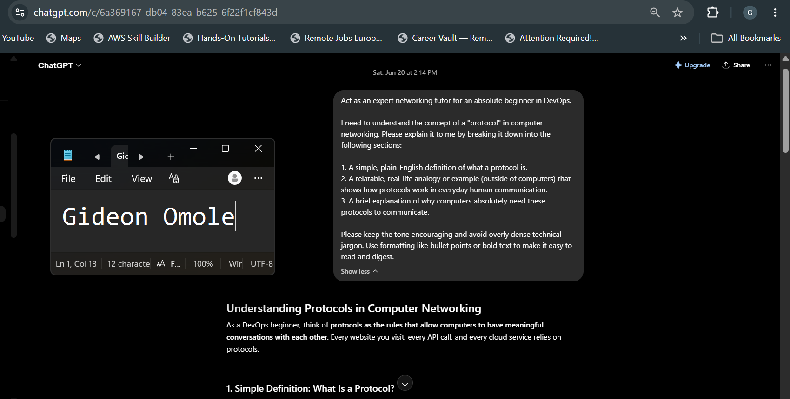
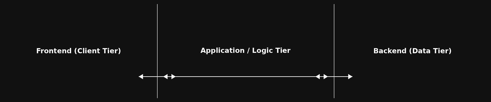
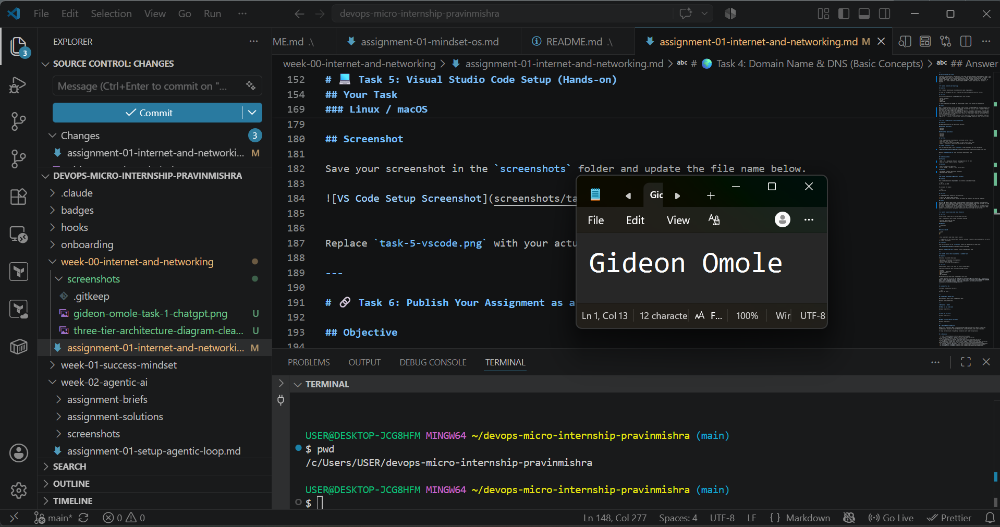

# Week 00 - Internet and Networking

Part of the DevOps Micro Internship (DMI) Cohort 3 with Agentic AI

---

# 🧑‍💻 Task 1: Using ChatGPT as Your Learning Assistant

## Scenario

You're new to DevOps and will frequently encounter technical questions. ChatGPT can be your learning companion.

## Your Task

Write a clear ChatGPT prompt to help you understand:

> "What is a protocol in networking? Explain with a simple real-life example."

Take a screenshot of your interaction showing:

* Your detailed prompt (with clear expectations)
* ChatGPT's simplified response with an example

## Screenshot

Save your screenshot in the `screenshots` folder and update the file name below.




Replace `task-1-chatgpt.png` with your actual screenshot file name.

---

## What I Learned (2–3 lines)

A protocol is essentially a shared set of rules that lets two computers understand each other, just like people follow rules in a conversation (e.g., saying "hello," waiting your turn to speak). This analogy made it click for me — without agreed-upon rules, messages could get sent but never properly understood. I also learned that a well-structured prompt (asking for a definition, an analogy, and a "why it matters" section) makes ChatGPT's answers much easier to follow as a beginner.

---

# 🌐 Task 2: Internet and Networking

## Scenario

Your friend is launching an online bookstore named **EpicReads**.

He asked you to explain how users globally can access his website hosted in Finland.

## Your Task

Write a short explanation (**100–150 words**) that includes:

* Packet Switching
* IP Address
* TCP/IP
* HTTP/HTTPS

💡 **Tip:** You may use ChatGPT (as demonstrated in Task 1) to refine your explanation.

## Answer

When a customer globally visits EpicReads, their browser uses HTTP/HTTPS to securely request your website's data. To find your server in Finland, the internet uses your site's unique IP Address, which acts just like a digital mailing address.
Once connected, TCP/IP takes over to manage the delivery. Instead of sending your website’s data all at once, the network uses Packet Switching. This breaks the data down into tiny, manageable pieces called packets. These packets travel across the global web of undersea cables and routers via the fastest available paths.
Once they arrive at the customer's device, TCP/IP ensures no data was lost and pieces them back together. In a fraction of a second, your bookstore's homepage seamlessly loads on their screen!

---

# 🏗️ Task 3: Application Architecture & Stack

## Scenario

EpicReads bookstore has two application versions:

### Two-Tier Application

* Frontend
* Database

### Three-Tier Application

* Frontend
* Backend
* Database

## Your Task

* Draw simple diagrams (hand-drawn or tool-based such as draw.io)
* Label each layer clearly
* List at least two common technologies or tools used for each layer
* Submit a screenshot or photo clearly showing your own drawing

## Diagram Screenshot / Photo

Save your diagram image in the `screenshots` folder and update the file name below.




Replace `task-3-diagram.png` with your actual diagram file name.

---

## Technologies Used

### Frontend

* HTML / CSS / JavaScript (The core building blocks of the web)
* React or Angular (Modern frontend frameworks)

### Backend

* Node.js (JavaScript/TypeScript)
* Python (Django / Fastapi) or Java (Spring Boot)

### Database

* PostgreSQL or MySQL (Relational databases)
* MongoDB (NoSQL database)

---

# 🌍 Task 4: Domain Name & DNS (Basic Concepts)

## Scenario

Your friend's bookstore **EpicReads** is currently accessible through:

```text
52.172.142.222:3000
```

He purchased the domain:

```text
epicreads.com
```

## Your Task

In **50–100 words**, explain in your own words:

1. What is DNS (Domain Name System)?
2. Which DNS record type should be used to connect the domain to the given IP, and why?

## Answer

Think of DNS (Domain Name System) as the phonebook of the internet. Computers only understand numbers like your IP address (52.172.142.222), but humans remember names like epicreads.com. DNS maps those user-friendly domain names directly to the correct server IP.
To connect your domain, you need to configure an A Record (Address Record) in your DNS settings. You use an A Record because its sole purpose is to map a domain name directly to a static IPv4 address. Once configured, typing your domain points traffic straight to your server.

---

# 💻 Task 5: Visual Studio Code Setup (Hands-on)

## Your Task

Install Visual Studio Code (if not already installed).

Take a screenshot of your VS Code environment showing:

* Terminal open inside VS Code
* Running a basic command:

### Windows

```powershell
dir
```

### Linux / macOS

```bash
pwd
ls
```

* Your selected VS Code theme clearly visible

⚠️ **Important:** The screenshot must show your username or another identifiable detail to confirm it is your environment.

## Screenshot

Save your screenshot in the `screenshots` folder and update the file name below.




Replace `task-5-vscode.png` with your actual screenshot file name.

---

# 🔗 Task 6: Publish Your Assignment as a LinkedIn Post

## Objective

Publishing on LinkedIn helps you:

* Build your professional online presence
* Reinforce your learning
* Document your DevOps journey publicly

## Your Task

Summarize your answers from Tasks 1–5 into a LinkedIn post.

Clearly structure your post into the following sections:

* ChatGPT
* Internet & Networking
* App Architecture
* DNS
* VS Code Setup

Add the following credit note at the end of your post:

> **P.S. This post is part of the DevOps Micro Internship (DMI) with Agentic AI — Cohort 3 — by Pravin Mishra. My graded progress is public: https://dmi.pravinmishra.com/s/YOUR-GITHUB-USERNAME.html · Start your DevOps journey: https://dmi.pravinmishra.com/?utm_source=student&utm_medium=ps-linkedin&utm_campaign=cohort3**

---

## LinkedIn Post URL

Paste your LinkedIn post URL here:

```text
https://www.linkedin.com/posts/gideon-omole-5ba318180_devops-cloudengineering-continuouslearning-activity-7474107917202358272-EnII?utm_source=share&utm_medium=member_desktop&rcm=ACoAACrC7l4BK-z0pGwSRQMO8ZJ5pFZyqybbIk4
```

---

## LinkedIn Post Backup Copy

Paste the full text of your LinkedIn post here:

Just wrapped up week zero of my DevOps deep-dive!

I’ve been spending the last few days breaking down how the internet, applications, and local dev environments actually work under the hood. It’s one thing to use these tools daily, but mapping out the mechanics has been eye-opening.

Here’s a quick recap of what I tackled:
AI Learning: Practiced writing targeted prompts to turn ChatGPT into a personal tutor, breaking down complex networking concepts with simple, real-world analogies.

Networking: Mapped out how global users access a remote server using HTTP/HTTPS, DNS, and TCP/IP with Packet Switching to securely slice, route, and reassemble data in milliseconds.

App Architecture: Drew out the structural differences between 2-Tier and 3-Tier setups, tracking data flow from Frontend (React) through Backend (Node.js/Python) to the Database (PostgreSQL/MongoDB).

DNS: Covered the internet's phonebook, using an A Record to point a human-readable domain straight to a raw IPv4 address.

Dev Environment: Optimized my VS Code setup with essential extensions and terminal integrations to keep my workflow fast and clean.
Excited to keep building on this foundation as we move into cloud infrastructure and automation! 
hashtag#DevOps hashtag#CloudEngineering hashtag#ContinuousLearning hashtag#TechJourney hashtag#Networking

P.S. This post is part of the DevOps Micro Internship (DMI) Cohort 3 run by Pravin Mishra. You can be part of this learning community too. 
JOIN HERE (https://lnkd.in/eX_G3Ea7 ) DMI Cohort 3: https://lnkd.in/e8VkY826

---

# Reflection – Week 0

### What did you find easy?

Writing clear prompts for ChatGPT and understanding the DNS and networking concepts felt straightforward once I connected them to real-life analogies. Drawing the two-tier and three-tier architecture diagrams was also simple since the layers are logical and easy to visualize.

---

### What was difficult?

Explaining packet switching and TCP/IP in a short, clear way without getting too technical was a bit challenging. I also found it tricky to summarize five different tasks into one concise, engaging LinkedIn post.

---

### What will you improve next week?

I want to go deeper into hands-on practice rather than just theory — actually setting up a simple server or deploying a basic app. I'll also try to write my explanations more concisely and practice using the VS Code terminal more confidently.

---

## 📌 About DMI & CloudAdvisory

DevOps Micro Internship (DMI) is a project-based DevOps program run by Pravin Mishra (The CloudAdvisory) focused on real-world execution, systems thinking, and career readiness.

It helps learners build strong DevOps foundations with hands-on experience.


## 📌 Resources

- 🌐 **DMI Official Website:** https://pravinmishra.com/dmi  
- 🎓 **DevOps for Beginners (Udemy):** https://www.udemy.com/course/devops-for-beginners-docker-k8s-cloud-cicd-4-projects/  
- 🎓 **Ultimate Agentic AI DevOps with Clude Code** https://www.udemy.com/course/ultimate-agentic-ai-devops-with-claude-code/?referralCode=448389767BC96284087B
- 🎓 **DevOps with Claude Code: Terraform, EKS, ArgoCD & Helm** https://www.udemy.com/course/devops-with-claude-code-terraform-eks-argocd-helm/?referralCode=1C5B734505D65A010FA3
- ▶️ **YouTube Playlist (DMI Cohort 3):** https://www.youtube.com/playlist?list=PLFeSNDtI4Cho  
- 🔗 **Pravin Mishra (LinkedIn):** https://www.linkedin.com/in/pravin-mishra-aws-trainer/  
- 🏢 **CloudAdvisory (LinkedIn):** https://www.linkedin.com/company/thecloudadvisory/

---

*This submission is part of DevOps Micro Internship (DMI) Cohort 3 — Agentic AI Track*