# Assignment 3 — Production Maintenance Drill (OPS Checklist)

Part of the DevOps Micro Internship (DMI) Cohort 3 with Agentic AI

---

## Purpose

In this assignment, you will treat your already deployed React application (on Ubuntu VM with Nginx) as a live production system. You will perform structured operational checks covering network validation, service health, log analysis, resource monitoring, configuration verification, and incident simulation with recovery — mirroring real on-call DevOps responsibilities.

---

# Task 1 — Server Access & Networking Validation

## Goal

Verify that the deployed React application is reachable from the browser and confirm basic network connectivity of the Ubuntu VM.

### Evidence

#### Screenshot 1 — Browser showing the React app with your Full Name visible on the UI

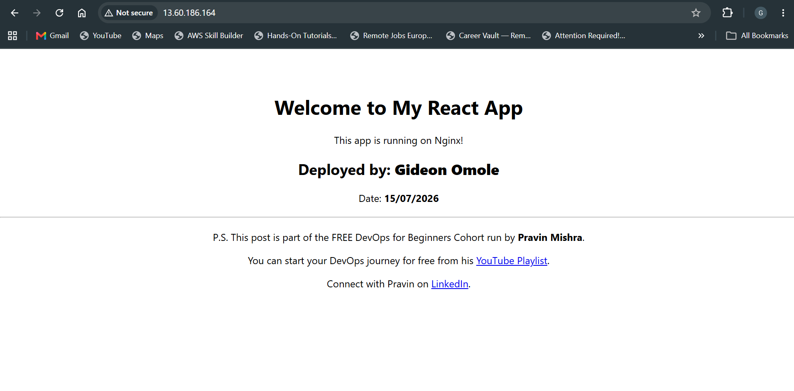

---

#### Screenshot 2 — Output of `ip a`

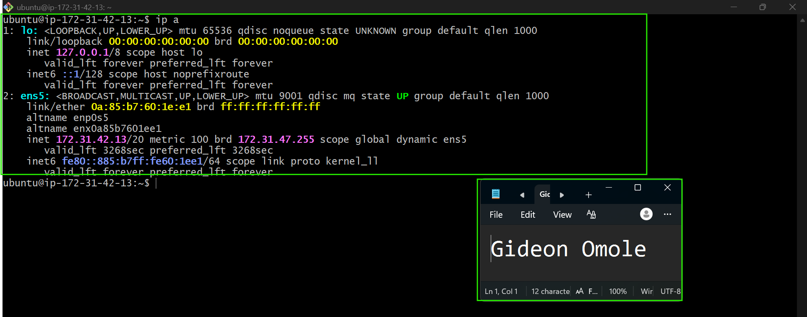

---

#### Screenshot 3 — Output of `sudo ss -tulpen`

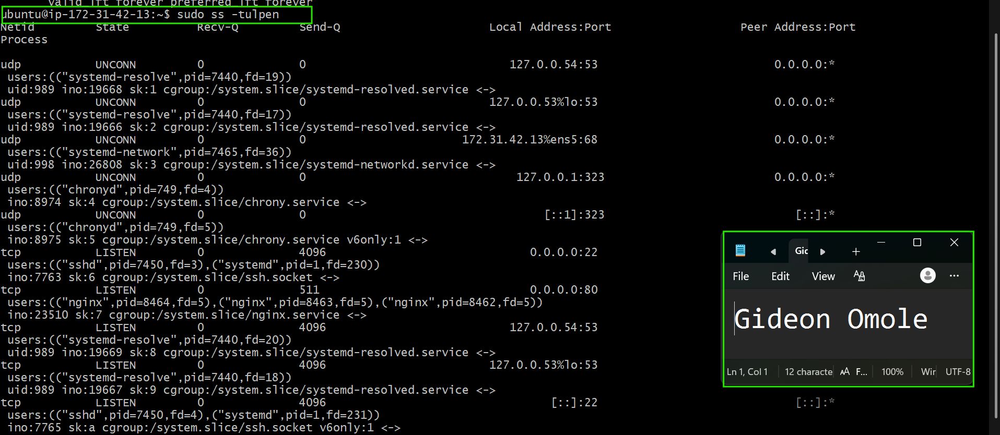

---

#### Screenshot 4 — Output of `sudo ufw status`

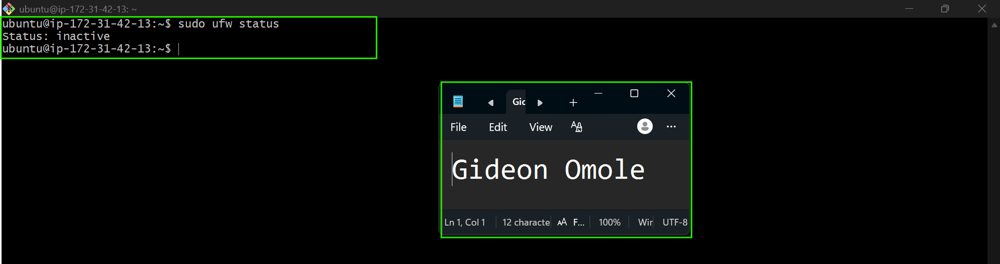

---

### Notes

Answer the following in your own words:

**1. What proves Nginx is listening on 0.0.0.0:80?**

The line tcp LISTEN 0 511 0.0.0.0:80 0.0.0.0:* with the process listed as nginx (three worker/master PIDs: 8464, 8463, 8462) confirms it. The 0.0.0.0:80 means it's bound to all network interfaces on port 80, not just localhost so it's reachable from outside the server, which is exactly why the app loads in a browser using the public IP.

---

**2. What proves SSH is active on port 22?**

Two lines confirm it: tcp LISTEN 0 4096 0.0.0.0:22 0.0.0.0:* and tcp LISTEN 0 4096 [::]:22 [::]:*, both tied to the sshd process. The first is IPv4, the second is the IPv6 equivalent. Together they show SSH is listening on all interfaces for both protocols, which is what let me connect earlier from my local machine.

---

**3. Did you find any unexpected open ports? Explain briefly.**

Nothing out of place. Going through the rest of the list, everything checks out as normal Ubuntu background noise:

127.0.0.54:53 and 127.0.0.53:53 → systemd-resolved, handling local DNS caching
172.31.42.13%ens5:68 → systemd-networkd, just the DHCP client
127.0.0.1:323 and [::1]:323 → chronyd, keeping the system clock in sync

All of these are bound to localhost or internal interfaces only. None of them are reachable from outside the server. So really, the only two ports actually exposed to the internet are the ones I meant to expose: 22 for SSH and 80 for Nginx. 

---

# Task 2 — Service Health & Systemd Validation (Nginx)

## Goal

Verify that Nginx is properly installed, running, enabled at boot, and safely configured.

### Evidence

#### Screenshot 1 — Output of `systemctl status nginx --no-pager`

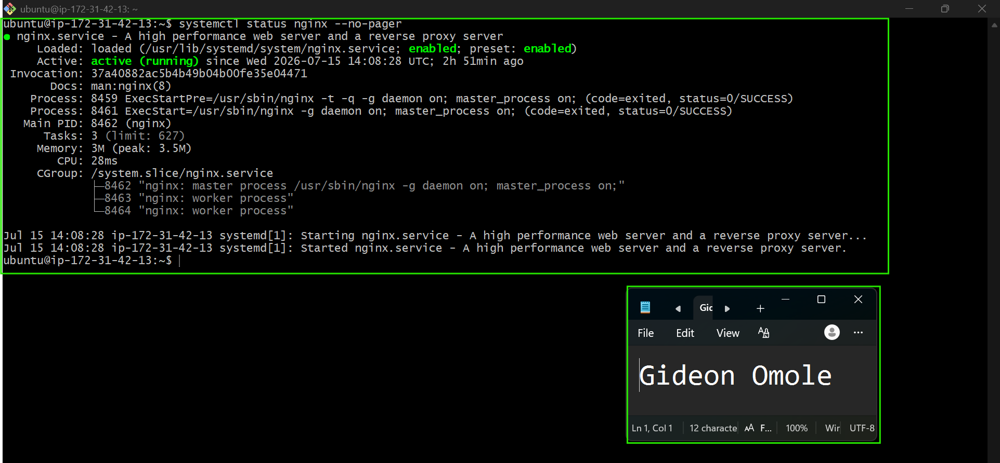

---

#### Screenshot 2 — Output of `sudo nginx -t`

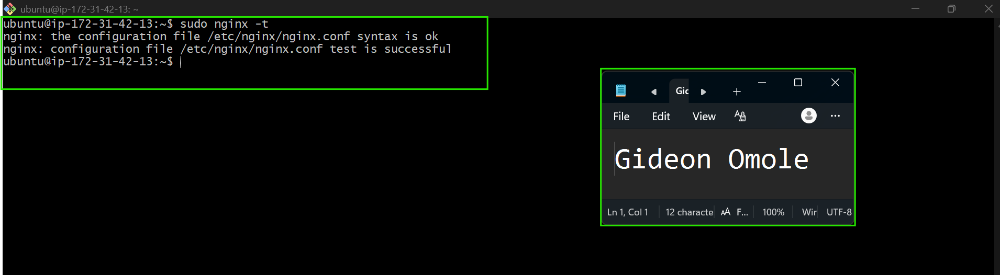

---

#### Screenshot 3 — Output of `sudo ss -lptn '( sport = :80 )'`

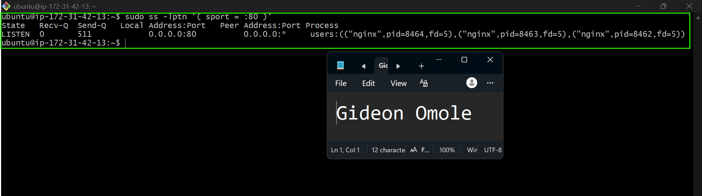

---

### Notes

Answer the following in your own words:

**1. What happens if Nginx fails to restart in production?**

If Nginx fails to restart, the site goes down immediately. There's no fallback process serving those static files, so anyone hitting the public IP gets a connection refused or timeout instead of the app.  
In a real production setup this would trigger monitoring alerts, but on a single EC2 instance like this one, it's on me to notice fast, since there's no redundancy or load balancer to pick up the slack.

---

**2. What's your basic rollback plan?**

Keep a backup of the last working config before making changes, e.g. `sudo cp default default.bak`. If something breaks after a restart, I check `systemctl status nginx` to see what went wrong, then restore the backup config and restart again. If the problem is with the app build instead of Nginx itself, I just redeploy the previous build folder to `/var/www/html/`, since the source code is safely stored in the repo either way.

---

# Task 3 — Logs & Request Trace

## Goal

Verify real traffic flow and analyze logs to understand system behavior and errors.

### Evidence

#### Screenshot 1 — Output of `sudo tail -n 30 /var/log/nginx/access.log`

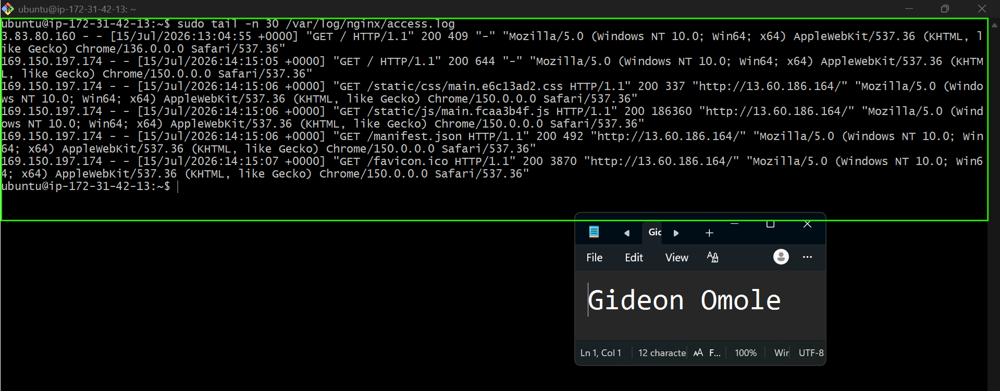

---

#### Screenshot 2 — Output of `sudo tail -n 30 /var/log/nginx/error.log`

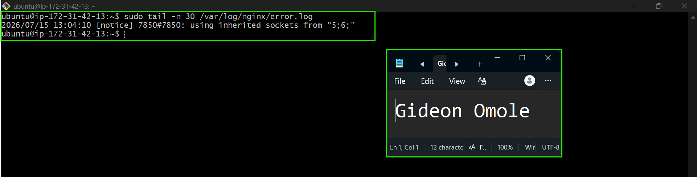

---

#### Screenshot 3 — Output of `sudo journalctl -u nginx --no-pager -n 50`

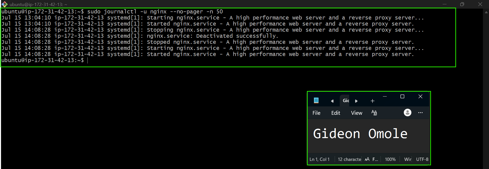

---

### Notes

Answer the following in your own words:

**1. Were there any errors in the logs?**

- If yes, mention 1–2 example error lines from the logs and explain what each one means in simple terms.
- If no, explain what it means if the error log is empty or shows no recent errors during your check.

No, there were no actual errors. The `error.log` only shows one line — `using inherited sockets from "5;6;"` which is just a routine startup notice, not a problem. It shows up every time Nginx restarts and simply means it picked up the existing network sockets instead of creating new ones. The `journalctl` output backs this up too: it just shows normal start/stop/restart events with no warnings or failures anywhere in the timeline.

---

**2. If there were no errors, what does that indicate about the system?**

It means Nginx is healthy and stable. No crashes, no failed restarts, no config issues being silently ignored the service started cleanly and has stayed running since. Basically, everything is working the way it's supposed to, with nothing in the logs suggesting hidden problems.

---

**3. Based on the access logs, were your curl requests visible in the log entries? What does that prove about traffic flow?**

Yes, the requests show up clearly. The access log has entries for `GET /`, along with the CSS, JS, manifest, and favicon files all loading with `200` status codes meaning every request succeeded. This proves the full traffic flow is working end-to-end: a request comes in from a real IP, Nginx picks it up, finds the right file in `/var/www/html`, and sends it back successfully. It also shows two different visitors hit the site (two different IPs and browsers), so the app really is reachable from outside, not just from my own machine.

---

# Task 4 — System Resource Health Check (Capacity Red Flags)

## Goal

Assess server capacity and detect potential performance or failure risks.

### Evidence

#### Screenshot 1 — Output of `uptime`

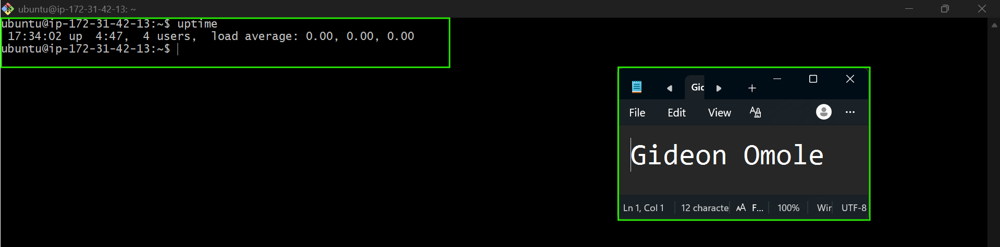

---

#### Screenshot 2 — Output of `free -h`

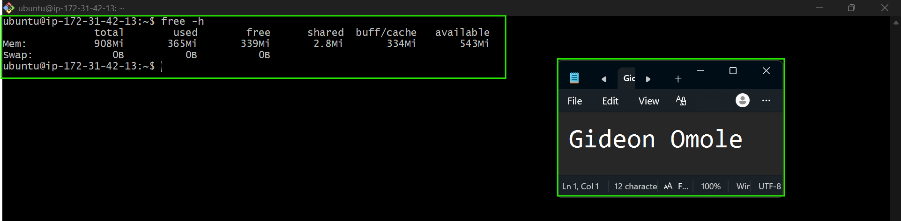

---

#### Screenshot 3 — Output of `df -h`

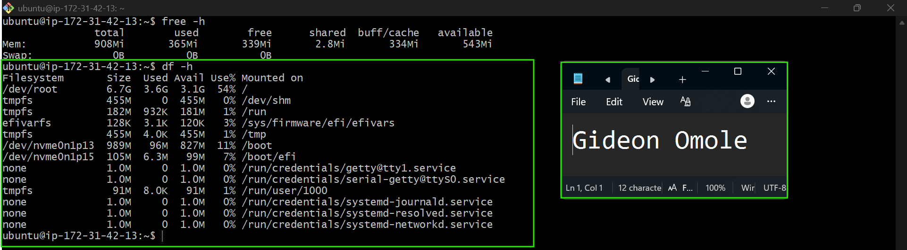

---

#### Screenshot 4 — Output of `sudo du -sh /var/* | sort -h`

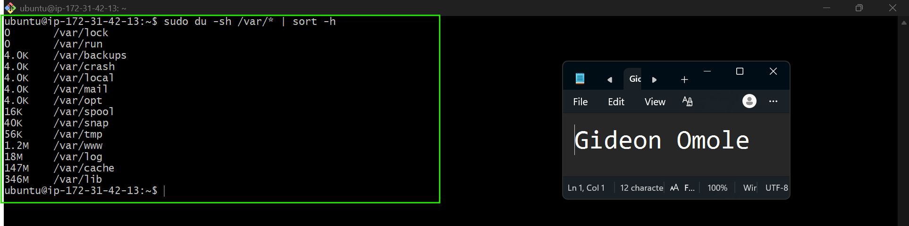

---

### Notes

Answer the following in your own words:

**1. Which resource looks most critical right now? (CPU/load, memory, or disk) Explain why.**

Memory is the most critical. Load average is 0.00, so the CPU is fine. Disk has 3.1GB free, so that's fine too. But this server only has 908Mi of RAM total, and it's already using 367Mi with just 541Mi left. It's not a problem right now, but out of the three, it has the least space left to grow if traffic increases.

---

**2. What happens if disk becomes 100% full in a production server?**

The server can't write anything new, logs stop recording, deployments fail, and the app can break if it needs to save temp files. In bad cases, even basic system tasks and SSH access can start failing. It usually takes manual cleanup to fix, so it's better to check disk space regularly before it gets full.

---

# Task 5 — Configuration & Deployment Verification

## Goal

Ensure the correct React build is deployed and Nginx is serving it properly.

### Evidence

#### Screenshot 1 — Output of `ls -lah /var/www/html | head -n 20`

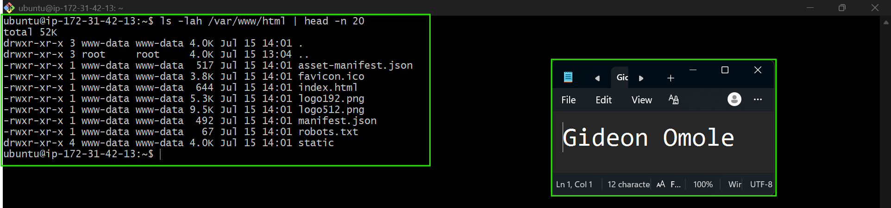

---

#### Screenshot 2 — Output of `grep -R "Deployed by" -n /var/www/html 2>/dev/null | head`

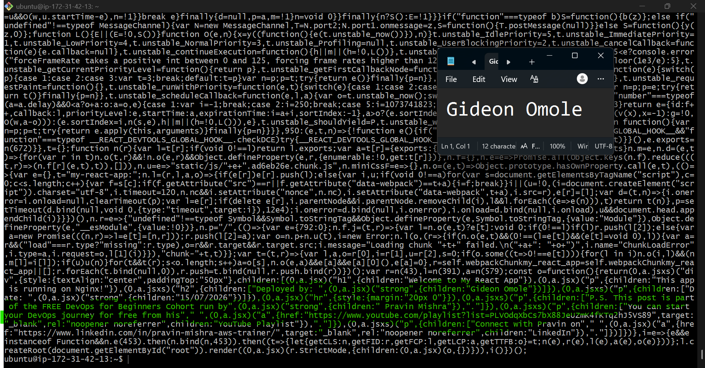

---

#### Screenshot 3 — Output of `grep -n "try_files" /etc/nginx/sites-available/default`

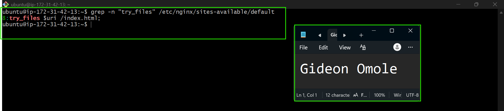

---

### Notes

Answer the following in your own words:

**1. How do you confirm that the correct version of the application is deployed?**

I ran `ls -lah /var/www/html` to check what files are actually sitting in the web root, and confirmed the expected React build files were there — `index.html`, the `static` folder (with the compiled JS and CSS), `manifest.json`, and `favicon.ico`, all with recent timestamps matching my last build. Next, I verified my personalization actually made it into the build by searching for "Deployed by" inside the JS file, which confirmed my name and the correct date were compiled into the running code, not just the source. I also checked the Nginx config at `/etc/nginx/sites-available/default` to make sure it was pointing to `/var/www/html` as the root and correctly routing requests with `try_files $uri /index.html`, so Nginx is serving the right app from the right location. Finally, I opened the site in a browser using the public IP and visually confirmed the page loaded correctly with my name and date displayed, which ties all the checks together and proves the correct version is truly live.

---

# Task 6 — Nginx Configuration Failure Simulation

## Goal

Simulate a real-world Nginx misconfiguration and recover the service safely.

### Evidence

#### Screenshot 1 — Output of `sudo nginx -t` showing the syntax error (broken config)

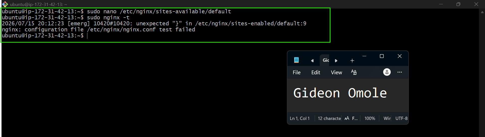

---

#### Screenshot 2 — Output of `sudo nginx -t` showing syntax ok (fixed config)

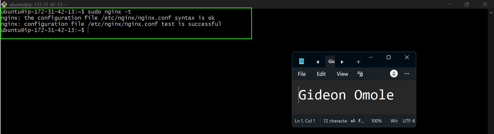

---

#### Screenshot 3 — Output of `curl -I http://<public-ip>` confirming recovery (200 OK)

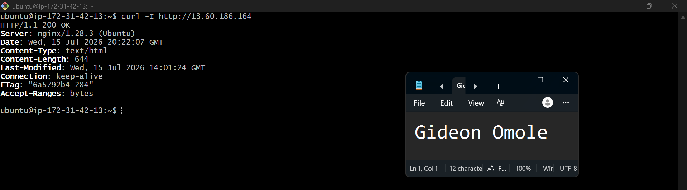

---

### Notes

Answer the following in your own words:

**1. What caused the configuration failure?**

Removing the semicolon after `try_files $uri /index.html` broke Nginx's config syntax. Nginx config files require every directive inside a block to end with a semicolon. Without it, Nginx can't tell where that line ends and the next one begins, so it fails to parse the file and refuses to load it.

---

**2. How did you fix the issue?**

I ran `sudo nginx -t` first, which showed the exact line number and syntax error, confirming where the problem was. Then I reopened the config with `sudo nano /etc/nginx/sites-available/default`, added the missing semicolon back to the `try_files` line, saved the file, and ran `sudo nginx -t` again to confirm the syntax was valid before restarting Nginx with `sudo systemctl restart nginx`.

---

**3. How can you avoid this kind of issue in real production systems?**

Always run `nginx -t` after any config change and before restarting the service. It catches syntax errors before they take the site down. Beyond that, config changes should ideally go through version control (like Git) so mistakes can be tracked and reverted quickly, and in a real team setting, changes would go through a review or staging step instead of being edited directly on a live production server.

---

# Task 7 — Web Application Failure Simulation

## Goal

Simulate missing deployment content and recover the application safely.

### Evidence

#### Screenshot 1 — Output of `curl -I http://<public-ip>` showing failure (non-200 response)

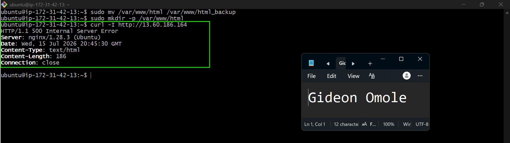

---

#### Screenshot 2 — Output of `curl -I http://<public-ip>` confirming recovery (200 OK)

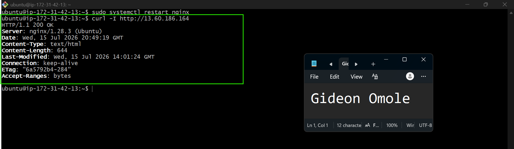

---

### Notes

Answer the following in your own words:

**1. What caused the application to break in this scenario?**

The web root directory (`/var/www/html`) was replaced with an empty folder, so Nginx had nothing to serve. Nginx itself was still running fine, but since there was no `index.html` or any content in the directory it was pointing to, requests returned a `500 Internal Server Error` instead of the actual app.

---

---

**2. How did you fix the issue and restore the application?**

I removed the empty placeholder directory with `sudo rm -rf /var/www/html`, then restored the original files by moving the backup back into place with `sudo mv /var/www/html_backup /var/www/html`. After that, I restarted Nginx with `sudo systemctl restart nginx` so it would pick up the restored content, and confirmed with `curl -I` that the site was returning `200 OK` again.

---

**3. What steps would you take to prevent this kind of issue in real production systems?**

Always keep a backup before deploying, and avoid overwriting the live folder directly. Set up monitoring so any downtime gets noticed right away instead of relying on someone checking manually.

---

# Task 8 — Security & Reliability Review

## Goal

Review and reflect on the security and reliability practices applied during this assignment.

### Security & Reliability Notes

Answer the following in your own words:

**1. Why is SSH key-based authentication more secure than sharing passwords?**

Passwords can be guessed, brute-forced, or leaked if reused across sites, and sharing them means multiple people know the same secret. SSH keys use a private/public key pair.The private key never leaves your machine, so there's nothing to steal in transit or guess through repeated login attempts. It's much harder to compromise a properly protected private key than a password.

---

**2. Why should only required ports be open on a production server?**

Every open port is a possible way in for an attacker. If a port isn't needed for the app to work, leaving it open just adds risk with no benefit. Keeping only essential ports open (like 22 for SSH and 80 for the web app) keeps the attack surface as small as possible, so there's less to defend and less that could go wrong.

---

**3. Why is it important for Nginx to be enabled on boot?**

If the server reboots whether from a crash, an update, or AWS maintenance, Nginx needs to start automatically, otherwise the website goes down and stays down until someone manually logs in and starts it. Enabling it on boot means the service recovers on its own without needing a person to intervene.

---

**4. What are the risks of sharing secrets, keys, or credentials publicly?**

Anyone who gets access to a shared key, password, or credential can use it to log into the server, access data, or rack up costs on the account often without you noticing right away. Leaked SSH keys or AWS credentials in particular can lead to a server being fully compromised or used for something malicious. Once a secret is exposed, it should be treated as compromised and rotated immediately.

---

**5. Why should cloud resources be stopped or terminated when they are no longer needed?**

Running resources cost money even when they're idle, so unused instances quietly rack up charges for nothing. Leaving them running also means unnecessary open ports and attack surface sitting around unmonitored. Stopping or terminating resources once they're done keeps costs down and reduces unnecessary security risk.

---

# LinkedIn Post (Required)

## Evidence

#### LinkedIn Post URL

Paste your LinkedIn post URL here:

`https://lnkd.in/p/epafgXzX`

---

#### Screenshot — Published LinkedIn post

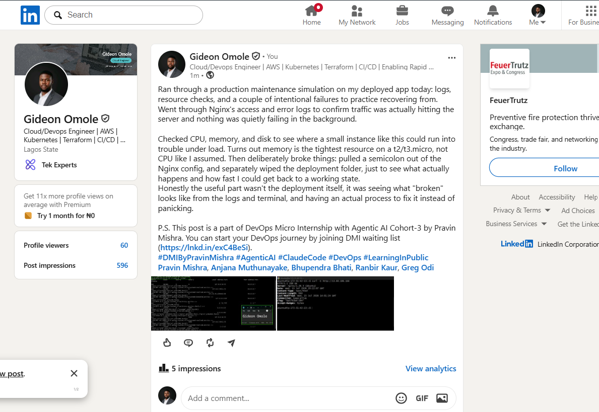

---

# Submission Instructions

- Add all required screenshots in your submission
- Full name must be visible in required screenshots
- Do not expose sensitive information (keys, passwords, account IDs)

---

# Completion Checklist

- [ ] Task 1: Screenshots (browser, ip a, ss -tulpen, ufw status) + Notes answered
- [ ] Task 2: Screenshots (nginx status, nginx -t, ss port 80) + Notes answered
- [ ] Task 3: Screenshots (access log, error log, journalctl) + Notes answered
- [ ] Task 4: Screenshots (uptime, free -h, df -h, du -sh) + Notes answered
- [ ] Task 5: Screenshots (ls html, grep deployed by, grep try_files) + Notes answered
- [ ] Task 6: Screenshots (nginx -t fail, nginx -t pass, curl recovery) + Notes answered
- [ ] Task 7: Screenshots (curl failure, curl recovery) + Notes answered
- [ ] Task 8: Security & Reliability Notes answered
- [ ] LinkedIn post published and URL submitted
- [ ] Full Name visible in all required screenshots
- [ ] No sensitive data exposed

---

## 📌 About DMI & CloudAdvisory

DevOps Micro Internship (DMI) is a project-based DevOps program run by Pravin Mishra (The CloudAdvisory) focused on real-world execution, systems thinking, and career readiness.

It helps learners build strong DevOps foundations with hands-on experience.

---

## 📌 Resources

- 🌐 DMI Official Website: https://pravinmishra.com/dmi  
- 🎓 DevOps for Beginners (Udemy): https://www.udemy.com/course/devops-for-beginners-docker-k8s-cloud-cicd-4-projects/  
- 🎓 Agentic AI DevOps with Claude Code: https://www.udemy.com/course/ultimate-agentic-ai-devops-with-claude-code/  
- 🎓 DevOps with Claude Code: Terraform, EKS, ArgoCD & Helm: https://www.udemy.com/course/devops-with-claude-code-terraform-eks-argocd-helm/  
- ▶️ YouTube Playlist: https://www.youtube.com/playlist?list=PLFeSNDtI4Cho  
- 🔗 Pravin Mishra (LinkedIn): https://www.linkedin.com/in/pravin-mishra-aws-trainer/  
- 🏢 CloudAdvisory (LinkedIn): https://www.linkedin.com/company/thecloudadvisory/

---

*This submission is part of DevOps Micro Internship (DMI) Cohort 3 — Agentic AI Track.*