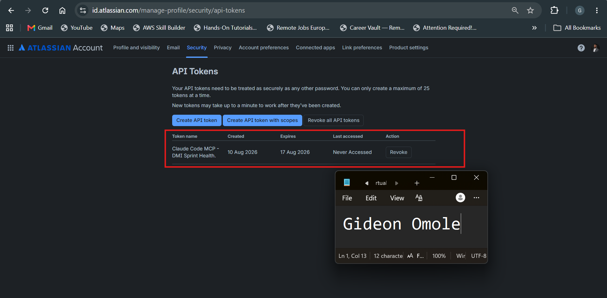
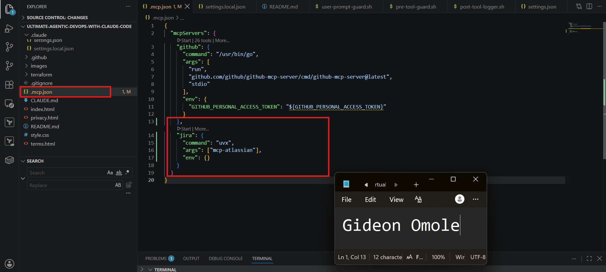
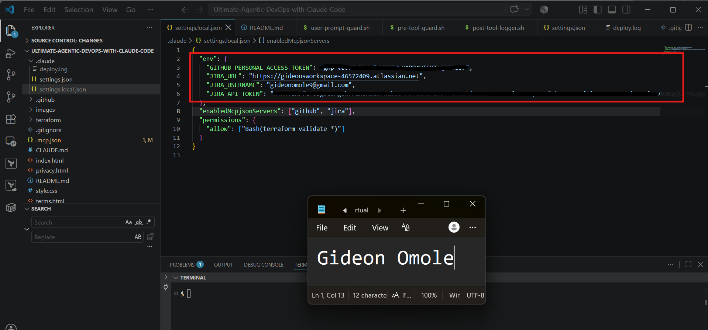
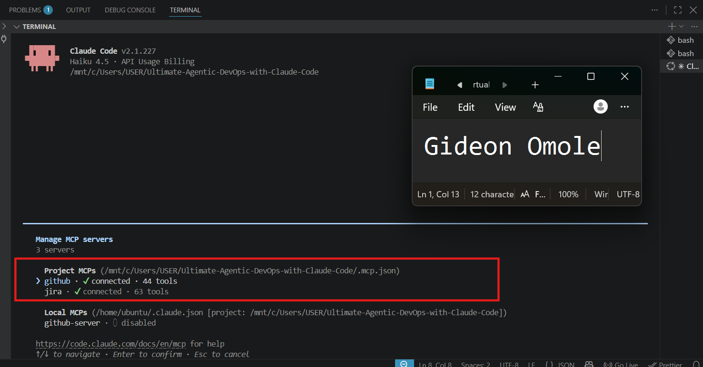
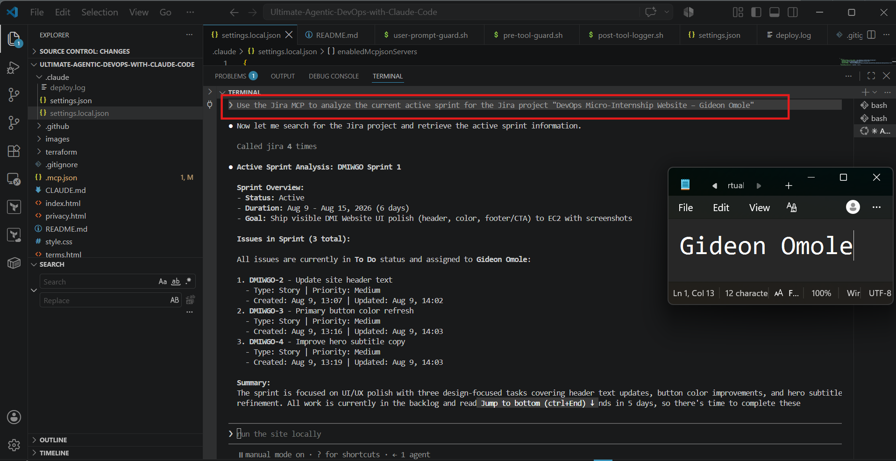
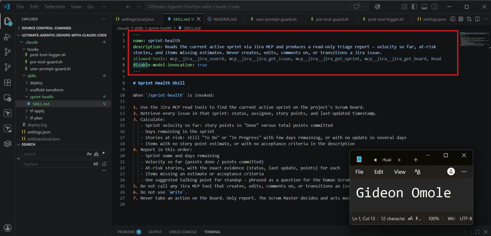
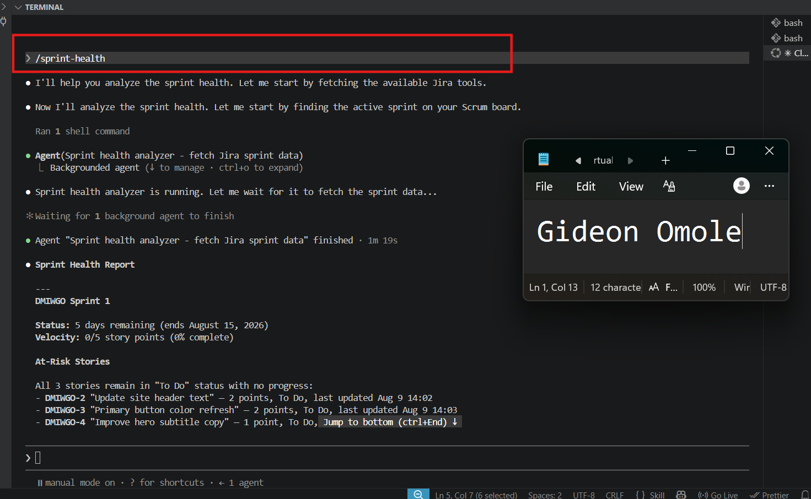
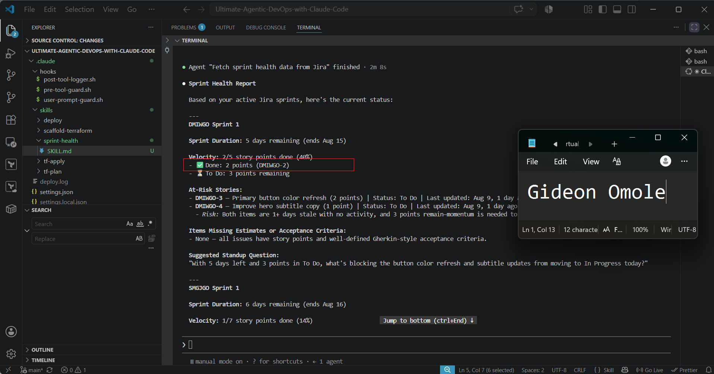

# Assignment 5 — AI-Assisted Sprint Health Report via Jira MCP

Part of the DevOps Micro Internship (DMI) Cohort 3 with Agentic AI

---

## Purpose

In this assignment, you will connect Claude Code to your Jira board through an MCP server, the same way you connected it to GitHub in Week 2, and build a read-only `/sprint-health` skill. The skill reads your current sprint through Jira's API and reports sprint velocity, stories at risk of missing the sprint, and items missing an estimate — but it must never create, edit, comment on, or transition a single ticket itself. You will prove that boundary holds by making a real change on the board yourself and confirming the skill only ever reports, never acts.

---

# Task 1 — Create a Jira API Token

## Goal

Generate an API token from your Atlassian account that the MCP server will use to authenticate with your Jira site. Do not screenshot the token value itself.

### Evidence

#### Screenshot 1 — Jira API token creation confirmation page showing the token name, with the token value not visible

.

### Notes You Must Write (Very Important):

Why does the MCP server need your site URL and account email in addition to the token?

Jira's REST API authenticates using Basic Auth, which requires a username (your email) and a secret (the API token) together — the token alone doesn't identify which Atlassian account it belongs to or which Jira site to connect to, since Atlassian hosts many separate instances (your-site.atlassian.net is yours specifically, distinct from anyone else's). The token proves "this really is you," the email says "on behalf of this specific account," and the URL says "talk to this specific Jira instance, not some other one."

---

# Task 2 — Create .mcp.json at the Project Root

## Goal

Create or update `.mcp.json` at your project root with a Jira MCP server block, following the same shape as the GitHub MCP server you configured in Week 2.

### Evidence

#### Screenshot 2 — `.mcp.json` open in VS Code showing the Jira server configuration

.

### Notes You Must Write (Very Important):

Compare this jira block to the github block from Week 2 Assignment 5. The GitHub server ran via npx (a Node.js package); this one runs via uvx (a Python package) — what stays exactly the same shape despite that difference, and why doesn't Claude Code care which language a given MCP server is written in?

Despite running via different languages (npx for Node.js vs. uvx for Python), both blocks keep the exact same four part structure: a server name, a command (the executable used to launch the server), an args array (arguments passed to that command), and an env object (environment variables the server needs).

Claude Code doesn't care what language the server is written in because .mcp.json only tells it how to start the process, it just runs the given command with the given arguments. Once the process is running, Claude Code communicates with it using the MCP protocol over stdio, which is a standardized, language agnostic messaging format. Since the protocol, not the implementation language, defines how Claude Code and the server exchange information, any MCP server (Go, Python, Node, etc.) can be plugged in the same way, as long as it speaks MCP correctly.

---

# Task 3 — Add Your Credentials to settings.local.json

## Goal

Add your Jira site URL, account email, and API token to `.claude/settings.local.json`, and confirm that file is listed in `.gitignore` so it is never committed.

### Evidence

#### Screenshot 3 — `settings.local.json` open in VS Code showing the `env` section, with the actual token value blurred or covered

.

### Notes You Must Write (Very Important):

Why must JIRA_API_TOKEN live in settings.local.json and never in .mcp.json?

The .gitignore file tells Git which files or folders should not be tracked or committed to the repository.
Since settings.local.json contains sensitive information such as API tokens, usernames, and URLs, it should never be pushed to GitHub. By adding it to .gitignore, you protect your credentials while still allowing other project files to be committed safely.

---

# Task 4 — Verify the Connection with /mcp

## Goal

Restart Claude Code and confirm the Jira MCP server shows as connected.

### Evidence

#### Screenshot 4 — `/mcp` output showing `jira: connected`

---

# Task 5 — Run a Live Query to Prove Real Board Data

## Goal

Ask Claude to list the issues in your current active sprint through the Jira MCP connection, and confirm the result matches what you see on your live board in the browser.

### Evidence

#### Screenshot 5 — Claude's response showing the live sprint issue list retrieved via Jira MCP

### Notes You Must Write (Very Important):

How did you confirm this was real board data and not something Claude guessed?

Here's an answer you can adapt (fill in specifics if yours differed):

I confirmed it was real data and not a guess by comparing the exact details in Claude's response against my live Jira board in the browser side by side. The issue keys, titles, statuses, and assignees Claude listed matched precisely what was showing on the board, including specific ticket numbers like SMGJGO-2 and SMGJGO-20 through SMGJGO-23, which are not something Claude could have invented on its own since they are unique to my Jira instance. I also checked that the sprint name and issue count matched what I saw under Worked on and Assigned to me on my Jira home page. If Claude had been guessing or hallucinating, it would not have been able to reproduce these exact identifiers, since they are specific to my account and only retrievable through the actual Jira MCP connection making a live API call using my credentials.

---

# Task 6 — Build the /sprint-health Skill

## Goal

Create a `/sprint-health` skill restricted to read-only Jira tools plus `Read`, with no issue-mutating tools and no `Write`. Run it and confirm it produces a report covering sprint velocity, at-risk stories, and items missing an estimate.

### Evidence

#### Screenshot 6 — `SKILL.md` frontmatter showing `allowed-tools` limited to read-only Jira tools plus `Read`, with `disable-model-invocation: true`

#### Screenshot 7 — `/sprint-health` output showing the full triage report against your real sprint

### Notes You Must Write (Very Important):

1. Which Jira MCP tools does this skill's allowed-tools list include, and which mutating tools (create issue, update issue, transition issue, add comment) does it deliberately exclude?

The allowed-tools list includes only read-only Jira operations, specifically tools like jira_get_issue, jira_search (or jira_jql), jira_get_sprint, jira_get_sprints_from_board, jira_get_board, and jira_get_project, along with the built-in Read tool for reading local files. It deliberately excludes every tool that can change data in Jira, including jira_create_issue, jira_update_issue, jira_transition_issue, jira_add_comment, jira_delete_issue, and jira_link_issues. It also excludes the built-in Write tool, so the skill cannot create or modify files either. This means the skill can only look at sprint data and report on it, it cannot create tickets, change statuses, add comments, or edit anything on the board.

2. Why does a Scrum Master need this restriction more than almost any other role in this course?

A Scrum Master's job is to observe and report on the health of a sprint, not to unilaterally change what the team is working on. If this skill could create, update, or transition issues, an automated report could accidentally move a story to Done, alter an estimate, or add a misleading comment without a human ever reviewing or approving the change. Because sprint health reports are often generated frequently and sometimes without close supervision, giving them full write access to Jira would introduce a real risk of silently corrupting the sprint backlog or the board's history in a way that misrepresents what the team actually did. Restricting this skill to read-only access ensures it can safely observe and summarize velocity, at-risk stories, and missing estimates without ever being able to alter the source of truth that the whole team, and stakeholders, rely on for planning and reporting.

---

# Task 7 — Prove the Skill Never Mutates the Board

## Goal

Manually update one ticket on your board in the browser (for example, move a story to "Done" or add a missing estimate), then run `/sprint-health` again and confirm the new report reflects your change — proving the skill only ever reads live state and never wrote to the board itself.

### Evidence

#### Screenshot 8 — Second `/sprint-health` run showing the report now reflects your manual board change

### Notes You Must Write (Very Important):

Map this assignment to Gather → Analyze → Human Act → Verify from Week 3 Assignment 6. Which step did you perform manually in the browser, and why must that step stay human?

Here's an answer using your specific ticket:

I manually changed the status of DMIGO-2 to Done directly in the browser, which corresponds to the Human Act step in the Gather → Analyze → Human Act → Verify framework. The /sprint-health skill itself only performs the Gather step, pulling live sprint data through read only Jira MCP tools, and the Analyze step, turning that data into a report on velocity, at risk stories, and missing estimates. Running the skill a second time and seeing DMIGO-2 reflected as Done in the new report was the Verify step, confirming that the skill is reading live board state rather than cached or stale data.

The status change itself must stay a human action because moving a ticket to Done is a judgment call about whether the actual work is truly complete, tested, and ready to be counted toward the sprint's delivered value. If the skill were allowed to make that change itself, it could mark work as finished based on incomplete or misleading signals, effectively fabricating progress on the board. Keeping mutation restricted to a human ensures that whoever changes the state of a ticket is accountable for that decision, while the skill's role stays limited to observing and reporting on whatever state the team has actually chosen to put the board in.

---

# Submission Instructions

Complete all tasks in sequence.

Your submission must include:
- All 8 required screenshots
- All the required notes

---

# Completion Checklist

- [ ] Task 1: Jira API token created, value never screenshotted (Screenshot 1)
- [ ] Task 2: `.mcp.json` has the Jira server block (Screenshot 2)
- [ ] Task 3: Credentials stored in `settings.local.json`, token blurred, file gitignored (Screenshot 3)
- [ ] Task 4: `/mcp` shows the Jira server connected (Screenshot 4)
- [ ] Task 5: Live query returned real sprint data, verified against the browser (Screenshot 5)
- [ ] Task 6: `/sprint-health` skill created with correct read-only `allowed-tools`, and produced a full report (Screenshots 6–7)
- [ ] Task 7: A manual board change was reflected in a second `/sprint-health` run (Screenshot 8)
- [ ] Skill never created, edited, transitioned, or commented on any issue
- [ ] Reflection answered (Notes)
- [ ] No API token value exposed

---

## 📌 About DMI & CloudAdvisory

DevOps Micro Internship (DMI) is a project-based DevOps program run by Pravin Mishra (The CloudAdvisory) focused on real-world execution, systems thinking, and career readiness.

It helps learners build strong DevOps foundations with hands-on experience.

---

## 📌 Resources

- 🌐 DMI Official Website: https://dmi.pravinmishra.com?utm_source=github&utm_medium=readme  
- 🎓 University: https://university.pravinmishra.com?utm_source=github&utm_medium=readme  
- 💬 Discord Community: https://discord.pravinmishra.com?utm_source=github&utm_medium=readme  
- 📝 Blog: https://dmi.pravinmishra.com/blog?utm_source=github&utm_medium=readme  
- ▶️ YouTube Playlist: https://www.youtube.com/playlist?list=PLFeSNDtI4Cho  
- 🔗 Pravin Mishra (LinkedIn): https://www.linkedin.com/in/pravin-mishra-aws-trainer/  
- 🏢 CloudAdvisory (LinkedIn): https://www.linkedin.com/company/thecloudadvisory/

---

*This submission is part of DevOps Micro Internship (DMI) Cohort 3 — Agentic AI Track.*
