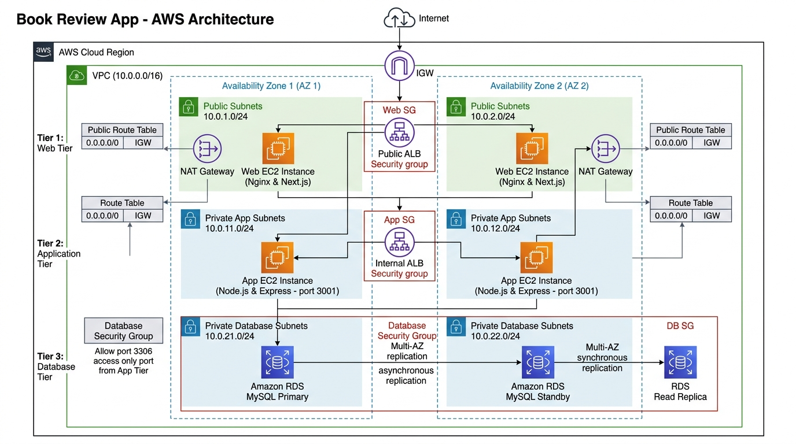
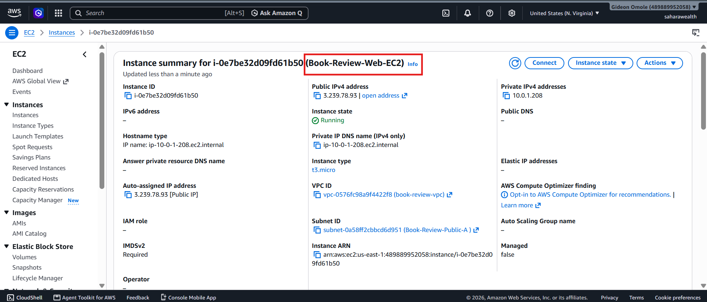
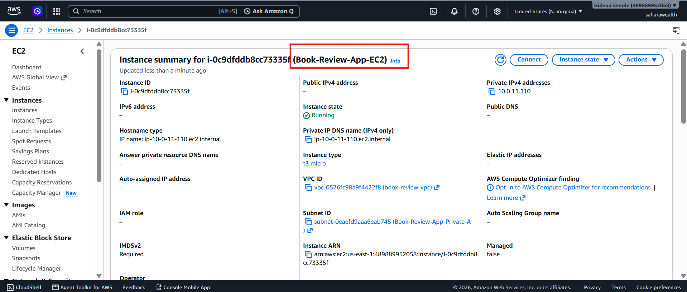
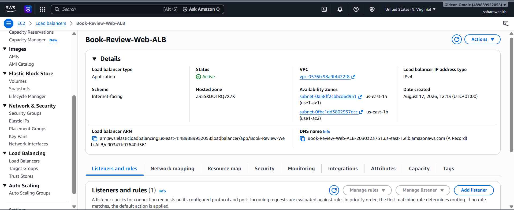
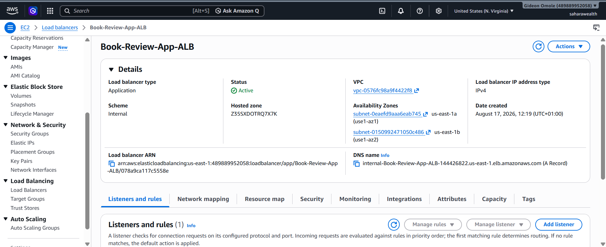
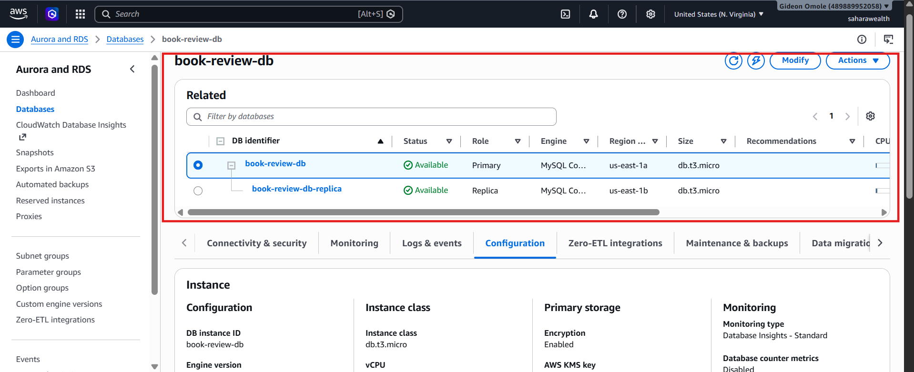
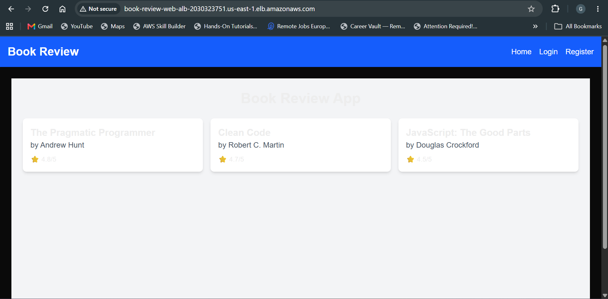
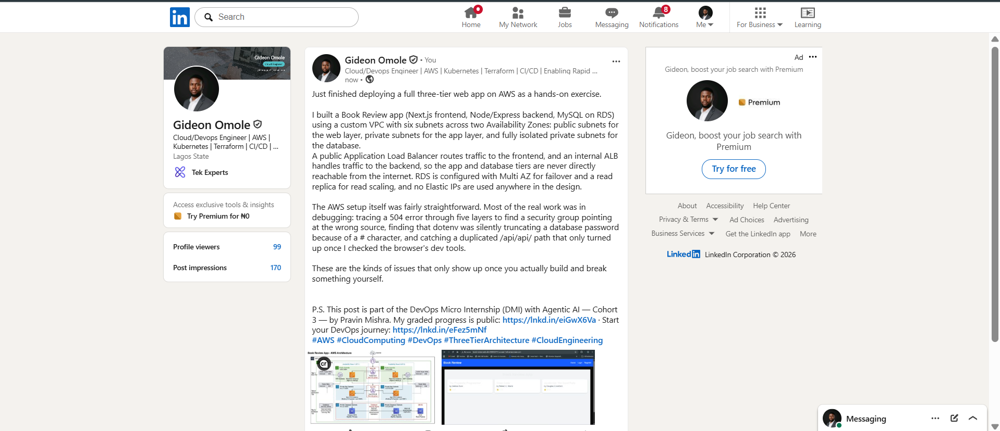

# Assignment 6 — Capstone Assignment — Deploy Book Review App (Three-Tier Architecture) on AWS

Part of the DevOps Micro Internship (DMI) Cohort 3 with Agentic AI

---

## Purpose

This is the most important assignment of the course. You will deploy the Book Review App in a fully production-style three-tier architecture on AWS: a Next.js Web Tier behind Nginx and a public ALB, a private Node.js/Express App Tier behind an internal ALB, and a private Multi-AZ MySQL RDS database with a read replica. You are expected to design, deploy, isolate, debug, and document the result independently.

---

# Task 1 — Architecture Diagram

## Goal

Create an architecture diagram showing the custom VPC (10.0.0.0/16), the six subnets across two Availability Zones (two public Web Tier, two private App Tier, two private Database Tier), the public ALB, Web Tier EC2/Nginx, internal ALB, private App Tier EC2, private Multi-AZ RDS with its read replica, and the permitted traffic flow.

### Evidence

#### Diagram image or link

---

# Task 2 — AWS Region & Services Used

## Goal

Record the AWS Region used and list every AWS service used across networking, compute, load balancing, security, and the database.

### Notes

**Region:**

us-east-1

---

**Services:**

Amazon VPC, Subnets (public/private), Internet Gateway, NAT Gateway, Route Tables, 
Amazon EC2 (Web Tier & App Tier), Application Load Balancer (public), 
Application Load Balancer (internal), Security Groups, Amazon RDS for MySQL 
(Multi-AZ + Read Replica)

---

# Task 3 — Public Entry Point

## Goal

Confirm the Book Review App loads through the public ALB DNS name.

### Evidence

#### Public ALB DNS

Paste your public ALB DNS name here:

`Book-Review-Web-ALB-2030323751.us-east-1.elb.amazonaws.com`

---

# Task 4 — Evidence Screenshots

## Goal

Capture visual proof of every tier and load balancer.

### Evidence

#### Web EC2

---

#### App EC2

---

#### Public ALB

---

#### Internal ALB

---

#### RDS + Replica

---

#### App UI proof

---

# Task 5 — Summary

## Goal

Summarize what worked in the final deployment, the issues encountered and how each was fixed, and the tools or sources used to research and debug.

### Notes

**What worked:**

The full three-tier architecture deployed successfully: a custom VPC with six subnets across two AZs, a public ALB routing to the Nginx/Next.js Web Tier, an internal ALB routing to the Node.js/Express App Tier, and RDS MySQL with Multi-AZ and a read replica in fully private subnets. The application is reachable both directly via the Web EC2's public IP and through the Public ALB DNS name, with the full request chain (browser → Nginx → Internal ALB → App EC2 → RDS) working end-to-end — homepage loads, book list populates, and the API responds correctly.

---

**Issues + fixes:**

- **SSH connection to a private App EC2 instance:** Resolved by using the Web EC2 as a bastion/jump host — copied the private key over with `scp`, set `chmod 400` permissions, then SSH'd from the Web EC2 into the App EC2's private IP.
- **SSH hang when connecting Web EC2 → App EC2:** Caused by the App Tier Security Group not allowing inbound SSH (22) from the Web Tier. Fixed by adding that rule temporarily for the bastion hop.
- **RDS `Access denied` error despite correct credentials:** The database password contained a `#` character, which dotenv silently truncated as a comment when unquoted in `.env`. Fixed by wrapping the password in quotes (`DB_PASS="password#"`) and confirmed with a debug log of `process.env` values before removing it.
- **504 Gateway Timeout on `/api/books` through Nginx:** Diagnosed layer by layer — backend worked locally, but the Internal ALB's target group showed the App EC2 as unhealthy. Root cause was a missing/incorrect Security Group chain: the App Tier SG needed to allow port 3001 from the Internal ALB's security group specifically, not from the Web Tier SG directly. Created dedicated ALB security groups (`Web-ALB-SG`, `App-ALB-SG`) so each hop in the chain (Public ALB → Web EC2 → Internal ALB → App EC2 → RDS) was explicitly authorized rather than relying on a self-referencing or reused security group.
- **503 from the Public ALB / timeout on direct public IP:** Caused by over-restricting the Web Tier SG to ALB-only traffic, which blocked both direct public access and, separately, the Web Target Group had no registered targets. Fixed by registering the Web EC2 with the Web Target Group and re-adding a rule allowing HTTP 80 from `0.0.0.0/0` alongside the ALB-sourced rule.
- **`/api/api/books` 404 on the frontend:** The homepage loaded but showed "No books available." Root cause traced via browser DevTools Network tab to a duplicated `/api` path — `NEXT_PUBLIC_API_URL` was set to `/api` in `.env.local`, but the frontend's `services/api.js` already appended `/api/...` to every request. Fixed by setting `NEXT_PUBLIC_API_URL` to blank, then rebuilding with `npm run build` and restarting via `pm2 restart frontend` (required since Next.js bakes env vars in at build time).
- **PM2 not surviving reboot:** `pm2 save` alone doesn't register PM2 with systemd. Fixed by running `pm2 startup`, executing the generated `sudo env PATH=...` command, then re-running `pm2 save`; verified with `systemctl is-enabled pm2-ubuntu`.
- **Terminal paste corruption (Git Bash/mintty):** Pasting produced garbled escape-code output instead of clean text. Worked around by generating secrets directly on the remote instance (`echo "VAR=$(openssl rand -hex 32)" >> .env`) instead of pasting pre-generated values.
- **Database Tier Security Group misconfiguration:** Caught during a review of the deployment guide — the DB Security Group's inbound rule was sourced from the Web Tier SG instead of the App Tier SG, which would have allowed the Web EC2 to bypass the App Tier and connect directly to MySQL. Corrected to source only from the App Tier SG, enforcing the intended tier isolation.

---

**Tools/sources used:**

AWS Console (EC2, VPC, RDS, Target Groups, Load Balancers, Security Groups), AWS documentation, Chrome DevTools (Network and Console tabs) for diagnosing the frontend 404 and CORS behavior, `curl` for layer-by-layer connectivity testing (localhost → Nginx → Internal ALB), `pm2` and `systemctl` for process/service verification, and ChatGPT/Claude for debugging guidance throughout — particularly for isolating multi-layer networking failures (Security Group chains, target group health) and diagnosing the `.env` password-truncation and `/api/api` path-doubling bugs.

---

# LinkedIn Post (Required)

## Goal

Publish a LinkedIn post sharing the capstone deployment, including the public ALB DNS (or a redacted screenshot), three to five lines on what you built and why it is production-style, and one proof screenshot.

## Evidence

#### LinkedIn Post URL

Paste your LinkedIn post URL here:

`https://www.linkedin.com/posts/gideon-omole-5ba318180_aws-cloudcomputing-devops-ugcPost-7495160589305090048-6RtO/?utm_source=share&utm_medium=member_desktop&rcm=ACoAACrC7l4BK-z0pGwSRQMO8ZJ5pFZyqybbIk4`

---

#### Screenshot of LinkedIn post

---

# Submission Instructions

- Add all required screenshots and links in your submission
- Do not expose passwords, RDS credentials, connection strings, private keys, or account IDs

---

# Completion Checklist

- [ ] Task 1: Architecture diagram completed
- [ ] Task 2: AWS Region and services documented
- [ ] Task 3: Public ALB DNS confirmed working
- [ ] Task 4: All six evidence screenshots captured (Web Tier, App Tier, both ALBs, RDS + replica, app UI)
- [ ] Task 5: Deployment summary completed (what worked, issues/fixes, tools/sources)
- [ ] LinkedIn post published and URL submitted
- [ ] App Tier and Database Tier confirmed not publicly accessible
- [ ] No sensitive data exposed

---

## 📌 About DMI & CloudAdvisory

DevOps Micro Internship (DMI) is a project-based DevOps program run by Pravin Mishra (The CloudAdvisory) focused on real-world execution, systems thinking, and career readiness.

It helps learners build strong DevOps foundations with hands-on experience.

---

## 📌 Resources

- 🌐 DMI Official Website: https://dmi.pravinmishra.com?utm_source=github&utm_medium=readme  
- 🎓 University: https://university.pravinmishra.com?utm_source=github&utm_medium=readme  
- 💬 Discord Community: https://discord.pravinmishra.com?utm_source=github&utm_medium=readme  
- 📝 Blog: https://dmi.pravinmishra.com/blog?utm_source=github&utm_medium=readme  
- ▶️ YouTube Playlist: https://www.youtube.com/playlist?list=PLFeSNDtI4Cho  
- 🔗 Pravin Mishra (LinkedIn): https://www.linkedin.com/in/pravin-mishra-aws-trainer/  
- 🏢 CloudAdvisory (LinkedIn): https://www.linkedin.com/company/thecloudadvisory/

---

*This submission is part of DevOps Micro Internship (DMI) Cohort 3 — Agentic AI Track.*