# Assignment 7 — AI-Assisted AWS Security and Cost Audit

Part of the DevOps Micro Internship (DMI) Cohort 3 with Agentic AI

---

## Purpose

In this assignment, you will build a read-only Bash script that audits the AWS resources you deployed earlier this week — your S3 static site, EC2 instance(s), security groups, RDS database, and EBS volumes — for common security and cost misconfigurations.

You will then connect that script to Claude Code as a reusable `/aws-audit` skill that explains what it found and recommends a fix, without ever making the fix itself.

Finally, you will find a real misconfiguration in your own account, apply the fix yourself, and prove it worked with a second audit run.

---

# Task 1 — Confirm Your AWS Resources and Set Up Your Workspace

## Goal

Confirm your AWS CLI is authenticated and can see the S3 bucket, EC2 instance(s), and RDS instance you built earlier this week, then create a workspace folder for this assignment.

### Evidence

#### Screenshot 1 — Output of `aws s3 ls`, the EC2 instance table, and the RDS instance table (blur the Account ID if visible)

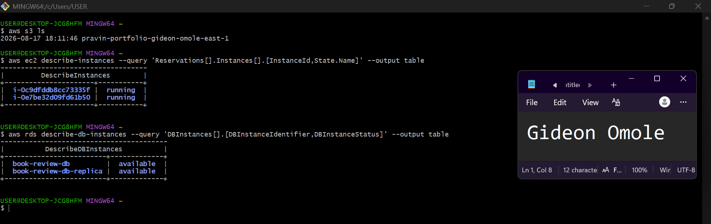

---

#### Screenshot 2 — Output of `pwd` and `find . -maxdepth 4 -type d | sort`

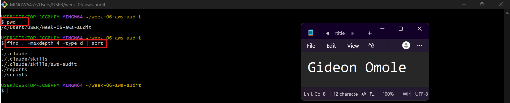

---

### Notes You Must Write (Very Important)

**1. Which resources from this week's earlier assignments did you see in the listings?**

I saw the AWS resources I created in the previous assignments, including S3 buckets for the portfolio website, EC2 instances used for the Mini Finance, EpicBook, and Book Review applications, security groups, VPC networking components, and RDS MySQL databases. The later assignments also included resources such as Application Load Balancers, Auto Scaling Groups, NAT Gateways, and Multi-AZ RDS. These resources were created as part of building and deploying the applications across the previous assignments.

**2. Why must you confirm your resources exist before writing an audit script against them?**

I must confirm that the resources exist so the audit script targets the correct AWS resources and does not fail because of missing or incorrect resource IDs, names, or regions. It also helps ensure that the audit checks the infrastructure I actually deployed and gives accurate security and cost findings.

---

# Task 2 — Define Safety Rules in CLAUDE.md

## Goal

Create a `CLAUDE.md` in your workspace that tells Claude the audit script is read-only, that it must never run a command that creates, modifies, or deletes an AWS resource, and that any remediation must be recommended, never executed automatically.

### Evidence

#### Screenshot 3 — `CLAUDE.md` open in VS Code showing all four sections

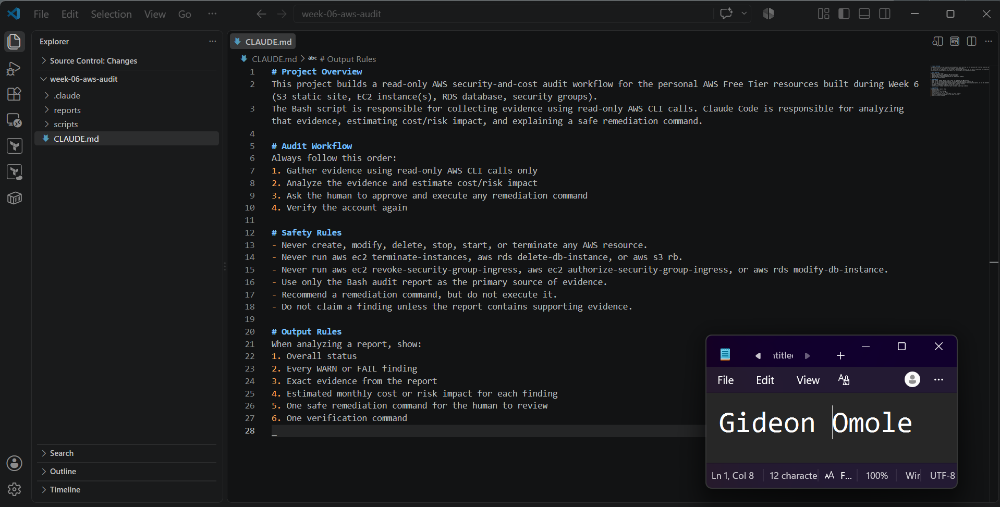

---

### Notes You Must Write (Very Important)

**1. Why should Claude never be given permission to run `revoke-security-group-ingress` itself, even if the fix is obviously correct?**

Claude should only identify and explain security issues, not make changes to AWS resources. Giving it permission to run revoke-security-group-ingress could allow it to accidentally remove a required security rule and cause an application or service to stop working. The actual remediation should always be reviewed and executed manually by me.

**2. Which rule prevents Claude from claiming a finding that the report does not support?**

The rule “Do not claim a finding unless the report contains supporting evidence” prevents Claude from making unsupported claims. It requires Claude to base every security or cost finding on evidence contained in the Bash audit report.

---

# Task 3 — Plan the Audit with Claude Code

## Goal

Ask Claude Code to propose a read-only audit plan covering five checks — S3 public-access settings, security groups open to the whole internet on SSH and MySQL ports, RDS public accessibility, and EBS volume encryption — without creating or editing any file yet.

### Evidence

#### Screenshot 4 — Claude Code showing the five-check plan

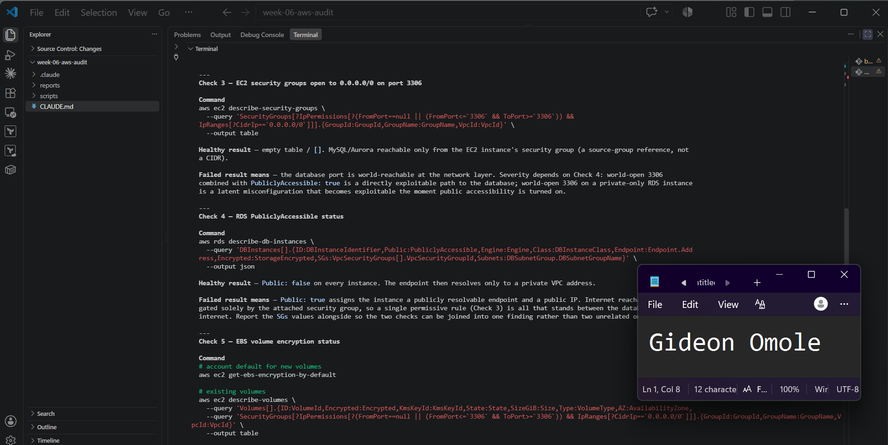

---

### Notes You Must Write (Very Important)

**1. Which part of this task represents the Gather phase?**

The Gather phase is where Claude proposes and uses the read-only AWS CLI commands to collect evidence about the five security and cost checks. This includes commands such as get-public-access-block, list-buckets, describe-security-groups, describe-db-instances, and describe-volumes. The purpose is to collect the information needed before analyzing any findings.

**2. Did every proposed command start with `describe-`, `get-`, or `list-`? Why does that matter?**

Yes. The proposed AWS CLI commands use read-only operations beginning with get-, describe-, or list-. For example, Claude proposed aws s3control get-public-access-block, aws s3api list-buckets, aws ec2 describe-security-groups, and aws rds describe-db-instances.

This matters because these commands only retrieve information from AWS and do not create, modify, or delete resources. That keeps the audit in the Gather phase and follows the safety rules in CLAUDE.md.

---

# Task 4 — Build the AWS Audit Script

## Goal

Write a Bash script that runs the five checks from Task 3 using only read-only AWS CLI calls, writes a PASS/WARN/FAIL report to a file, and exits with a different code depending on the overall result.

Make it executable and confirm it has no syntax errors.

### Evidence

#### Screenshot 5 — Top section of `aws-audit.sh` showing the variables and the checks array

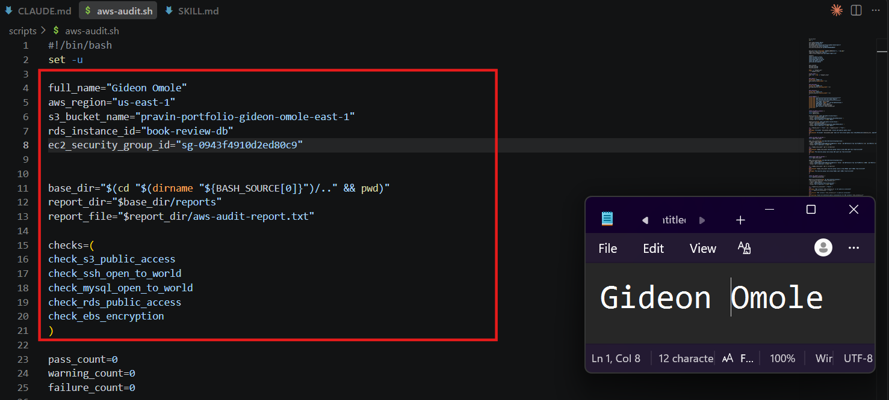

---

#### Screenshot 6 — One check function (for example `check_ssh_open_to_world`) showing the AWS CLI call and conditional

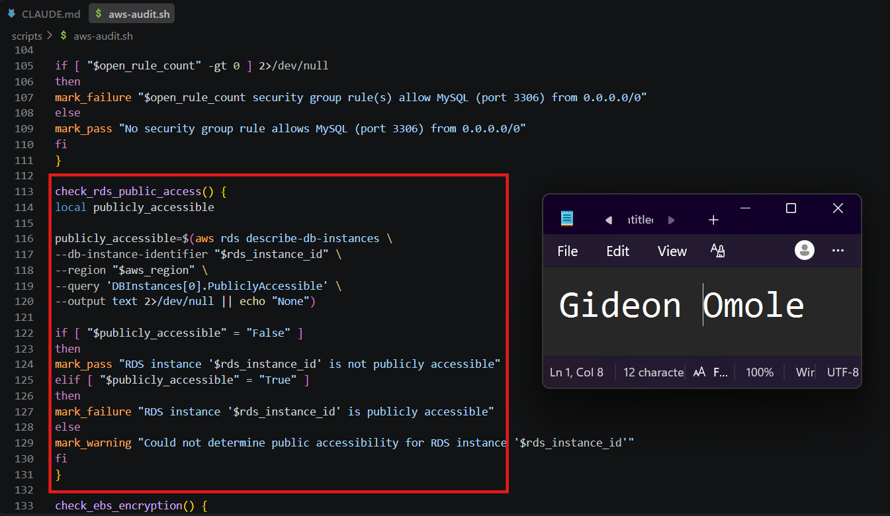

---

#### Screenshot 7 — Output of `bash -n scripts/aws-audit.sh` and `ls -l scripts/aws-audit.sh`

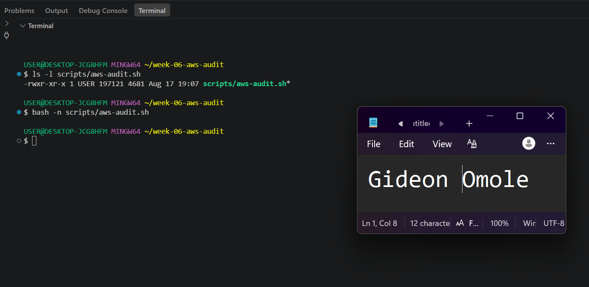

---

### Notes You Must Write (Very Important)

**1. What is stored in the checks array, and how does the loop use it?**

The `checks` array stores the **names of the five audit functions**:

- `check_s3_public_access`
- `check_ssh_open_to_world`
- `check_mysql_open_to_world`
- `check_rds_public_access`
- `check_ebs_encryption`

The loop goes through each function name in the array and executes it using `"$check_function"`. This allows the script to run all five audit checks automatically without calling each function individually.

**2. Why does every AWS CLI call in this script use `--query` and `--output text` instead of parsing raw JSON?**

`--query` extracts **only the specific information the script needs** from the AWS response, while `--output text` returns the result in a simple format that Bash can easily compare and use in conditions.

For example, the script can directly check whether RDS returns `True` or `False` instead of parsing a complete JSON response. This keeps the script simpler and easier to process.

**3. Why does the script use different exit codes for HEALTHY, WARN, and FAIL?**

The different exit codes allow other tools or automation to understand the audit result programmatically:

- **`0` — HEALTHY:** No problems were found.
- **`1` — WARN:** A warning was found, but no critical failure occurred.
- **`2` — FAIL:** One or more serious security failures were found.

This makes the audit useful for automation because another script or CI/CD system can check the exit code and determine whether the audit passed, produced warnings, or failed.

---

# Task 5 — Run the Baseline Audit

## Goal

Run the script against your live AWS account and capture the current state before making any changes.

### Evidence

#### Screenshot 8 — Output of `./scripts/aws-audit.sh` showing your Full Name and all five checks

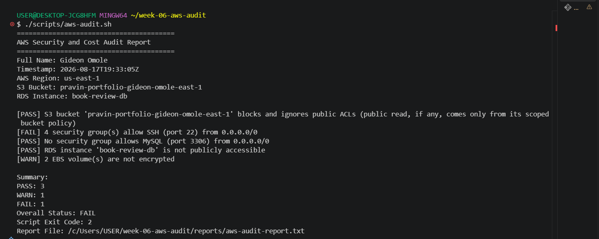

---

#### Screenshot 9 — Output showing the captured exit code and final summary

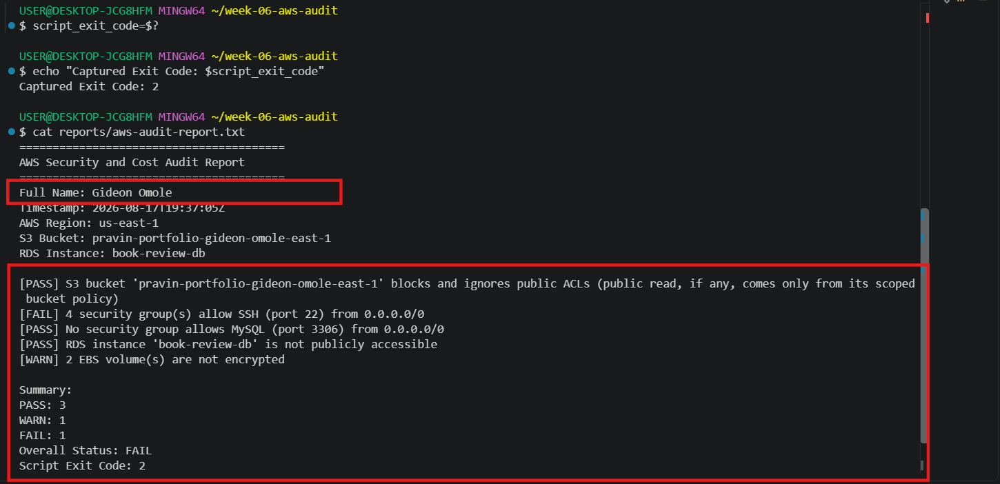

---

### Notes You Must Write (Very Important)

**1. What is the overall status of your baseline audit?**

The overall baseline audit status is FAIL, with 3 PASS, 1 WARN, and 1 FAIL. The captured exit code was 2, which indicates a FAIL status.

**2. Did any check return FAIL or WARN? If so, which one, and what evidence did it show?**

FAIL: 4 security groups allow SSH (port 22) from 0.0.0.0/0, meaning SSH access is open to the entire internet.
WARN: 2 EBS volumes are not encrypted.

The other three checks passed:

S3 bucket blocks public ACLs.
No security group allows MySQL (port 3306) from the internet.
RDS instance is not publicly accessible.
The **EBS volume encryption check** returned:

> `[WARN] 2 EBS volume(s) are not encrypted`

This means the audit found **2 EBS volumes that are not encrypted**.

The other four checks passed:
- S3 public-access protection — PASS
- SSH port 22 open to the internet — PASS
- MySQL port 3306 open to the internet — PASS
- RDS public accessibility — PASS

**3. If every check passed, what does that tell you about the security posture of your account so far?**

If every check had passed, it would indicate that the audited areas of the AWS account currently have a healthy security posture, with no detected issues in the checks performed. However, in this baseline audit, there are security issues that need to be reviewed and remediated.

---

# Task 6 — Build and Run the /aws-audit Skill

## Goal

Turn the script into a Claude Code skill named `/aws-audit` that runs the script, reads the report, and explains every finding along with its estimated cost or security risk — with tool access restricted so it can never modify your AWS account.

### Evidence

#### Screenshot 10 — `SKILL.md` showing the frontmatter, tool restrictions, and safety rules

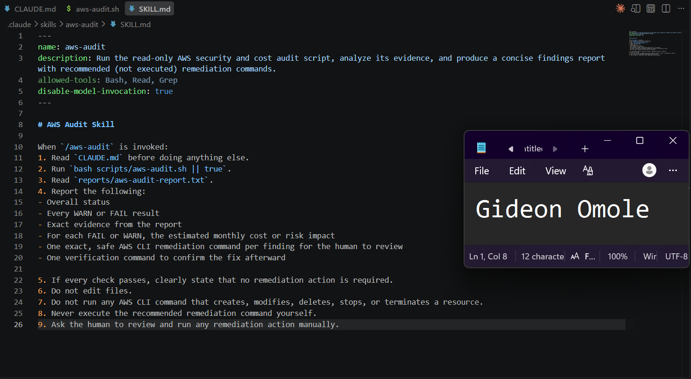

---

#### Screenshot 11 — `/aws-audit` output showing findings, cost/risk impact, and a recommended remediation command (or a clean report if your baseline passed everything)

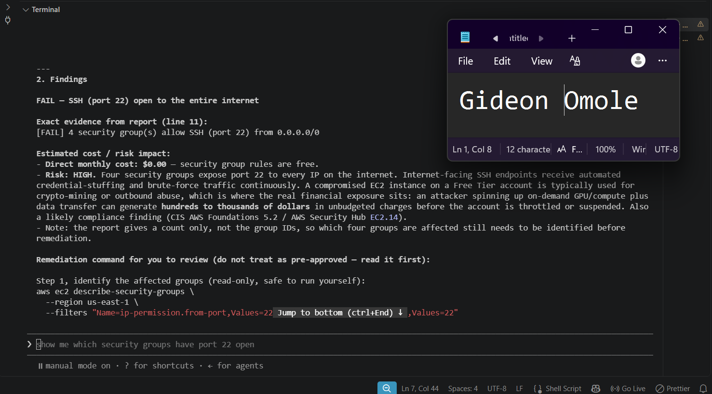

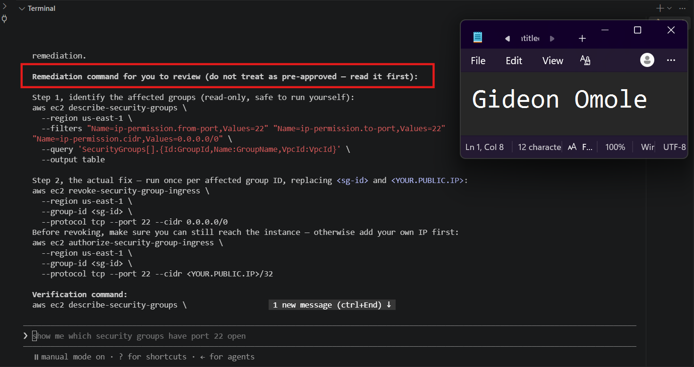

---

### Notes You Must Write (Very Important)

**1. Why does this skill have Bash, Read, and Grep, but not Write?**

The skill is designed to be **read-only**.

- **Bash** – runs the audit script and read-only AWS commands.
- **Read** – reads `CLAUDE.md` and the audit report.
- **Grep** – searches files for specific information.
- **Write** – is not included because Claude should **not modify files** during the audit.

This follows the **least-privilege principle**.

**2. What part is performed by Bash, and what part is performed by Claude?**

**Bash performs the actual checks and collects the evidence.**

For example, the audit script checks whether EBS volumes are encrypted, whether SSH is open to the internet, and whether RDS is publicly accessible.

**Claude reads the results and analyzes them.** It explains the findings, assesses the risk, estimates potential costs, and recommends remediation commands.

In simple terms:

> **Bash = collect and check the data**  
> **Claude = analyze and explain the results**

**3. Why is estimating cost/risk impact something the AI adds on top of a plain PASS/FAIL script?**

A `PASS` or `FAIL` only tells you **whether something is configured correctly**. It doesn't explain how important the finding is.

Claude adds context such as:

- **Risk:** How serious is the issue?
- **Cost:** Could fixing it or leaving it unresolved cost money?
- **Impact:** What could happen if it isn't fixed?
- **Priority:** Should it be addressed immediately?

---

# Task 7 — Fix a Real Finding and Re-Verify

## Goal

Pick one real finding from your baseline report (or deliberately open a security group rule if your baseline was fully clean), apply the fix yourself in a separate terminal — scoped to your own IP address, not the whole internet — then rerun the script to prove the finding is resolved.

### Evidence

#### Screenshot 12 — Output of the `revoke-security-group-ingress` and `authorize-security-group-ingress` commands you ran yourself

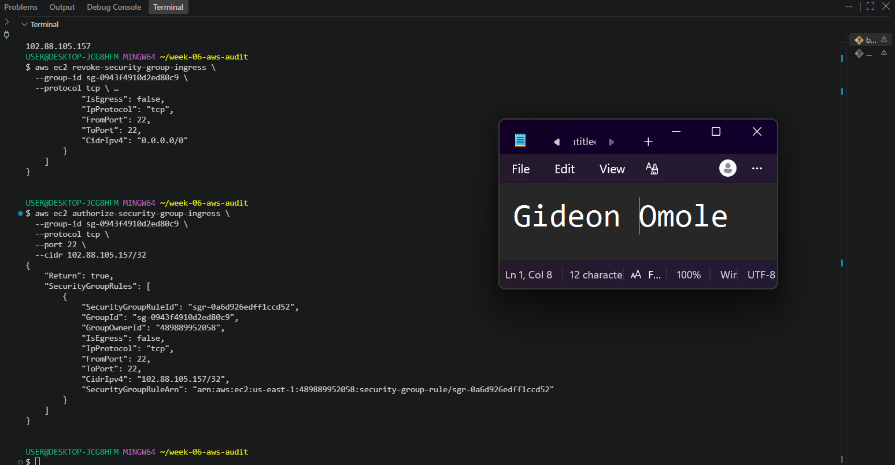

---

#### Screenshot 13 — Rerun of `./scripts/aws-audit.sh` showing the finding is now PASS

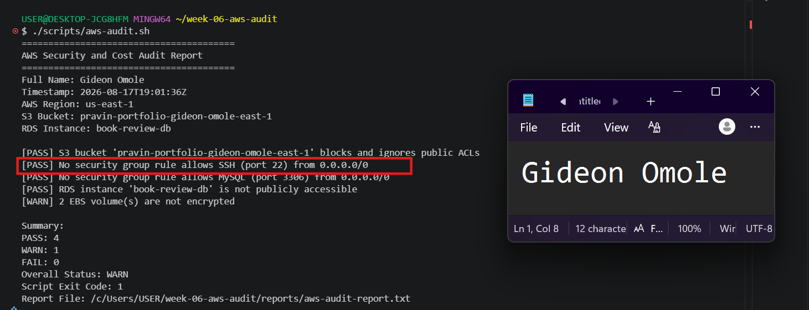

---

### Notes You Must Write (Very Important)

**1. Which exact finding did you fix, and what command did you run?**

I fixed the **SSH access from 0.0.0.0/0** finding.

I first removed SSH access from the entire internet.
Then I allowed SSH access only from my public IP.
The audit now confirms: [PASS] No security group rule allows SSH (port 22) from 0.0.0.0/0

**2. Why did you scope the new rule to your own IP address instead of leaving it open to `0.0.0.0/0`?**

I scoped it to my own IP address to follow the principle of least privilege.

0.0.0.0/0 allows SSH connections from anywhere on the internet, while /32 allows access from only one specific IPv4 address.

This reduces the attack surface while still allowing me to connect to my EC2 instance.

**3. Did Claude execute the remediation command, or did you? Why does that matter?**

I executed the remediation commands myself.

Claude only recommended the commands and explained what they would do.

This matters because the commands modify AWS security configuration. Keeping the final remediation under human control prevents the AI from making potentially disruptive changes without human approval.

**4. Which phase of the Agentic Loop does the Bash script represent? Which phase does Claude's explanation represent? Which phase is you running the fix?**

Bash audit script → Observe: It collects information and checks the current AWS configuration.
Claude's explanation → Analyze/Reason: Claude interprets the evidence, identifies the problem, and recommends a solution.
Me running the fix → Act: I execute the remediation command and change the AWS configuration.
Re-running the audit → Verify: The audit confirms that the SSH finding has been fixed.

---

# LinkedIn Post (Required)

## Goal

Create a LinkedIn post including:

- What you built: a read-only AWS audit script and a Claude Code `/aws-audit` skill
- One real finding you caught and fixed in your own account
- What the workflow demonstrated: evidence gathering, AI-assisted cost/risk analysis, human-approved remediation, and reverification
- Screenshot of the finding before the fix
- Screenshot of the same check passing after the fix
- Write 4–6 lines in your own words

Suggested tags:

`#DMIByPravinMishra #AWS #AgenticAI #ClaudeCode #DevOps`

### Evidence

#### LinkedIn Post URL

Paste your LinkedIn post URL here:

`https://www.linkedin.com/posts/gideon-omole-5ba318180_dmibypravinmishra-aws-agenticai-ugcPost-7495208532028420097-RDMk/?utm_source=share&utm_medium=member_desktop&rcm=ACoAACrC7l4BK-z0pGwSRQMO8ZJ5pFZyqybbIk4`

---

#### Screenshot of Published LinkedIn Post

---

# Submission Instructions

Complete all tasks in sequence.

Your submission must include:

- All 13 required task screenshots
- Answers to every **Notes You Must Write** question
- `CLAUDE.md`
- `scripts/aws-audit.sh`
- `.claude/skills/aws-audit/SKILL.md`
- `reports/aws-audit-report.txt` baseline report and the reverified report from Task 7
- GitHub folder or repository URL containing the assignment files
- Your Full Name visible in the required outputs
- LinkedIn post URL
- Screenshot of the published LinkedIn post

Submit only a Google Doc link.

Add the GitHub URL inside the Google Doc.

Follow the Assignment Submission Guidelines.

---

# Completion Checklist

- [ ] Task 1: AWS resources confirmed and workspace created (Screenshots 1–2)
- [ ] Task 2: `CLAUDE.md` created with project context and safety rules (Screenshot 3)
- [ ] Task 3: Claude produced a read-only five-check audit plan before any script existed (Screenshot 4)
- [ ] Task 4: `aws-audit.sh` built, executable, and passes `bash -n` (Screenshots 5–7)
- [ ] Task 5: Baseline audit captured and saved with Full Name visible (Screenshots 8–9)
- [ ] Task 6: `/aws-audit` skill loads and runs successfully with no Write permission (Screenshots 10–11)
- [ ] Task 7: A real finding was fixed by you and reverified as PASS (Screenshots 12–13)
- [ ] Skill never executed a remediation command
- [ ] New security group rule is scoped to your own IP, not `0.0.0.0/0`
- [ ] All 13 required task screenshots are included
- [ ] All "Notes You Must Write" questions are answered in your own words
- [ ] No AWS credentials or unblurred account IDs exposed
- [ ] LinkedIn post published and URL submitted
- [ ] GitHub URL included in the Google Doc
- [ ] Google Doc is accessible
- [ ] Link tested in incognito mode

---

# Final Submission

Submit only your Google Doc link.

### Question

Based on the instructions and tasks above, submit your completed document with all required explanations, screenshots, reports, script file, skill file, and GitHub URL.

`Add your Google Doc link here`

---

## 📌 About DMI & CloudAdvisory

DevOps Micro Internship (DMI) is a project-based DevOps program run by Pravin Mishra (The CloudAdvisory) focused on real-world execution, systems thinking, and career readiness.

It helps learners build strong DevOps foundations with hands-on experience.

---

## 📌 Resources

- 🌐 DMI Official Website: https://dmi.pravinmishra.com?utm_source=github&utm_medium=readme  
- 🎓 University: https://university.pravinmishra.com?utm_source=github&utm_medium=readme  
- 💬 Discord Community: https://discord.pravinmishra.com?utm_source=github&utm_medium=readme  
- 📝 Blog: https://dmi.pravinmishra.com/blog?utm_source=github&utm_medium=readme  
- ▶️ YouTube Playlist: https://www.youtube.com/playlist?list=PLFeSNDtI4Cho  
- 🔗 Pravin Mishra (LinkedIn): https://www.linkedin.com/in/pravin-mishra-aws-trainer/  
- 🏢 CloudAdvisory (LinkedIn): https://www.linkedin.com/company/thecloudadvisory/

---

*This submission is part of DevOps Micro Internship (DMI) Cohort 3 — Agentic AI Track.*