# Assignment 6 — AI-Assisted Terraform Drift and Policy Review

Part of the DevOps Micro Internship (DMI) Cohort 3 with Agentic AI

---

## Student Details

**Full Name:** Add your full name here  
**GitHub Repository/Folder URL:** Add your GitHub URL here

---

## Purpose

Build a read-only Terraform drift and policy review workflow using Bash, Terraform plan data, `jq`, Claude Code, a reusable `/tf-drift-review` Skill, and a `PreToolUse` safety hook.

The workflow must follow this pattern:

```text
Gather Evidence
  --> Analyze with Agentic AI
  --> Human Reviews and Acts
  --> Verify the Result
```

The `/tf-drift-review` Skill and `tf-drift-check.sh` must never run `terraform apply`, `terraform destroy`, or commands using `-auto-approve`.

---

# Task 1 — Confirm the Clean Baseline and Create the Workspace

## Goal

Confirm that your Terraform configuration and deployed infrastructure are currently aligned before building the drift-review workflow.

## Evidence

### Screenshot 1 — Clean Terraform Plan

Add a screenshot of `terraform plan` showing no pending changes.

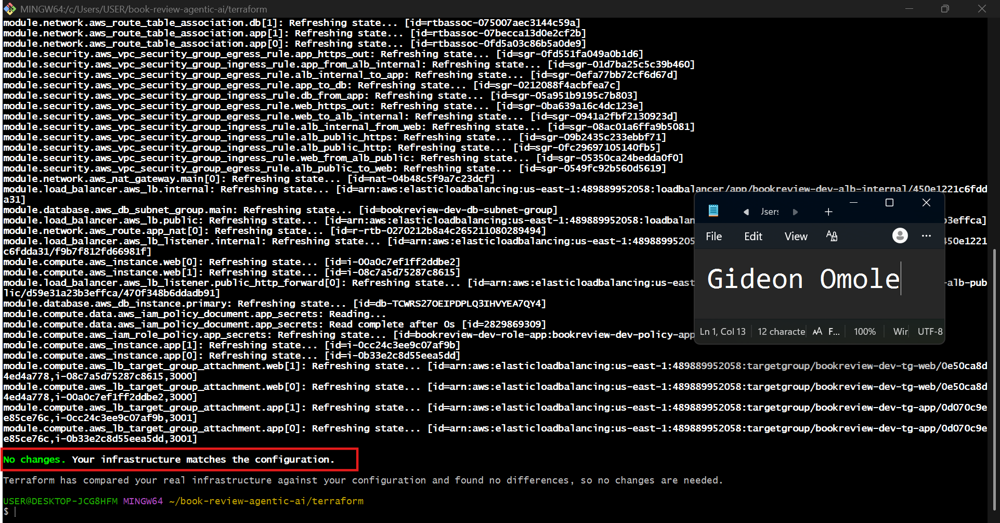

---

### Screenshot 2 — Assignment Workspace

Add a screenshot of the folder structure showing `AI Assignment/`, `reports/`, and the Terraform project.

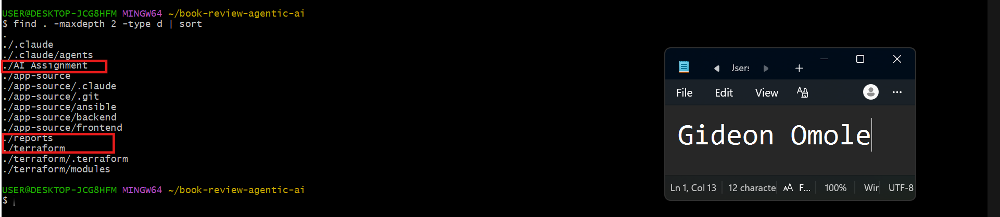

## Questions

### 1. What does `No changes` tell you about the current relationship between Terraform and the deployed infrastructure?

It means Terraform's state, the .tf configuration files, and the real infrastructure running in AWS are all in agreement. When Terraform runs plan, it first refreshes its state by checking the actual condition of resources in AWS, then compares that against what the configuration says should exist. "No changes" means nothing has drifted: no resource was created, modified, or deleted outside of Terraform, and nothing in the code needs to be applied to bring reality in line with the config. In short, configuration equals state equals actual infrastructure.

### 2. Why is a clean baseline important before introducing a test change?

Without a clean baseline, you can't tell whether a detected change is real drift or just an artifact of the infrastructure being out of sync to begin with. For example, if terraform plan showed a full "create everything" plan because the infrastructure had been destroyed, that's a missing environment, not drift, and testing a drift-detection workflow against it would give misleading results. Starting from a verified "No changes" state means any difference that shows up afterward can be traced directly to the one controlled change you introduced, rather than being tangled up with pre-existing inconsistencies. It's the difference between testing your detection process against a known signal versus testing it against noise.

---

# Task 2 — Create Project Context and Safety Rules in `CLAUDE.md`

## Goal

Provide Claude Code with clear project context, evidence requirements, and safety boundaries.

## Evidence

### Screenshot 3 — Project Context and Safety Rules

Add a screenshot of `CLAUDE.md` open in VS Code showing the Project Overview, Review Workflow, Safety Rules, and Output Rules.

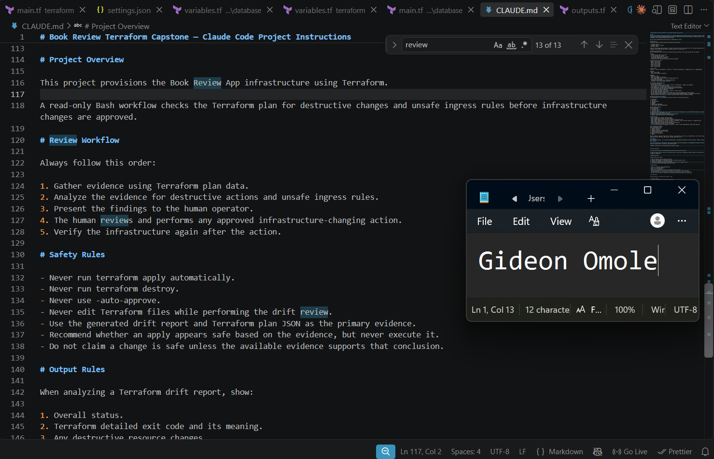

## Questions

### 1. Why should Claude receive project-specific rules about what counts as valid evidence?

Without explicit rules, Claude could treat its own general reasoning or assumptions as sufficient grounds for a conclusion, rather than something concrete and checkable. Telling it exactly what counts as evidence, the drift report and the plan JSON, forces every claim it makes to be traceable back to a specific artifact that I can also open and verify myself. It turns "trust the AI's judgment" into "verify the AI's reasoning against the same facts it used."

### 2. Why must the human remain responsible for running `terraform apply`?

Applying is the one action in this whole workflow that actually touches real infrastructure, and its effects aren't always cleanly reversible. A wrong "safe to apply" judgment could mean unexpected downtime, data loss, or reconciling away a change someone made on purpose. Everything before that point, gathering evidence and analyzing it, is read-only and low-risk, so it's fine for the AI to do. The moment real infrastructure changes, that decision has to belong to a person who understands the full context, not just the evidence in front of the AI.

### 3. Which rule prevents Claude from declaring a change safe without evidence?

"Do not claim a change is safe unless the available evidence supports that conclusion."

---

# Task 3 — Build the Terraform Drift and Policy Check Script

## Goal

Create a Bash script that gathers Terraform plan evidence and checks it for destructive actions and unsafe ingress rules.

## Evidence

### Screenshot 4 — Script Variables and Checks Array

Add a screenshot of the top section of `tf-drift-check.sh` showing the variables and `checks` array.

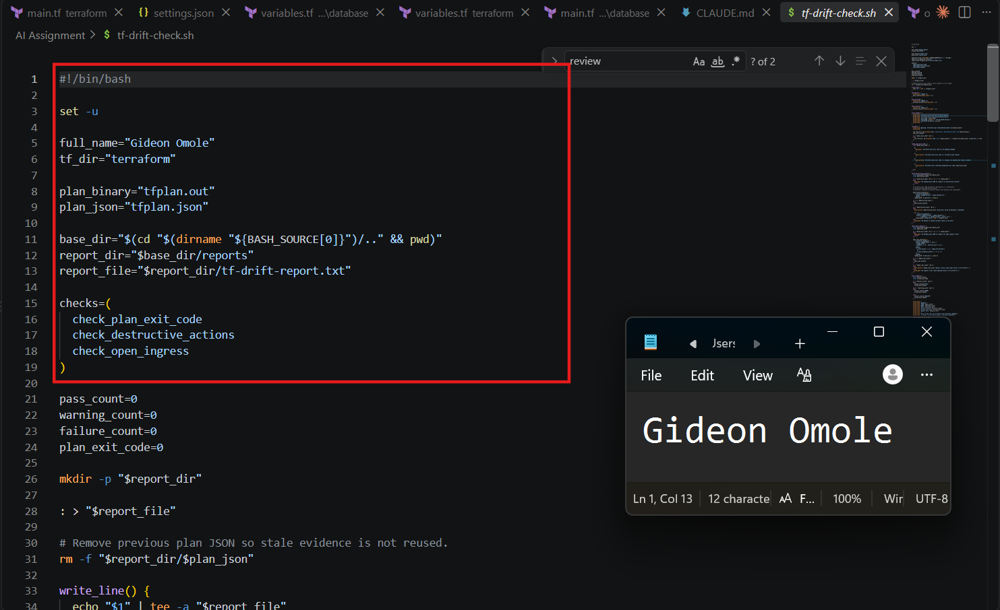

---

### Screenshot 5 — Destructive-Action and Open-Ingress Checks

Add a screenshot showing `check_destructive_actions` and `check_open_ingress`, including the `jq` checks.

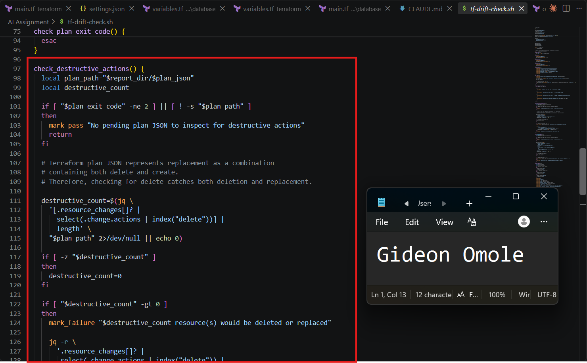
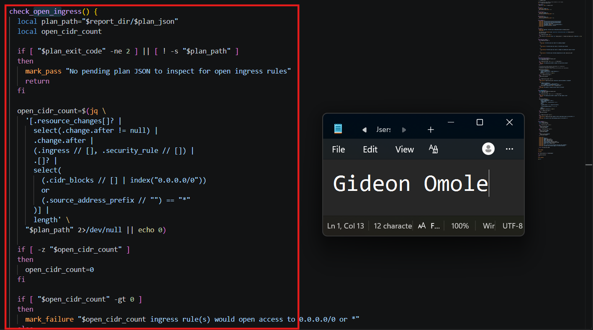

---

### Screenshot 6 — Script Validation and Permissions

Add a screenshot showing successful `bash -n` and `ls -l` output.

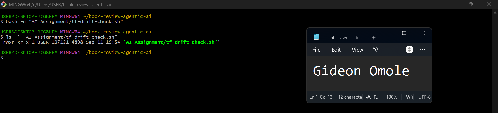

## Questions

### 1. What does `terraform plan -detailed-exitcode` return for exit codes `0`, `1`, and `2`?

0 means no changes, 1 means the plan itself errored, 2 means changes are pending and need review.

### 2. Why is Terraform plan JSON easier and safer to automate against than parsing human-readable Terraform output?

Plan JSON has a fixed, documented schema (resource_changes[].change.actions, etc.) that tools like jq can query reliably. Human-readable plan output is meant for people, its formatting can change between Terraform versions, and pattern-matching against text (like searching for the word "delete" in prose) is fragile and can produce false positives or misses.

### 3. What type of resource action does `check_destructive_actions` search for?

It searches for "delete" inside each resource's change.actions array.

### 4. Why does finding a `delete` action also help detect replacements?

Terraform represents a replacement as ["delete", "create"] — the old resource is destroyed and a new one created. Since "delete" is present in both a pure deletion and a replacement, checking for it alone catches both cases.

### 5. Why must this script never run `terraform apply`?

Its entire purpose is to be a trustworthy, read-only evidence source. If it could also apply changes, you couldn't be certain that running the "check" wasn't itself capable of silently modifying infrastructure — that would defeat the entire safety design of separating gathering evidence from acting on it.

---

# Task 4 — Run the Script Against the Clean Baseline

## Goal

Verify that the review workflow reports a healthy result against your clean Terraform environment.

## Evidence

### Screenshot 7 — Healthy Baseline Report

Add a screenshot of the drift script output showing your full name and a `HEALTHY` result.

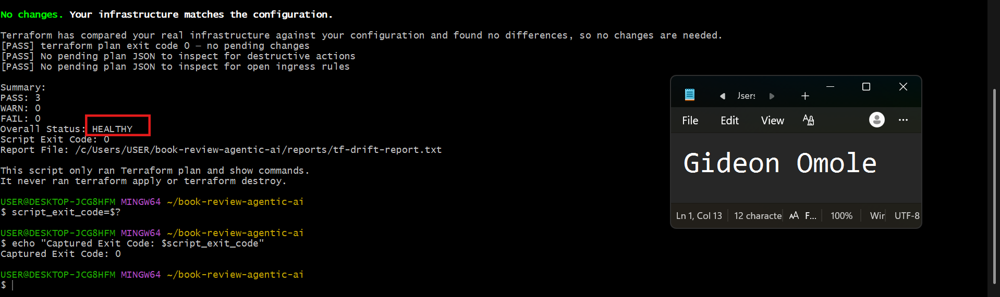

---

### Screenshot 8 — Baseline Script Exit Code

Add a screenshot showing the captured script exit code `0`.

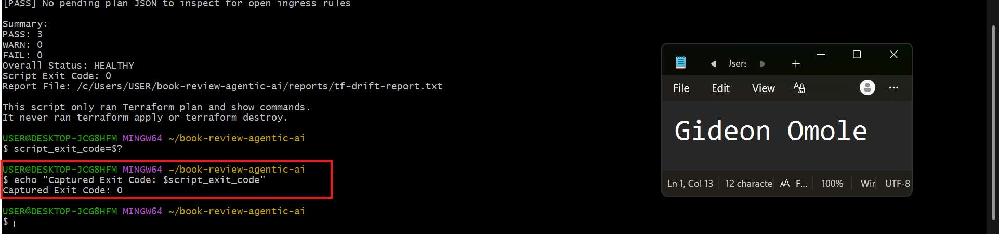

## Questions

### 1. What is the Overall Status of your baseline?

HEALTHY.

### 2. Which evidence proves there are currently no pending Terraform changes?

terraform plan exit code 0 in the report, and the absence of any destructive-action or open-ingress findings tied to a pending plan.

### 3. Was `reports/tfplan.json` created? Explain why or why not.

No. The script only writes the JSON plan when Terraform's exit code is 2 (changes pending). Since the exit code was 0, there was nothing to convert to JSON, so the script correctly skipped that step.

---

# Task 5 — Create and Run the `/tf-drift-review` Claude Code Skill

## Goal

Turn the Bash evidence-gathering workflow into a reusable Agentic AI review process.

## Evidence

### Screenshot 9 — `/tf-drift-review` Skill Configuration

Add a screenshot of `SKILL.md` showing the frontmatter, allowed tools, and safety rules.

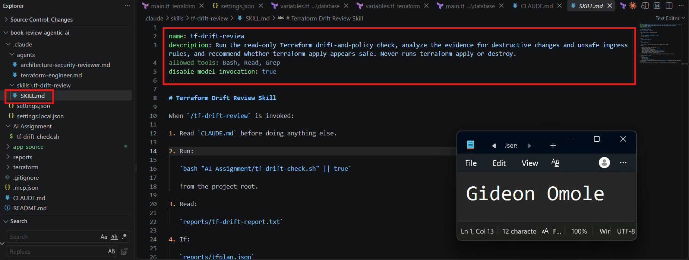

---

### Screenshot 10 — Clean Agentic AI Review

Add a screenshot of `/tf-drift-review` showing the clean `HEALTHY` result.

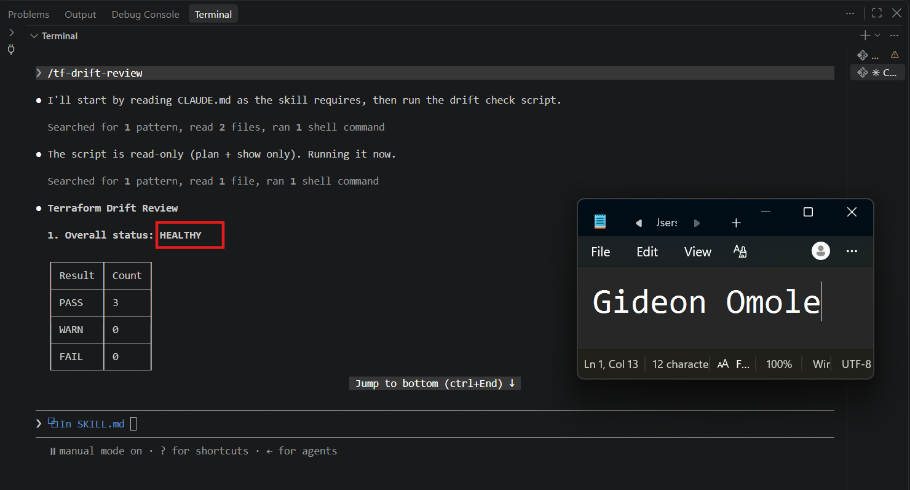

## Questions

### 1. Why does this Skill have `Bash`, `Read`, and `Grep`, but not `Write`?

It's designed to inspect, not modify. Bash lets it run the controlled script; Read and Grep let it read/search the report and CLAUDE.md. No Write tool means it structurally cannot edit Terraform files, even if it wanted to — the safety boundary is enforced by what capabilities exist, not just by instructions.

### 2. Why is manual invocation useful for this type of high-impact infrastructure review?

It keeps a human deliberately in the loop at the moment review happens, rather than having reviews (and their conclusions) triggered automatically and possibly acted on without anyone specifically choosing to look.

### 3. Which part of the workflow is deterministic Bash automation?

The Bash script is the deterministic part. It runs terraform plan, captures the Terraform exit code, converts the plan to JSON when changes exist, and uses jq to check for destructive actions and unrestricted ingress.
The same inputs produce the same checks and the same type of output. There is no AI judgment involved in these checks.

### 4. Which part requires Claude's reasoning?

Interpreting what the evidence means, explaining significance in plain language, distinguishing new changes from pre-existing conditions, and producing a recommendation.

### 5. Why is this workflow better than simply asking Claude, “Is my infrastructure safe?”

A vague question invites a vague, potentially overconfident answer with no verifiable basis. This workflow forces every claim Claude makes to be grounded in specific, inspectable evidence (the report and JSON), so you can check its reasoning against the same facts it used.

---

# Task 6 — Introduce a Controlled Difference and Detect It

## Goal

Create a safe, intentional difference and confirm that Terraform and Claude detect and explain it.

## Evidence

### Screenshot 11 — Controlled Difference

Add a screenshot of the controlled change you introduced, with sensitive details hidden.


---

### Screenshot 12 — Detected Difference and Risk Assessment

Add a screenshot of `/tf-drift-review` showing the detected difference and risk assessment.

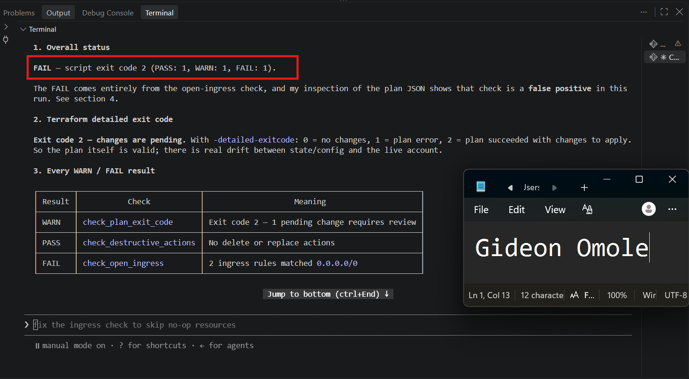
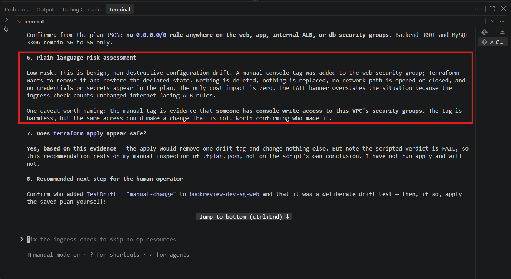

---

### Screenshot 13 — Detected Drift Report

Add a screenshot of `drift-detected-report.txt` showing your full name and the `WARN` or `FAIL` result.

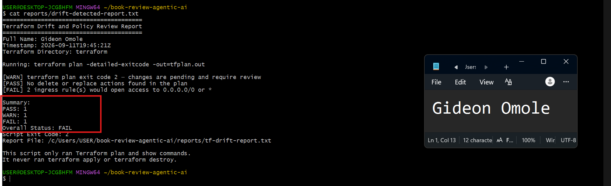

## Questions

### 1. What change did you introduce?

A manual tag (TestDrift=manual-change) added directly to the web security group via the AWS Console.

### 2. Was it true infrastructure drift or a Terraform configuration change?

True infrastructure drift — the .tf files were never touched; the real AWS resource was changed outside Terraform.

### 3. What Terraform plan evidence proves that a change is pending?

terraform plan -detailed-exitcode returned exit code 2, and the plan summary showed 0 to add, 1 to change, 0 to destroy. The one change was module.security.aws_security_group.web, where Terraform wanted to remove a tag (TestDrift = "manual-change") that existed in AWS but not in the .tf configuration.

### 4. Was the action an update, deletion, replacement, or security-rule change?

An in-place update, and specifically a tag-only change. No security group rules, ports, or CIDR blocks were touched. Claude confirmed this directly by comparing before and after in the plan JSON and finding the ingress rules byte-identical, the only actual diff was the tag being removed.

### 5. What did Claude recommend?

Claude recommended confirming who added the TestDrift tag and that it was a deliberate test, then applying the saved plan manually if so. It explicitly said it had not run apply and would not. It also flagged that although the script's overall verdict was FAIL, that verdict was misleading: the FAIL came entirely from the open-ingress check incorrectly flagging two pre-existing, unchanged rules on the public ALB (port 80/443 from 0.0.0.0/0) as if the current plan had created them, when those rules were already there and are intentional per the architecture (they're the app's actual public entry point). Claude noted this as a scoping bug in the script itself, checking .change.after across all resources instead of filtering to only rules genuinely being added or changed, rather than an actual infrastructure problem.

### 6. Why should you review the recommendation before taking action?

Because Claude's own answer shows exactly why: it reached a "safe to apply" conclusion by manually inspecting the plan JSON itself, not by trusting the script's own verdict, which said FAIL. If I had only looked at the Overall Status line and not read Claude's full explanation, I would have assumed something dangerous was happening and either blocked a harmless change or spent time chasing a problem that didn't exist. Reviewing the actual reasoning, not just the pass/fail label, is what let me catch that the FAIL was a false positive caused by a limitation in how the script scans the plan, rather than real risk.

---

# Task 7 — Add a `PreToolUse` Hook to Block Unsafe Apply Attempts

## Goal

Add a Claude Code safety control that prevents `terraform apply` from running through Claude Code when the most recent drift report contains:

```text
Overall Status: FAIL
```

## Evidence

### Screenshot 14 — `PreToolUse` Safety Hook

Add a screenshot of `.claude/settings.json` showing the `PreToolUse` safety hook.

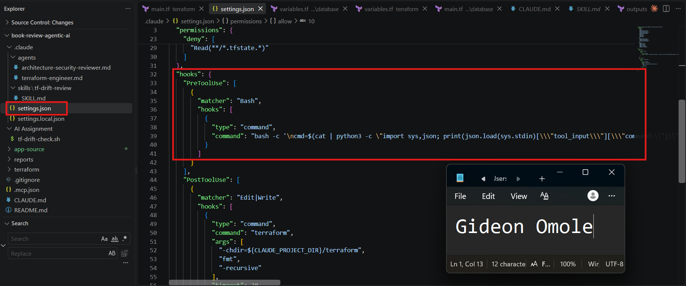

---

### Screenshot 15 — Blocked Apply Attempt

Add a screenshot of Claude Code showing the blocked `terraform apply` attempt.

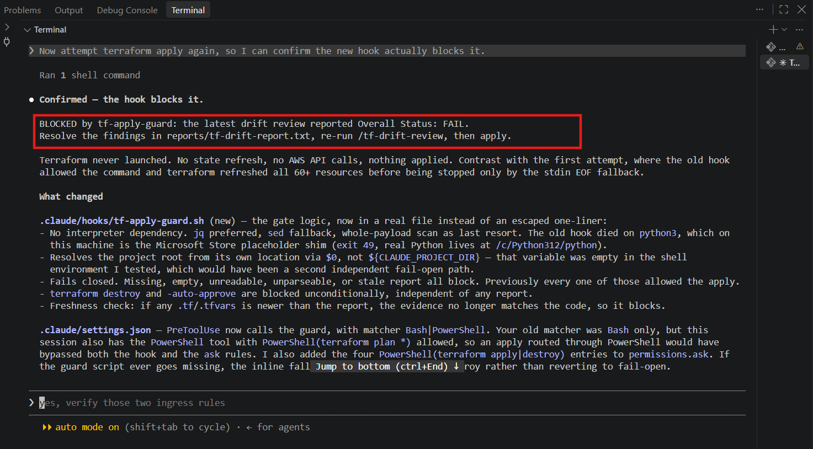

## Questions

### 1. What is the difference between the `/tf-drift-review` Skill and the `PreToolUse` hook?

The Skill analyzes evidence and produces reasoning/recommendations; the hook is a deterministic gate that inspects a command before execution and blocks it based on a fixed rule, with no reasoning involved.

### 2. Which component performs analysis?

The /tf-drift-review Skill (Claude's reasoning).

### 3. Which component enforces the safety gate?

The PreToolUse hook.

### 4. Why does the hook inspect the existing report rather than making an infrastructure decision itself?

The hook is intentionally "dumb" on purpose — it just checks a fixed condition (does the command contain terraform apply, does the latest report say FAIL) rather than trying to judge infrastructure safety itself. This makes its behavior fully predictable and impossible to reason around.

### 5. Why is a deterministic guard useful for high-impact commands?

Because it doesn't depend on the AI making the right call every time. Even if Claude's own judgment were wrong or inconsistent, the hook still enforces the rule the same way, every time, regardless of what Claude concluded.

---

# Task 8 — Resolve the Difference and Verify the Final State

## Goal

Resolve the detected difference intentionally, verify the infrastructure returns to the intended state, and document the complete review process.

## Evidence

### Screenshot 16 — Human-Reviewed Resolution

Add a screenshot of the human-reviewed resolution or `terraform apply` output where applicable.

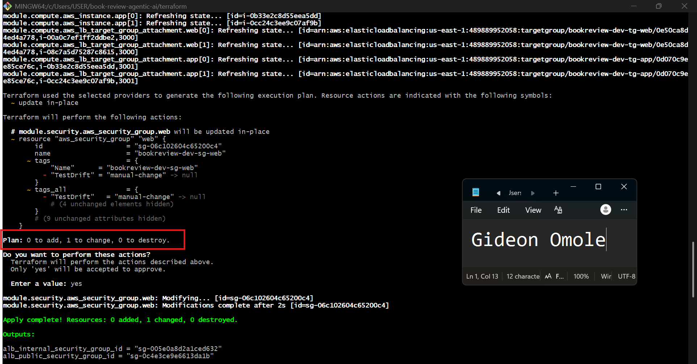

---

### Screenshot 17 — Final Healthy Review

Add a screenshot of the final `/tf-drift-review` showing `HEALTHY`.

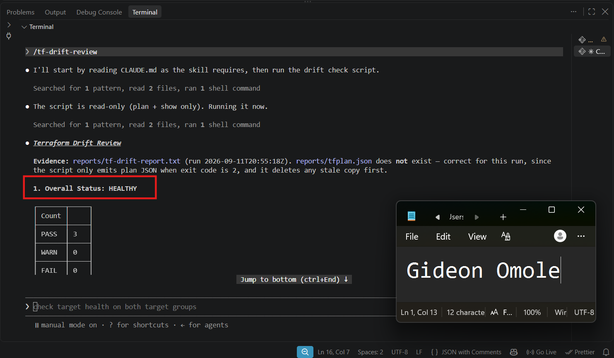

---

### Screenshot 18 — Saved Reports

Add a screenshot of `ls -lah reports` showing both:

- `drift-detected-report.txt`
- `resolved-report.txt`

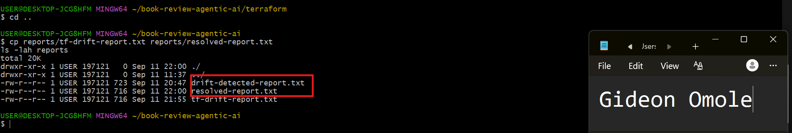

---

### Screenshot 19 — Drift Review Summary

Add a screenshot of `drift-review-summary.md` showing all required sections and your full name.

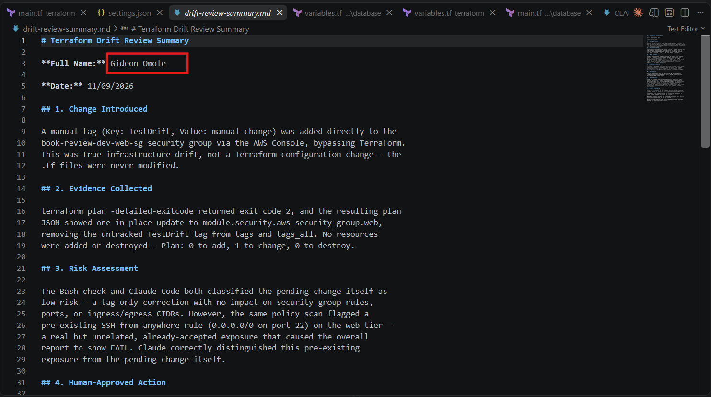
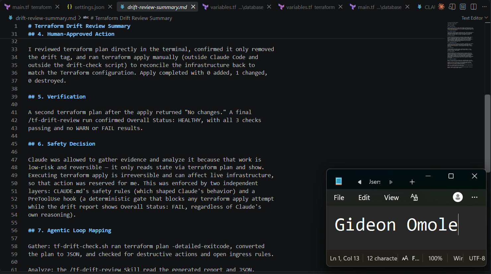

## Terraform Drift Review Summary

### 1. Change Introduced

Explain the controlled change you introduced.

State whether it was:

- True infrastructure drift, or
- A Terraform configuration change

A manual tag (Key: TestDrift, Value: manual-change) was added directly to the
book-review-dev-web-sg security group via the AWS Console, bypassing Terraform.
This was true infrastructure drift, not a Terraform configuration change — the
.tf files were never modified.

### 2. Evidence Collected

Describe the Terraform plan evidence and affected resource.

terraform plan -detailed-exitcode returned exit code 2, and the resulting plan
JSON showed one in-place update to module.security.aws_security_group.web,
removing the untracked TestDrift tag from tags and tags_all. No resources
were added or destroyed — Plan: 0 to add, 1 to change, 0 to destroy.

### 3. Risk Assessment

Explain the risk identified by the Bash check and Claude Code.

The Bash check and Claude Code both classified the pending change itself as
low-risk — a tag-only correction with no impact on security group rules,
ports, or ingress/egress CIDRs. However, the same policy scan flagged a
pre-existing SSH-from-anywhere rule (0.0.0.0/0 on port 22) on the web tier —
a real but unrelated, already-accepted exposure that caused the overall
report to show FAIL. Claude correctly distinguished this pre-existing
exposure from the pending change itself.

### 4. Human-Approved Action

Explain the action you reviewed and executed manually.

I reviewed terraform plan directly in the terminal, confirmed it only removed
the drift tag, and ran terraform apply manually (outside Claude Code and
outside the drift-check script) to reconcile the infrastructure back to
match the Terraform configuration. Apply completed with 0 added, 1 changed,
0 destroyed.

### 5. Verification

Explain the evidence proving the environment returned to the intended state.

A second terraform plan after the apply returned "No changes." A final
/tf-drift-review run confirmed Overall Status: HEALTHY, with all 3 checks
passing and no WARN or FAIL results.

### 6. Safety Decision

Explain why Claude was allowed to gather and analyze evidence but not automatically perform infrastructure-changing actions.

Claude was allowed to gather evidence and analyze it because that work is
low-risk and reversible — it only reads state via terraform plan and show.
Executing terraform apply is irreversible and can affect live infrastructure,
so that action was reserved for me. This was enforced by two independent
layers: CLAUDE.md's safety rules (which shaped Claude's behavior) and a
PreToolUse hook (a deterministic gate that blocks any terraform apply attempt
while the drift report shows Overall Status: FAIL, regardless of Claude's
own reasoning).

### 7. Agentic Loop Mapping

Explain how your workflow followed:

```text
Gather --> Analyze --> Human Act --> Verify
```

Gather: tf-drift-check.sh ran terraform plan -detailed-exitcode, converted
the plan to JSON, and checked for destructive actions and open ingress rules.

Analyze: the /tf-drift-review Skill read the generated report and JSON,
explained the drift in plain language, and distinguished the low-risk tag
change from the unrelated pre-existing SSH exposure.

Human Act: I reviewed terraform plan myself and ran terraform apply manually
after confirming the change was safe and expected.

Verify: a second /tf-drift-review run confirmed the environment returned to
HEALTHY, with no pending changes remaining.


## Questions

### 1. What action did you execute to resolve the difference?

Ran terraform apply manually, from a normal terminal (not through Claude Code), to remove the untracked TestDrift tag and bring AWS back in line with the .tf configuration.
### 2. Did you review `terraform plan` before taking action?

Yes, confirmed it showed only the one in-place tag removal with no other changes.

### 3. What evidence proves the environment is now aligned?

follow-up terraform plan returning "No changes," and the final /tf-drift-review run reporting Overall Status: HEALTHY with 3/3 PASS.

### 4. Why is a second drift review required after the fix?

To independently confirm the fix actually worked, rather than just assuming it did because the apply command completed without error — verification closes the loop instead of trusting the action blindly.

### 5. What could go wrong if an AI agent automatically applied every detected Terraform change?

It could apply a change that looks routine but has unintended consequences (e.g., a resource replacement causing downtime, or reconciling a manual change that was actually intentional and needed), all without a human ever specifically reviewing that particular action.

### 6. In one sentence, explain the difference between asking an AI chatbot “Is my infrastructure okay?” and using this evidence-based Agentic AI workflow.

Asking a chatbot directly invites an ungrounded, potentially overconfident guess, while this workflow forces every conclusion to be traceable to specific, inspectable evidence that a human can independently verify.

---

# LinkedIn Post — Mandatory

## Goal

Publish a LinkedIn post in your own words describing:

- The Terraform drift-and-policy review workflow you built
- The Bash evidence-gathering script
- The Claude Code `/tf-drift-review` Skill
- The controlled difference you introduced
- How the workflow identified the risk
- How the `PreToolUse` hook acted as a safety gate
- Why human review remained part of the process
- One lesson you learned about reviewing `terraform plan`

Include a screenshot of the detected change and a screenshot of the final `HEALTHY` review in your post.

Suggested tags:

```text
#DMIByPravinMishra #Terraform #AgenticAI #ClaudeCode #DevOps
```

## LinkedIn Evidence

### LinkedIn Post URL

https://www.linkedin.com/posts/gideon-omole-5ba318180_aws-terraform-devops-ugcPost-7504287752662937607-q1aH/?utm_source=share&utm_medium=member_desktop&rcm=ACoAACrC7l4BK-z0pGwSRQMO8ZJ5pFZyqybbIk4

### Published LinkedIn Post Screenshot — Mandatory

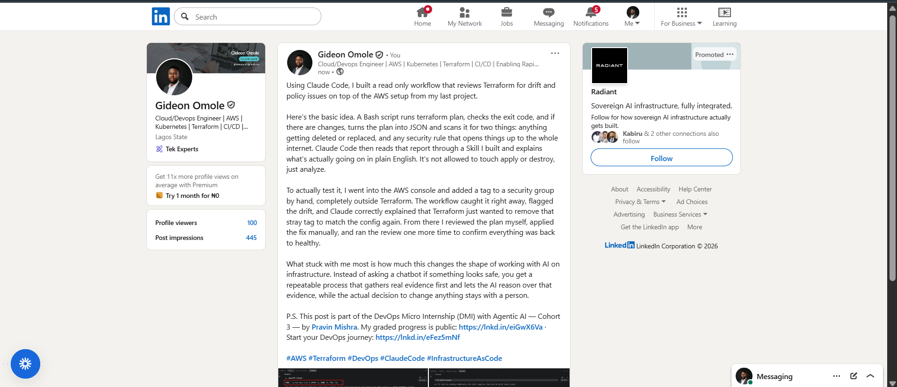

---

# Required Assignment Files

Confirm that the following files are included in your GitHub repository:

- `CLAUDE.md`
- `AI Assignment/tf-drift-check.sh`
- `.claude/skills/tf-drift-review/SKILL.md`
- `.claude/settings.json` containing the safety hook
- `reports/drift-detected-report.txt`
- `reports/resolved-report.txt`
- `drift-review-summary.md`

---

# Submission Instructions

- Complete Tasks 1–8 in sequence.
- Include Screenshots 1–19 exactly as specified.
- Answer every question under Tasks 1–8 in your own words.
- Complete all seven sections of the Terraform Drift Review Summary.
- Include the GitHub repository/folder URL containing the assignment files.
- Include your full name in the required reports and screenshots.
- Include the LinkedIn post URL and a screenshot of the published LinkedIn post.
- Do not expose access keys, passwords, tokens, account IDs, private keys, Terraform secrets, or other sensitive information.
- Review all screenshots carefully and hide or redact sensitive details where necessary.

---

# Completion Checklist

- [ ] Confirmed a clean Terraform baseline
- [ ] Created the required assignment workspace
- [ ] Created or updated `CLAUDE.md`
- [ ] Added project context and safety rules
- [ ] Created `tf-drift-check.sh`
- [ ] Added my full name to the report
- [ ] Validated the Bash script
- [ ] Made the script executable
- [ ] Used `terraform plan -detailed-exitcode`
- [ ] Used Terraform plan JSON
- [ ] Used `jq` to inspect destructive actions
- [ ] Used `jq` to inspect unsafe ingress
- [ ] Confirmed the baseline returns `HEALTHY`
- [ ] Created `/tf-drift-review`
- [ ] Restricted the Skill to appropriate tools
- [ ] Confirmed the Skill remains read-only
- [ ] Confirmed the Skill never runs `terraform apply`
- [ ] Confirmed the Skill never runs `terraform destroy`
- [ ] Introduced a controlled detectable difference
- [ ] Correctly identified whether it was true drift or a configuration change
- [ ] Saved `drift-detected-report.txt`
- [ ] Added the `PreToolUse` safety hook
- [ ] Verified the hook blocks `terraform apply` when the report is `FAIL`
- [ ] Reviewed the Terraform evidence before resolving the change
- [ ] Performed any infrastructure-changing action manually
- [ ] Ran the drift review again after resolution
- [ ] Confirmed the final status is `HEALTHY`
- [ ] Saved `resolved-report.txt`
- [ ] Completed `drift-review-summary.md`
- [ ] Mapped the workflow to `Gather --> Analyze --> Human Act --> Verify`
- [ ] Included all 19 numbered screenshots
- [ ] Answered all required questions
- [ ] Published the required LinkedIn post
- [ ] Added the LinkedIn post URL and screenshot
- [ ] Included the GitHub repository/folder URL
- [ ] Confirmed that no sensitive information is exposed

---

*This submission is part of the DevOps Micro Internship (DMI) Cohort 3 — Agentic AI Track.*
