# Assignment 02 — Provision Linux VMs with Terraform and Run Ansible Ad-Hoc Commands

Part of the DevOps Micro Internship (DMI) with Agentic AI

---

## Purpose

In this assignment, you will use Terraform to provision three or four Ubuntu Linux Virtual Machines on either Microsoft Azure or Amazon Web Services.

You will configure SSH key-based authentication, organize the servers using a custom Ansible inventory, and run Ansible ad-hoc commands across individual hosts and inventory groups.

---

# Task 1 — Create the Multi-Host Lab Structure

## Goal

Create a separate project directory for the multi-host lab and prepare the Terraform, Ansible, and documentation files.

This project will use the Git repository and Ansible controller prepared in Assignment 01.

### Evidence

#### Screenshot 1 — Terminal showing the complete `ansible-adhoc-lab` project structure

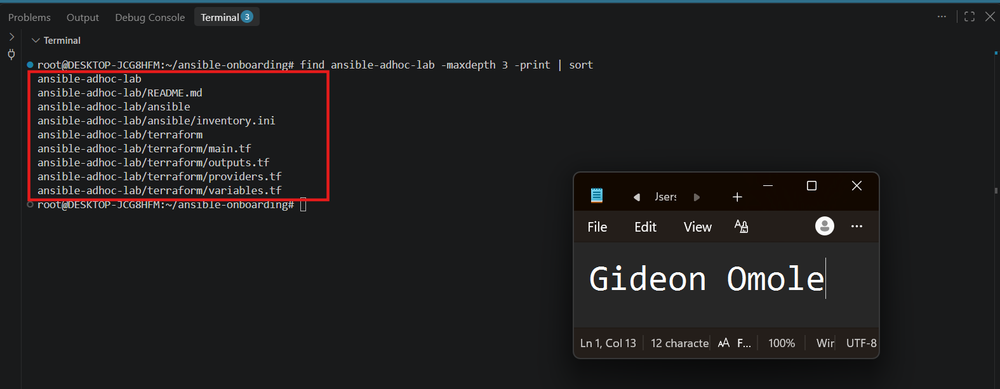

---

#### Screenshot 2 — Terminal showing `git status --short` with the new project files and updated `.gitignore`

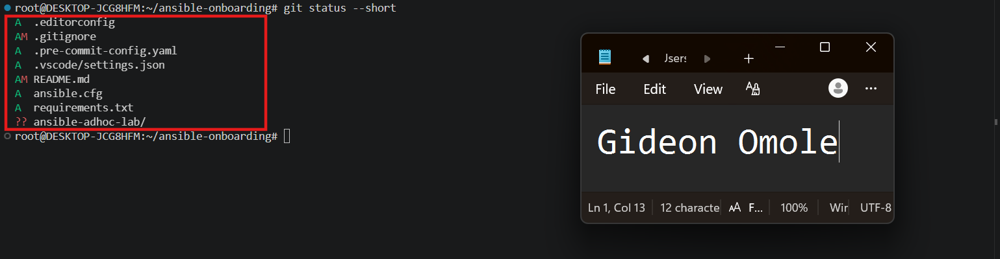

---

### Notes

Created a separate ansible-adhoc-lab/ project directory inside the existing ansible-onboarding workspace, split into terraform/ and ansible/ subfolders to keep infrastructure code and inventory/config cleanly separated. Reused the Git repository and Python virtual environment from Assignment 01 rather than creating a new one — no git init was run inside ansible-adhoc-lab.

Updated the existing .gitignore to also exclude Terraform's working directory (.terraform/), state files (*.tfstate, *.tfstate.*), saved plans (*.tfplan), and crash logs, while intentionally keeping .terraform.lock.hcl trackable as instructed, since it pins provider versions for the team.

Verified with git status --short that no Terraform-generated files were staged, confirming the ignore rules are working correctly before any terraform init was run.

---

# Task 2 — Create the Terraform Configuration

## Goal

Create the Terraform configuration required to provision three or four Ubuntu Linux VMs on your selected cloud platform.

Complete only one option:

- Option A — Microsoft Azure
- Option B — Amazon Web Services

Do not configure both providers for this assignment.

### Evidence

#### Screenshot 3 — Terraform configuration showing the three or four server roles and the `for_each` or `count` implementation

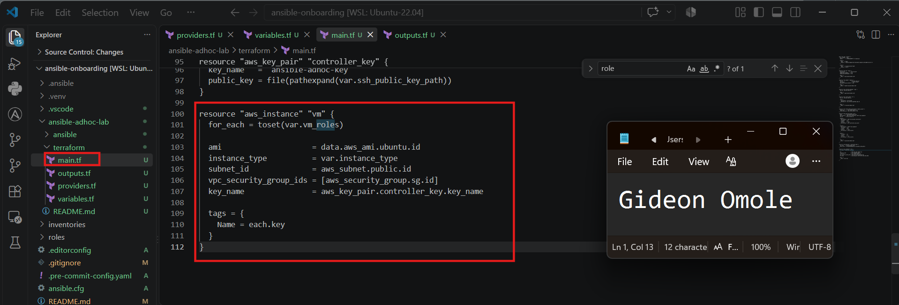

---

#### Screenshot 4 — Terraform configuration showing SSH restricted to the controller IP and HTTP allowed only for web hosts

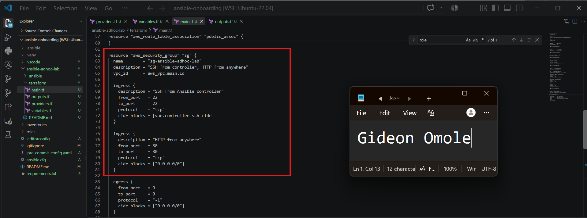

---

#### Screenshot 5 — Terraform output configuration showing how public IP addresses are associated with the server roles

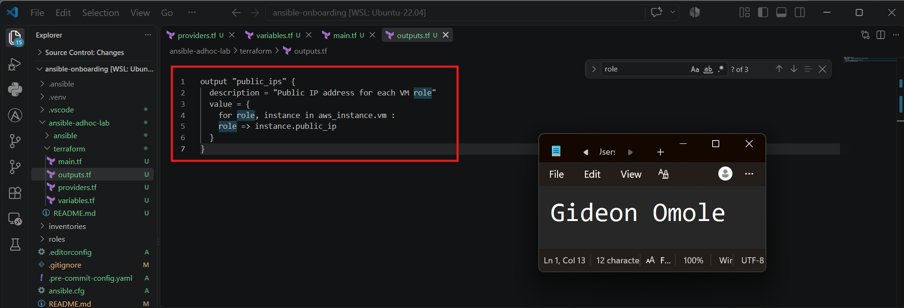

---

### Notes

Selected AWS as the cloud platform and the four-VM option (web1, web2, app1, db1). Defined server roles in a vm_roles list variable and used a single aws_instance resource block with for_each = toset(var.vm_roles) to provision all four VMs, instead of writing four separate, repeated resource blocks. Each VM's Name tag is set dynamically using each.key, which matches the current role being looped over.

All four instances share the same Ubuntu 22.04 AMI (looked up dynamically via a data "aws_ami" block rather than hardcoding a region-specific AMI ID), the same instance type, subnet, and security group, and use the same SSH key pair created from the controller's existing public key (id_ed25519.pub).

Networking and security were configured with a single VPC, public subnet, internet gateway, and route table shared across all instances, plus one security group (sg-ansible-adhoc-lab) restricting inbound SSH to only the Ansible controller's public IP in /32 format, while allowing inbound HTTP from anywhere for the web role. No cloud credentials were hardcoded in the Terraform files — authentication is handled entirely through the AWS CLI configuration on the controller.

Defined a public_ips output as a role-to-IP map so each VM's address can be clearly matched to its role (web1, web2, app1, db1) once provisioned, which will be used directly when building the Ansible inventory in Task 5.

---

# Task 3 — Provision the Infrastructure with Terraform

## Goal

Initialize and validate the Terraform configuration, review the execution plan, provision the selected three or four VMs, and retrieve their public IP addresses.

### Evidence

#### Screenshot 6 — Final `terraform apply` output showing `Apply complete`

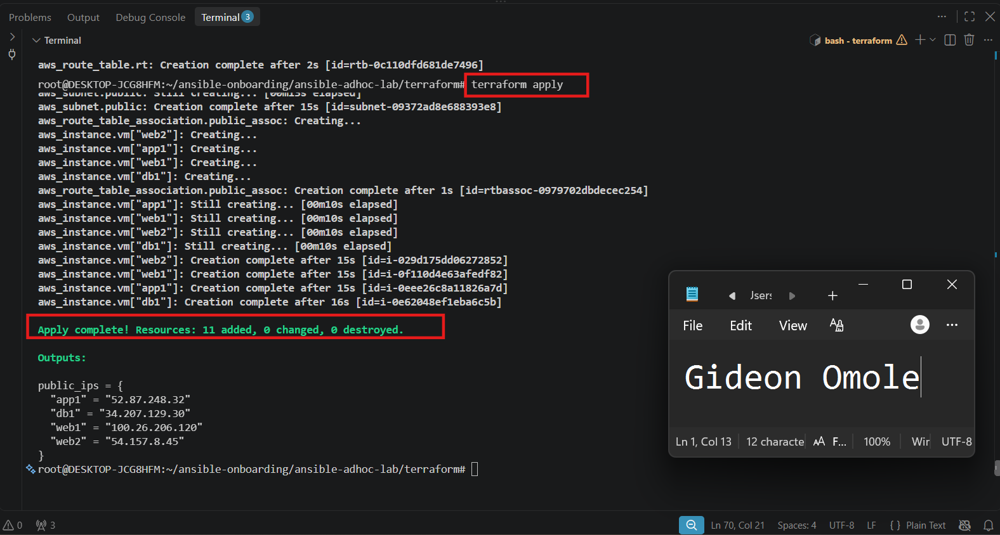

---

#### Screenshot 7 — `terraform output public_ips` showing the role-to-IP mapping for all three or four VMs

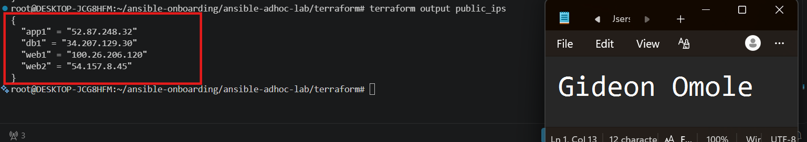

---

#### Screenshot 8 — Azure Portal or AWS Management Console showing all three or four VMs in the `Running` state, with their role-based names visible

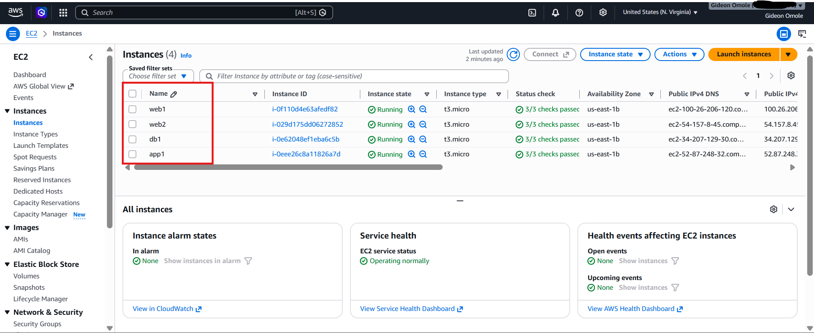

---

### Notes

Ran terraform fmt and terraform fmt -check to confirm consistent formatting, then terraform init to download the AWS provider. terraform validate initially failed because AWS reserves the sg- prefix for auto-generated security group IDs and rejects it in a custom name field — fixed by renaming the security group's name to ansible-adhoc-lab-sg while keeping sg-ansible-adhoc-lab as its Name tag for consistency with the naming convention used elsewhere. Re-ran terraform validate, which passed successfully.

Reviewed terraform plan to confirm it would create exactly the expected resources — one VPC, one public subnet, an internet gateway, route table and association, one security group, one key pair, and four EC2 instances (web1, web2, app1, db1) — with SSH restricted to the controller's /32 IP and no unexpected deletions or region mismatches.

Ran terraform apply and confirmed all resources were created successfully (Apply complete!). Retrieved the four public IP addresses via terraform output public_ips, and verified all four EC2 instances were shown as running in the AWS Console with their correct role-based Name tags. Confirmed via git status --short that Terraform state files and the .terraform/ working directory remained excluded from Git as expected.

---

# Task 4 — Verify SSH Key-Based Access

## Goal

Verify that each managed VM can be accessed from the Ansible controller using SSH key-based authentication.

### Evidence

#### Screenshot 9 — Terminal showing successful SSH hostname output from all VMs

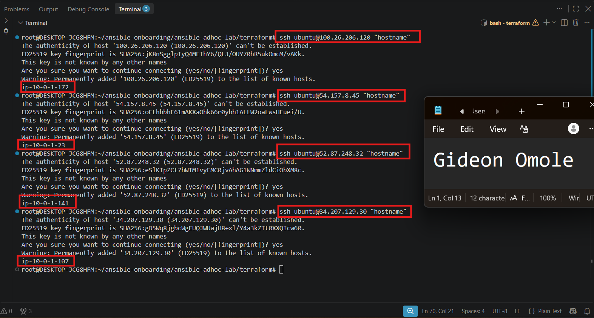

---

### Notes

SSH'd into all four VMs (web1, web2, app1, db1) from the controller using the ubuntu username and the existing SSH key. All four connected successfully on the first try, accepting the host fingerprint and returning a hostname with no password prompt — confirming key-based authentication was set up correctly.

---

# Task 5 — Create the Custom Ansible Inventory

## Goal

Create an Ansible inventory file that groups the managed VMs by role.

The inventory allows Ansible to run commands against all servers, or only specific groups such as `web`, `app`, or `db`.

### Evidence

#### Screenshot 10 — `inventory.ini` showing the `web`, `app`, and `db` groups

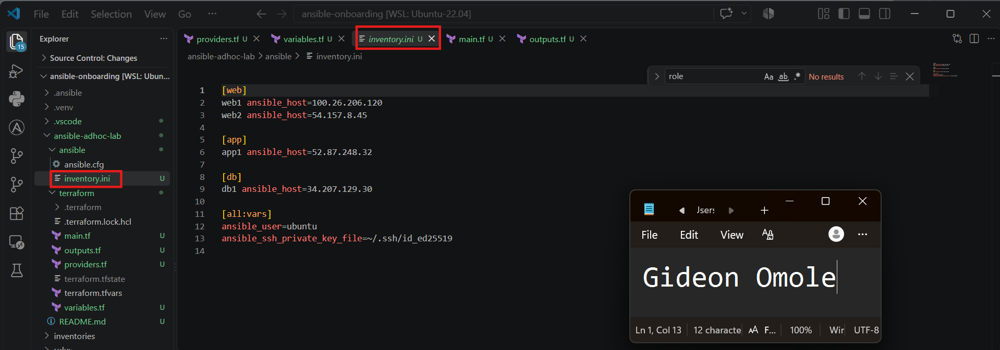

---

#### Screenshot 11 — Output of `ansible-inventory -i inventory.ini --graph`

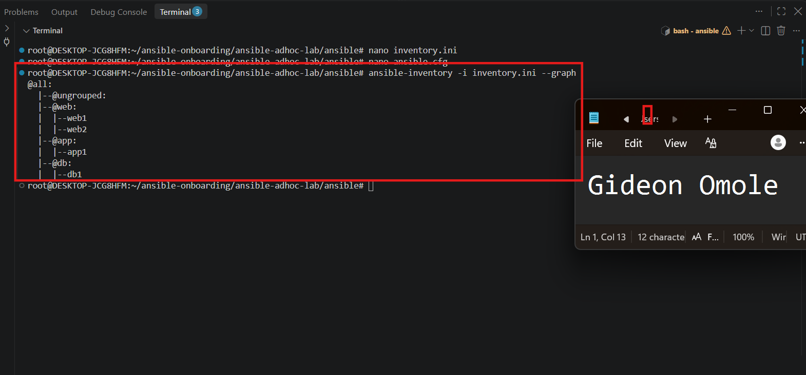

---

### Notes

Created inventory.ini grouping the four VMs by role — web (web1, web2), app (app1), and db (db1) — using each VM's public IP from the Terraform output. Set ansible_user and ansible_ssh_private_key_file once under [all:vars] so every host uses the same login details without repeating them. Added a local ansible.cfg with host_key_checking = False to avoid repeated fingerprint prompts during testing. Verified the structure with ansible-inventory -i inventory.ini --graph, which correctly showed all three groups and hosts.

---

# Task 6 — Run Ansible Ad-Hoc Commands

## Goal

Run Ansible ad-hoc commands from the controller to verify connectivity, check server information, and manage packages and services across inventory groups.

This task proves that the inventory is working and that Ansible can control multiple managed VMs without writing a playbook.

### Evidence

#### Screenshot 12 — Output of `ansible all -i inventory.ini -m ping`

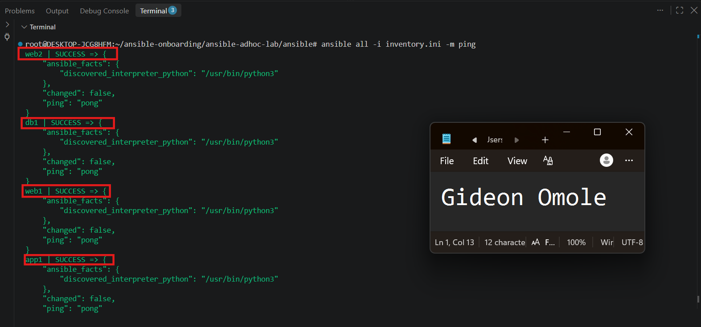

---

#### Screenshot 13 — Output of `ansible all -i inventory.ini -m command -a "uptime"`

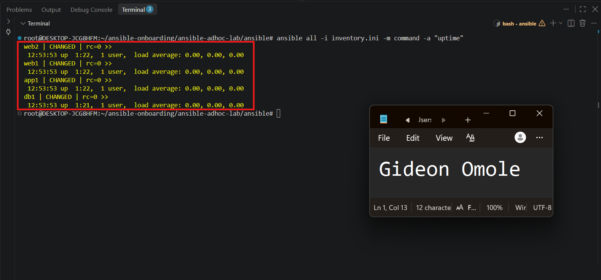

---

#### Screenshot 14 — Output of `ansible web -i inventory.ini -m apt -a "name=nginx state=present update_cache=yes" --become`

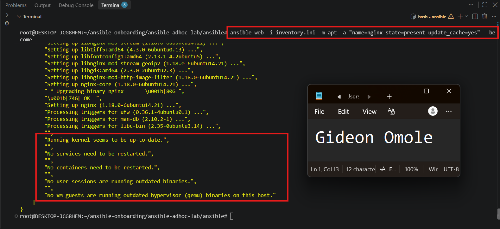

---

#### Screenshot 15 — Output of `ansible web -i inventory.ini -m service -a "name=nginx state=started enabled=yes" --become`

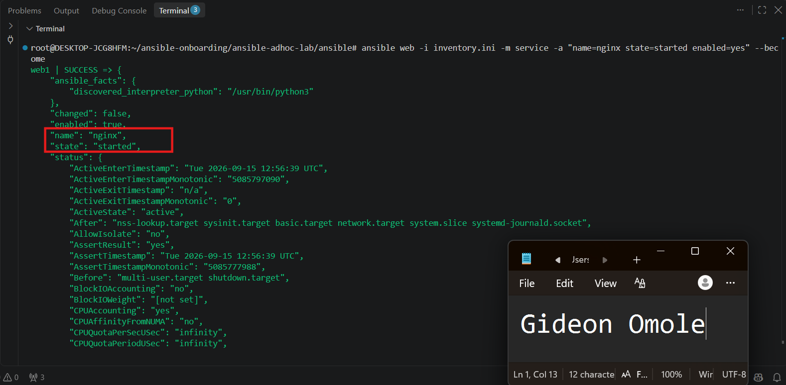

---

#### Screenshot 16 — Output of `ansible all -i inventory.ini -m apt -a "name=htop state=present update_cache=yes" --become`

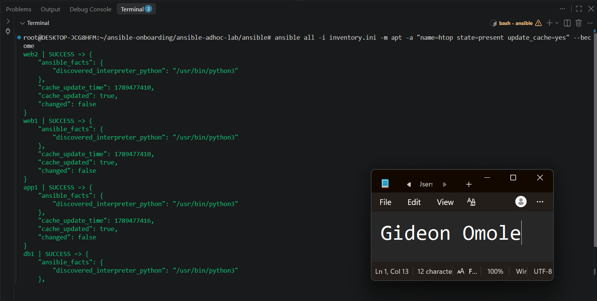

---

#### Screenshot 17 — Output of `ansible web -i inventory.ini -m command -a "systemctl is-active nginx"`

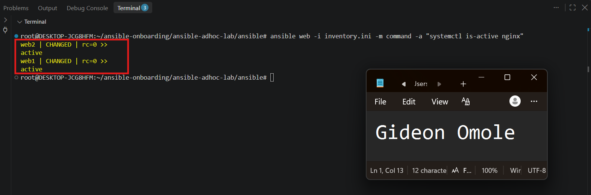

---

### Notes

Ran ansible all -m ping to confirm connectivity to all four VMs — all returned SUCCESS. Ran ad-hoc commands to check whoami and uptime across all hosts. Used --become to install and start Nginx on the web group only, and confirmed it was active with systemctl is-active nginx. Installed htop on all four VMs. Checked disk usage on the db group and memory usage across all hosts. All commands completed successfully, confirming the inventory groups work correctly and Ansible can manage multiple hosts without a playbook.

---

# LinkedIn Post Required

## Evidence

#### LinkedIn Post URL

Paste your LinkedIn post URL here:

`https://www.linkedin.com/posts/gideon-omole-5ba318180_devops-terraform-ansible-activity-7505620090286043137-LYNL/?utm_source=share&utm_medium=member_desktop&rcm=ACoAACrC7l4BK-z0pGwSRQMO8ZJ5pFZyqybbIk4`

---

#### Screenshot — Published LinkedIn post

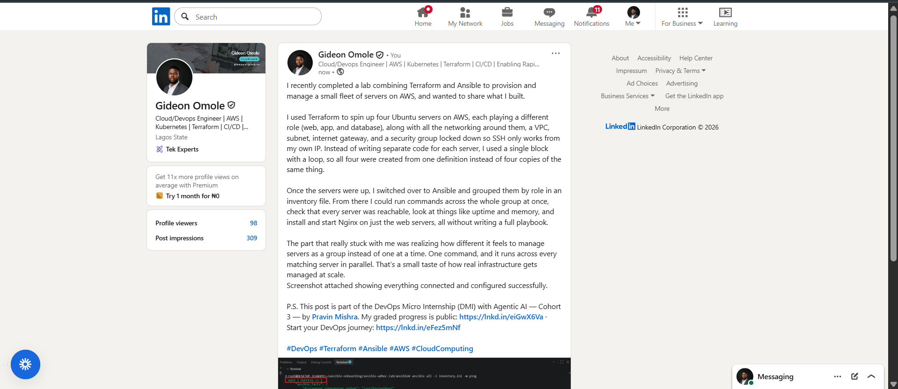

---

# Assignment Questions

Answer the following in your own words:

**1. What is the purpose of an Ansible inventory file?**

It's a list of all the servers Ansible can manage, organized under friendly names and groups, along with the connection details (IP address, SSH user, private key) needed to reach each one. Instead of typing IP addresses and login details every time, you reference servers by name or group, and Ansible looks up the rest automatically.

---

**2. What is the difference between the `web`, `app`, and `db` groups in your inventory?**

They're separate groups representing different roles in the infrastructure — web1 and web2 are the web servers, app1 is the application server, and db1 is the database server. Grouping them by role lets you target commands at just one type of server (like installing Nginx only on the web group) instead of running the same command against every server regardless of its purpose.

---

**3. What does the Ansible `ping` module verify?**

It confirms Ansible can successfully connect to a host over SSH and that Python is available and working on the remote machine. It's not an actual network ping (ICMP) — it's checking that Ansible itself can communicate with and control the server, not just that the server is reachable on the network.

---

**4. Why do package installation commands require `--become`?**

Installing software or managing system services requires administrator (root) privileges, but the SSH user (ubuntu) doesn't have those by default. --become tells Ansible to escalate privileges on the remote server, similar to adding sudo in front of a command, so the action is allowed to succeed.

---

**5. When would you use an ad-hoc command instead of a playbook?**

Ad-hoc commands are best for quick, one-time tasks, like checking disk space, restarting a service, or installing a single package, where writing and saving a whole YAML file would be unnecessary overhead. Playbooks make more sense when the same set of actions needs to be repeated reliably over time, documented, or shared with a team.

---

**6. What is one challenge you faced while setting up SSH or inventory, and how did you fix it?**

One issue I ran into was .venv accidentally getting tracked by Git before the .gitignore file existed, which caused pre-commit to try linting hundreds of unrelated files inside the virtual environment. I fixed it by creating the missing .gitignore file and running git rm -r --cached .venv to untrack it, after which Git and pre-commit correctly ignored the folder going forward.
---

# Required Files

Confirm that the following files are included in your assignment workspace:

- [ ] `ansible-adhoc-lab/README.md`
- [ ] `ansible-adhoc-lab/terraform/providers.tf`
- [ ] `ansible-adhoc-lab/terraform/main.tf`
- [ ] `ansible-adhoc-lab/terraform/variables.tf`
- [ ] `ansible-adhoc-lab/terraform/outputs.tf`
- [ ] `ansible-adhoc-lab/ansible/inventory.ini`
- [ ] Updated `.gitignore`

---

# Submission Instructions

- Add all required screenshots from the tasks.
- Full Name must be visible in required screenshots.
- Mention whether you used Azure or AWS.
- Mention whether you used the three-VM option or four-VM option.
- Add the public IP addresses of the VMs, redacted if preferred.
- Add your `inventory.ini` proof.
- Add a short explanation of what you learned.
- Answer all assignment questions clearly in your own words.
- Add your LinkedIn post URL.
- Do not expose SSH private keys, Terraform state files, cloud credentials, passwords, access keys, secret keys, account IDs, or subscription IDs.

---

# Completion Checklist

- [ ] Task 1: `ansible-adhoc-lab` project structure created
- [ ] Task 1: `.gitignore` updated for Terraform files
- [ ] Task 2: Terraform configuration created
- [ ] Task 2: Server roles defined for either three or four VMs
- [ ] Task 2: `count` or `for_each` used
- [ ] Task 2: SSH restricted to the controller public IP
- [ ] Task 2: HTTP allowed only for web hosts
- [ ] Task 2: Terraform output maps roles to public IPs
- [ ] Task 3: Terraform initialized successfully
- [ ] Task 3: Terraform configuration validated
- [ ] Task 3: Terraform apply completed successfully
- [ ] Task 3: All selected VMs are running
- [ ] Task 4: SSH key-based access works for every VM
- [ ] Task 5: `inventory.ini` contains `web`, `app`, and `db` groups
- [ ] Task 5: `ansible-inventory -i inventory.ini --graph` shows the correct groups
- [ ] Task 6: `ansible all -i inventory.ini -m ping` returns `SUCCESS`
- [ ] Task 6: Ad-hoc commands run successfully
- [ ] Task 6: `--become` was used for package and service tasks
- [ ] Task 6: Nginx is active on the `web` group
- [ ] Screenshots 1–17 are included
- [ ] Assignment questions are answered
- [ ] LinkedIn post published
- [ ] LinkedIn post URL added
- [ ] No sensitive information is exposed

---

## About DMI & CloudAdvisory

DevOps Micro Internship (DMI) is a project-based DevOps program run by Pravin Mishra and The CloudAdvisory, focused on real-world execution, systems thinking, and career readiness.

It helps learners build strong DevOps foundations with hands-on experience.

---

## Resources

- DMI Official Website: [https://dmi.pravinmishra.com?utm_source=github&utm_medium=readme](https://dmi.pravinmishra.com?utm_source=github&utm_medium=readme)
- University: [https://university.pravinmishra.com?utm_source=github&utm_medium=readme](https://university.pravinmishra.com?utm_source=github&utm_medium=readme)
- Discord Community: [https://discord.pravinmishra.com?utm_source=github&utm_medium=readme](https://discord.pravinmishra.com?utm_source=github&utm_medium=readme)
- Blog: [https://dmi.pravinmishra.com/blog?utm_source=github&utm_medium=readme](https://dmi.pravinmishra.com/blog?utm_source=github&utm_medium=readme)
- YouTube Playlist: [https://www.youtube.com/playlist?list=PLFeSNDtI4Cho](https://www.youtube.com/playlist?list=PLFeSNDtI4Cho)
- Pravin Mishra LinkedIn: [https://www.linkedin.com/in/pravin-mishra-aws-trainer/](https://www.linkedin.com/in/pravin-mishra-aws-trainer/)
- CloudAdvisory LinkedIn: [https://www.linkedin.com/company/thecloudadvisory/](https://www.linkedin.com/company/thecloudadvisory/)

---

*This submission is part of DevOps Micro Internship (DMI) — Agentic AI Track.*