# Assignment 03 — Deploy a Static Website to Multiple Servers Using a Multi-Play Ansible Playbook

Part of the DevOps Micro Internship (DMI) with Agentic AI

---

## Student Details

**Full Name:** Gideon Omole 
**Cloud Platform Used:** AWS   
**Server 1 URL:** `http://98.92.19.77`  
**Server 2 URL:** `http://3.91.106.233`

---

## Purpose

In this assignment, you will create a multi-play Ansible playbook to install Nginx, deploy a static website to two Ubuntu servers, and verify that the website is accessible from both servers.

You may use either AWS EC2 instances or Azure Virtual Machines as your managed servers.

---

# Task 1 — Create the Project Structure

## Goal

Create the required folders and files for the Ansible project.

## Evidence

### Screenshot 1 — Terminal or VS Code showing the complete `static-web` project structure

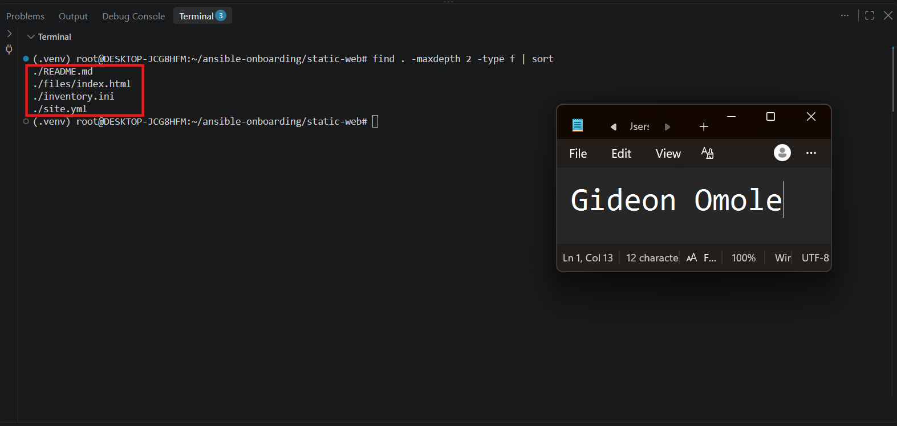

---

# Task 2 — Configure the Ansible Inventory

## Goal

Add both Ubuntu servers to the Ansible inventory.

## Evidence

### Screenshot 2 — Output of `ansible-inventory -i inventory.ini --graph` showing `web1` and `web2`

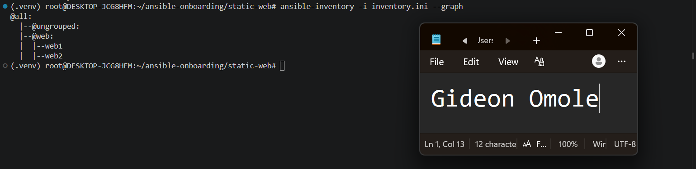

---

## Configuration File

Copy and paste the complete contents of your `inventory.ini` file below:

```ini
[web]
web1 ansible_host=98.92.19.77
web2 ansible_host=3.91.106.233

[web:vars]
ansible_user=ubuntu
ansible_ssh_private_key_file=/root/.ssh/id_ed25519
```

---

# Task 3 — Verify Ansible Connectivity

## Goal

Confirm that the Ansible controller can connect to both servers.

## Evidence

### Screenshot 3 — Ansible ping output showing `SUCCESS` and `pong` for both servers

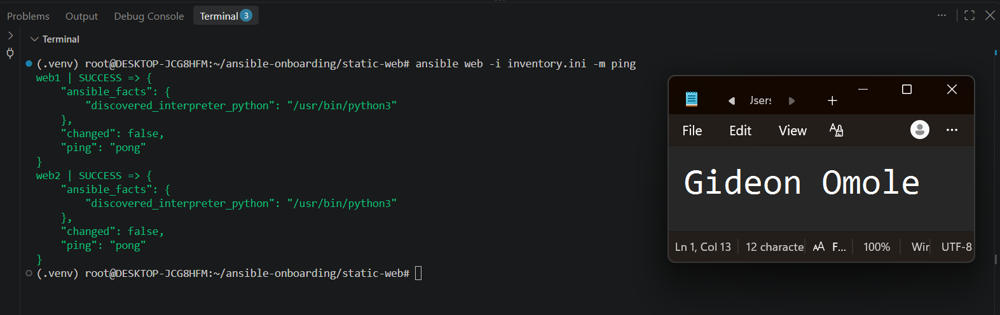

---

# Task 4 — Download and Personalize the Static Website

## Goal

Download `index.html` to the Ansible controller and personalize the website with your full name.

## Evidence

### Screenshot 4 — Edited `files/index.html` showing the footer line with your full name

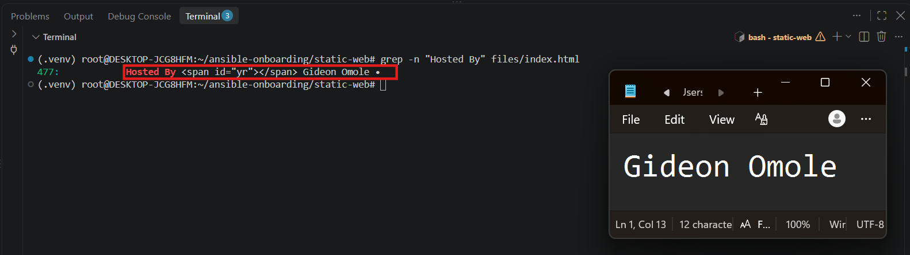

---

# Task 5 — Create the Multi-Play Ansible Playbook

## Goal

Create a single Ansible playbook containing separate plays for installation, deployment, and verification.

## Configuration File

Copy and paste the complete contents of your `site.yml` file below:

```yaml
---
- name: Install and configure Nginx
  hosts: web
  become: true
  tasks:
    - name: Update apt package cache
      ansible.builtin.apt:
        update_cache: true

    - name: Install nginx
      ansible.builtin.apt:
        name: nginx
        state: present

    - name: Start and enable nginx
      ansible.builtin.service:
        name: nginx
        state: started
        enabled: true

- name: Deploy the static website
  hosts: web
  become: true
  tasks:
    - name: Copy index.html to the web server
      ansible.builtin.copy:
        src: files/index.html
        dest: /var/www/html/index.html
        owner: www-data
        group: www-data
        mode: "0644"
      notify: Reload nginx

  handlers:
    - name: Reload nginx
      ansible.builtin.service:
        name: nginx
        state: reloaded

- name: Verify both websites from the controller
  hosts: localhost
  connection: local
  gather_facts: false
  become: false
  tasks:
    - name: Check HTTP status of each web server
      ansible.builtin.uri:
        url: "http://{{ hostvars[item].ansible_host }}"
        status_code: 200
      loop: "{{ groups['web'] }}"
      register: website_checks

    - name: Assert both servers returned HTTP 200
      ansible.builtin.assert:
        that:
          - item.status == 200
        success_msg: "{{ item.item }} returned HTTP {{ item.status }}"
      loop: "{{ website_checks.results }}"
```

---

# Task 6 — Validate the Playbook Syntax

## Goal

Check the playbook for YAML or Ansible syntax errors before running it.

## Evidence

### Screenshot 5 — Successful syntax-check output showing `playbook: site.yml`

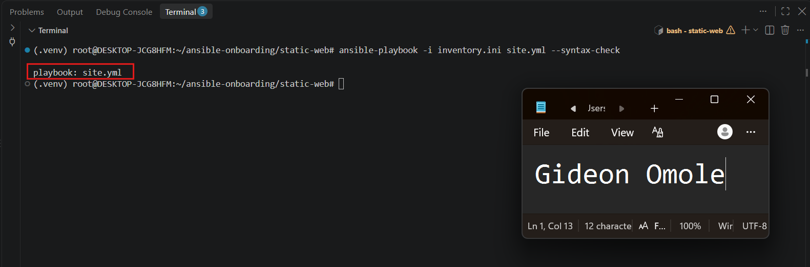

---

# Task 7 — Run the Multi-Play Playbook

## Goal

Install Nginx, deploy the website, and verify both servers in one playbook run.

## Evidence

### Screenshot 6 — Play 3 verification showing HTTP `200` for both servers

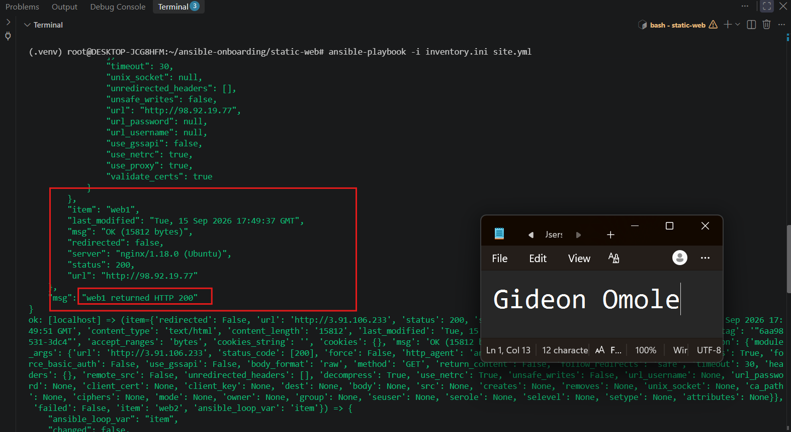
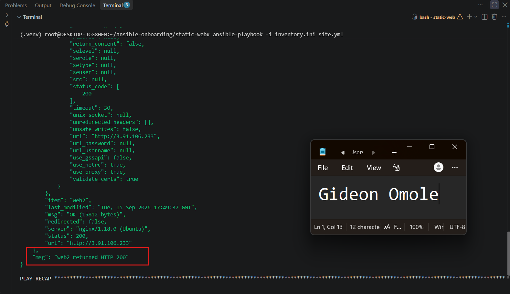


---

### Screenshot 7 — Final play recap showing `unreachable=0` and `failed=0` for `web1`, `web2`, and `localhost`

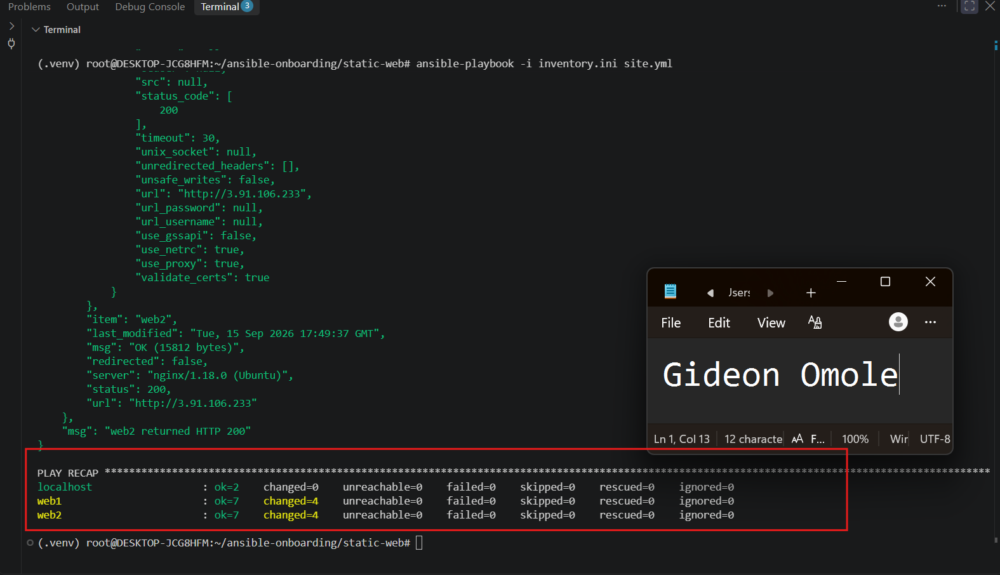

---

# Task 8 — Verify Idempotency

## Goal

Run the playbook again and confirm that it does not make unnecessary changes.

## Evidence

### Screenshot 8 — Second playbook run showing the play recap with `changed=0`, `unreachable=0`, and `failed=0` for both web servers

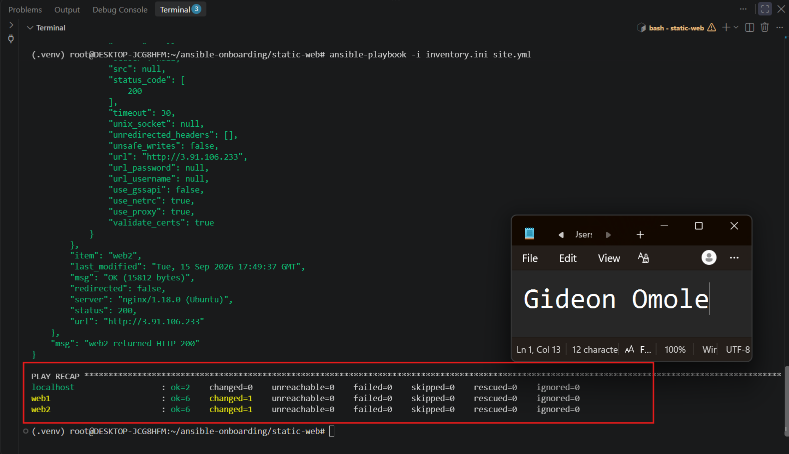

---

# Task 9 — Test Both Websites Manually

## Goal

Confirm that the static website is accessible from both public IP addresses.

## Evidence

### Screenshot 9 — `curl -I` output showing HTTP `200 OK` from both servers

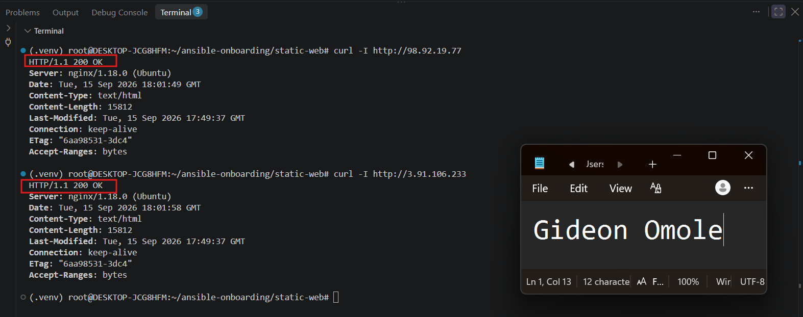

---

### Screenshot 10 — Browser showing the website from Server 1 with the public IP and your full name visible


---

### Screenshot 11 — Browser showing the website from Server 2 with the public IP and your full name visible

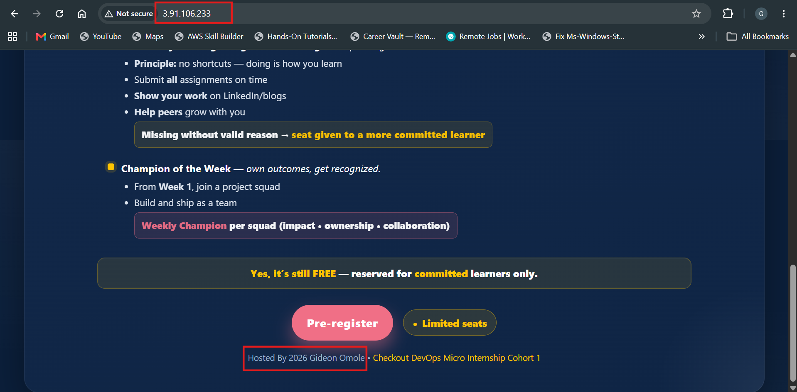

---

## Website URLs

Add both deployed website URLs below:

```text
Server 1: http://98.92.19.77
Server 2: http://3.91.106.233
```
---

# Task 10 — Complete the Project README

## Goal

Document how the project works and record what you learned.

## README Content

Copy and paste the complete contents of your `README.md` file below:

```markdown
# Multi-Play Ansible Static Website Deployment

## Project Overview
Deployed a static marketing website to two Ubuntu servers on AWS using a single
Ansible playbook split into three plays: install Nginx, deploy the website, and
verify both servers respond correctly.

## Environment
- Cloud platform: AWS (EC2)
- Operating system: Ubuntu 22.04 LTS
- Number of managed servers: 2 (web1, web2)
- Web server: Nginx

## How to Run the Playbook
```bash
ansible-playbook -i inventory.ini site.yml
```

## Issue Faced and Solution
[Describe a real issue you hit — e.g. a syntax error, wrong key path, or a
security group blocking port 80 — and how you fixed it.]

## What I Learned
[Your own reflection — e.g. how handlers avoid unnecessary reloads, or how
splitting responsibilities into separate plays keeps the playbook easier to
read and maintain.]

## Why Installation and Deployment Are Separate
Keeping Nginx installation in its own play means that play rarely needs to
change once servers are set up, while the deployment play — which changes
whenever the website content updates — can be run and reasoned about
independently. It also makes the playbook easier to read: each play has one
clear responsibility.

## Benefit of the Ansible Copy Module
The copy module only transfers the file and reports a change when the
source and destination differ, making repeated runs safe and idempotent.
It also keeps the website's source of truth on the controller (or in
version control), rather than each server independently cloning from Git,
which could drift out of sync between servers over time.


---

# LinkedIn Post Required

## Evidence

### LinkedIn Post URL

Paste your LinkedIn post URL here:

`https://www.linkedin.com/posts/gideon-omole-5ba318180_devops-ansible-aws-activity-7505692473533304832-cx7U?utm_source=share&utm_medium=member_desktop&rcm=ACoAACrC7l4BK-z0pGwSRQMO8ZJ5pFZyqybbIk4`

---

### Screenshot — Published LinkedIn post

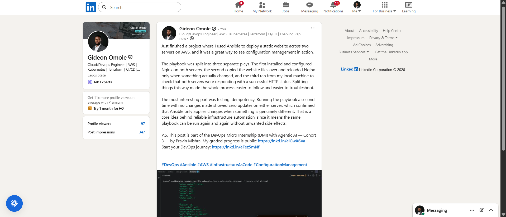

---

# Assignment Questions

Answer the following in your own words:

**1. What issue did you face while completing this assignment, and how did you fix it?**

One issue I ran into was making sure the SSH private key path in inventory.ini was correct for my environment. Since I was working as the root user in WSL, I used the absolute path /root/.ssh/id_ed25519 instead of ~/.ssh/id_ed25519 to avoid any path-expansion issues when Ansible connected to the servers. Once that was set correctly, connectivity worked on the first try.

---

**2. What did you learn from this assignment?**

I learned how to structure a single Ansible playbook into multiple plays, each with a clear responsibility, rather than cramming everything into one long list of tasks. I also got a much better understanding of how handlers work, since the Nginx reload only fires when the website file actually changes, not on every single run.

---

**3. Why is it useful to split installation, deployment, and verification into separate plays?**

Splitting these responsibilities makes the playbook easier to read, test, and maintain. Nginx installation rarely needs to change once servers are set up, while the website content might be updated frequently, so keeping them separate means each play can be reasoned about and modified independently without touching unrelated logic. It also makes it easier to see exactly where something failed if a run goes wrong.

---

**4. What is one benefit of using the Ansible `copy` module instead of cloning the website directly from Git on every managed server?**

The copy module keeps a single, controlled source of truth on the Ansible controller and only transfers the file when it detects a change, which keeps runs fast and predictable. If every server cloned from Git independently, they could end up out of sync with each other depending on timing, network issues, or repository changes, whereas copy guarantees every server receives the exact same file from the same source.

---

**5. What does idempotency mean in this assignment?**

Idempotency means running the same playbook multiple times produces the same end result without making unnecessary changes each time. I saw this directly when I ran the playbook a second time and got changed=0 for both servers, since Nginx was already installed and running and the website file already matched what was expected, so Ansible correctly recognized there was nothing left to do.

---

**6. What does the Ansible `uri` module verify in Play 3?**

The uri module sends an actual HTTP GET request to each web server's public IP address and checks the returned status code, confirming that Nginx is not just installed but genuinely serving the website and responding correctly over the network. This is different from the ping module, which only checks that Ansible can connect and run Python, it does not confirm the website itself is reachable or working.

---

# Required Files

Confirm that the following files are included in your assignment folder:

- [ ] `inventory.ini`
- [ ] `site.yml`
- [ ] `files/index.html`
- [ ] `README.md`

---

# Submission Instructions

- Add all required screenshots in the correct order.
- Full Name must be visible in required screenshots.
- Include both deployed website URLs.
- Paste `inventory.ini`, `site.yml`, and `README.md` as editable text.
- Answer all assignment questions clearly in your own words.
- Add your LinkedIn post URL.
- Do not expose SSH private keys, passwords, cloud account IDs, or other sensitive information.

---

# Completion Checklist

- [ ] Task 1: `static-web` folder structure is complete
- [ ] Task 2: Both servers are listed under the `[web]` group in `inventory.ini`
- [ ] Task 2: Inventory graph shows `web1` and `web2`
- [ ] Task 3: Ansible ping returns `SUCCESS` and `pong` for both servers
- [ ] Task 4: `files/index.html` contains your full name
- [ ] Task 5: `site.yml` contains three separate plays
- [ ] Task 5: Play 1 installs, starts, and enables Nginx
- [ ] Task 5: Play 2 deploys `index.html` using the `copy` module
- [ ] Task 5: Nginx reload handler is included
- [ ] Task 5: Play 3 verifies both web servers from the controller
- [ ] Task 6: Playbook syntax check passes
- [ ] Task 7: First playbook run completes with `unreachable=0` and `failed=0`
- [ ] Task 7: URI verification returns HTTP `200` for both servers
- [ ] Task 8: Second playbook run demonstrates idempotency
- [ ] Task 8: Second run shows `changed=0` for both web servers
- [ ] Task 9: Both `curl -I` commands return HTTP `200 OK`
- [ ] Task 9: Website loads from Server 1
- [ ] Task 9: Website loads from Server 2
- [ ] Task 9: Full name is visible on both deployed websites
- [ ] Task 10: `README.md` contains all required explanations
- [ ] Screenshots 1–11 are included
- [ ] `inventory.ini`, `site.yml`, and `README.md` are pasted as editable text
- [ ] Both website URLs are included
- [ ] Assignment questions are answered
- [ ] LinkedIn post published
- [ ] LinkedIn post URL added
- [ ] No sensitive information is exposed

---

## About DMI & CloudAdvisory

DevOps Micro Internship (DMI) is a project-based DevOps program run by Pravin Mishra and The CloudAdvisory, focused on real-world execution, systems thinking, and career readiness.

It helps learners build strong DevOps foundations with hands-on experience.

---

## Resources

- DMI Official Website: [https://dmi.pravinmishra.com?utm_source=github&utm_medium=readme](https://dmi.pravinmishra.com?utm_source=github&utm_medium=readme)
- University: [https://university.pravinmishra.com?utm_source=github&utm_medium=readme](https://university.pravinmishra.com?utm_source=github&utm_medium=readme)
- Discord Community: [https://discord.pravinmishra.com?utm_source=github&utm_medium=readme](https://discord.pravinmishra.com?utm_source=github&utm_medium=readme)
- Blog: [https://dmi.pravinmishra.com/blog?utm_source=github&utm_medium=readme](https://dmi.pravinmishra.com/blog?utm_source=github&utm_medium=readme)
- YouTube Playlist: [https://www.youtube.com/playlist?list=PLFeSNDtI4Cho](https://www.youtube.com/playlist?list=PLFeSNDtI4Cho)
- Pravin Mishra LinkedIn: [https://www.linkedin.com/in/pravin-mishra-aws-trainer/](https://www.linkedin.com/in/pravin-mishra-aws-trainer/)
- CloudAdvisory LinkedIn: [https://www.linkedin.com/company/thecloudadvisory/](https://www.linkedin.com/company/thecloudadvisory/)

---

*This submission is part of DevOps Micro Internship (DMI) — Agentic AI Track.*