# Assignment 04 — Deploy Mini Finance on Azure Using Terraform and Ansible

Part of the DevOps Micro Internship (DMI) with Agentic AI

---

## Purpose

In this assignment, you will provision Azure infrastructure using Terraform and deploy the Mini Finance website using an Ansible multi-play playbook.

Terraform will create the Azure Virtual Machine and networking resources. Ansible will install Nginx, clone the Mini Finance repository, deploy the website, and verify the deployment.

---

# Task 1 — Create the Project Structure

## Goal

Create separate directories and files for the Terraform infrastructure and Ansible configuration.

### Evidence

#### Screenshot 1 — Terminal or VS Code showing the complete `mini-finance` project structure

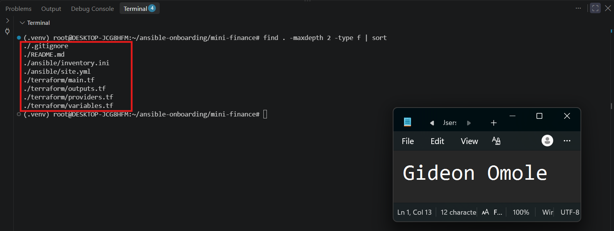

---

### Notes

Created a mini-finance project directory inside the existing ansible-onboarding workspace, split into separate terraform/ and ansible/ subfolders to keep infrastructure code and deployment configuration cleanly separated, consistent with the structure used in previous assignments. Created the four required Terraform files (providers.tf, main.tf, variables.tf, outputs.tf) and the two Ansible files (inventory.ini, site.yml), along with a project README.md.

Created a .gitignore file scoped to this project to exclude Terraform's working directory, state files, saved plans, crash logs, and private key file types, preventing any of these from being accidentally committed. Verified the final structure with find . -maxdepth 2 -type f | sort, confirming all required files were present before starting the actual Terraform configuration.

---

# Task 2 — Create the Azure Infrastructure Using Terraform

## Goal

Use Terraform to provision an Ubuntu Virtual Machine with the required Azure networking and security resources.

### Evidence

#### Screenshot 2 — Terraform code showing the `Allow-SSH` rule for port `22` and the `Allow-HTTP` rule for port `80`

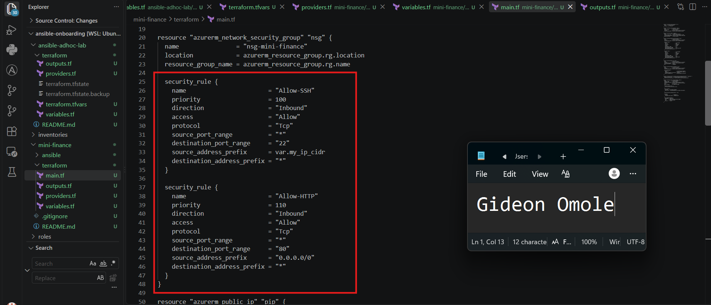

---

#### Screenshot 3 — Terraform code showing the association between `nsg-mini-finance` and `nic-mini-finance`

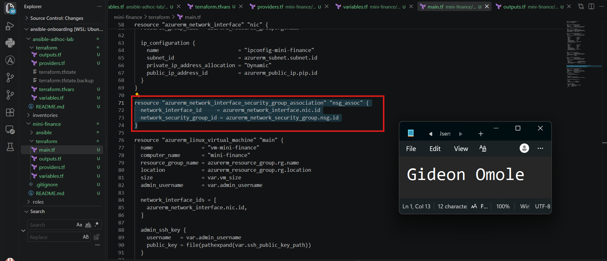

---

### Notes

Configured the AzureRM provider and built out the full Terraform configuration for the Mini Finance infrastructure. Created a resource group, virtual network, and subnet to hold the VM, then defined a network security group with two inbound rules, one allowing SSH on port 22 restricted to my controller's public IP in slash 32 format, and one allowing HTTP on port 80 from anywhere so the website can be reached publicly.

Created a static public IP address and a network interface, then explicitly associated the network security group with the network interface using a separate association resource, since Azure treats the security group and the network interface as two independent resources that need to be linked together for the firewall rules to actually take effect.

Finally, defined the Ubuntu 22 point 04 virtual machine using SSH key authentication with password authentication disabled, referencing my existing public key file, and added a public IP output so the VM's address can be retrieved easily after provisioning. Ran terraform fmt to keep the configuration consistently formatted before moving on to initialization and validation.

---

# Task 3 — Initialize and Apply the Terraform Configuration

## Goal

Format and validate the Terraform configuration, review the execution plan, and provision the Azure infrastructure.

### Evidence

#### Screenshot 4 — End of the `terraform apply` output showing `Apply complete!` with no errors

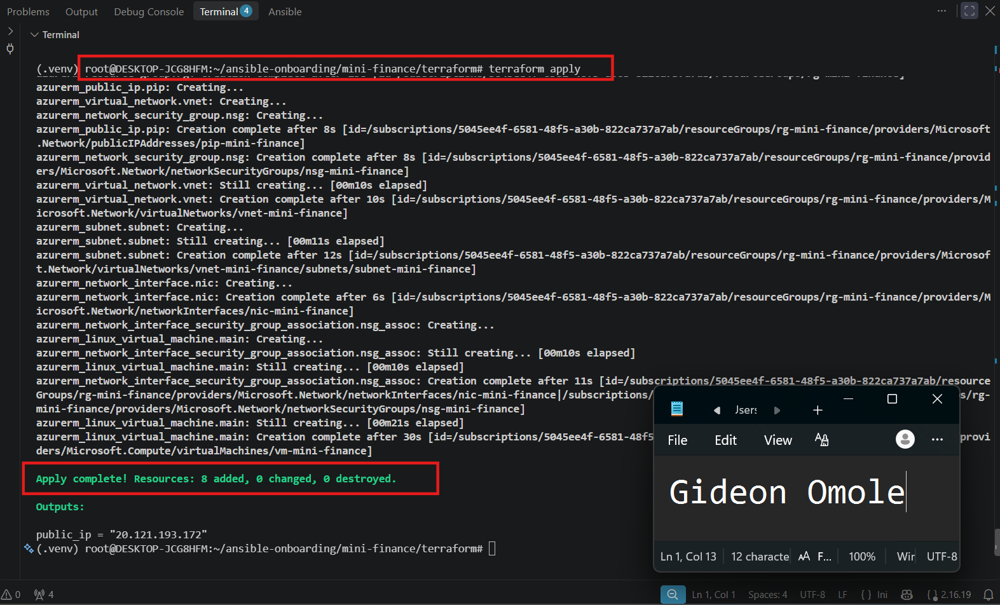

---

#### Screenshot 5 — Output of `terraform output public_ip` showing the VM’s public IP address

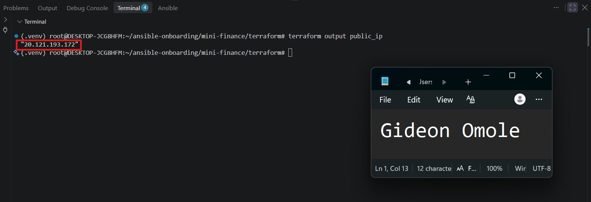

---

### Notes

Ran terraform fmt and terraform init to prepare the working directory, then terraform validate and terraform plan to review the resources before applying. The plan initially failed during validation because Azure's admin_ssh_key only supports RSA keys, and my existing controller key was ED25519. Generated a separate RSA key pair specifically for Azure (id_rsa_azure) and updated the ssh_public_key_path variable to point to it, which resolved the error.

Re-ran terraform plan, confirmed it showed exactly the expected 7 resources to be created with no unexpected changes or deletions, then ran terraform apply and confirmed successfully. Retrieved the VM's public IP using terraform output public_ip for use in the next tasks.

---

# Task 4 — Verify Passwordless SSH Access

## Goal

Confirm that the Ansible controller can connect to the Terraform-provisioned Azure VM using SSH key authentication.

### Evidence

#### Screenshot 6 — Passwordless SSH command and the returned `mini-finance` hostname

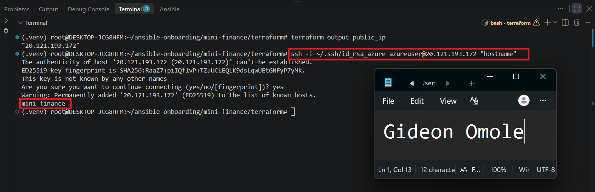

---

### Notes

Tested passwordless SSH access from the controller to the Azure VM using the RSA private key generated in Task 3, since the VM only trusts the matching RSA public key. The connection succeeded on the first attempt, prompting only for host fingerprint confirmation, and returned the expected hostname mini-finance with no password requested, confirming SSH key authentication was configured correctly by Terraform.

---

# Task 5 — Create the Ansible Inventory and Verify Connectivity

## Goal

Add the Terraform-provisioned Azure VM to the Ansible inventory and confirm that Ansible can connect to it.

### Evidence

#### Screenshot 7 — Ansible ping output showing `SUCCESS` and `pong` from the Azure VM

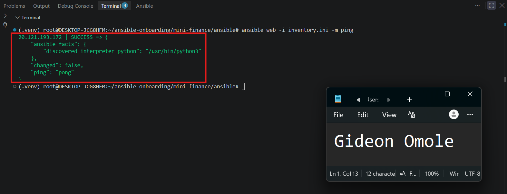

---

### Configuration File

Copy and paste the complete contents of your `ansible/inventory.ini` file below:

```ini
[web]
20.121.193.172

[web:vars]
ansible_user=azureuser
ansible_ssh_private_key_file=/root/.ssh/id_rsa_azure
```

---

# Task 6 — Create the Multi-Play Ansible Playbook

## Goal

Create one Ansible playbook containing separate plays to install Nginx, deploy the Mini Finance website, and verify the deployment.

### Evidence

#### Screenshot 8 — `site.yml` showing Play 1 and the beginning of Play 2

Screenshot must show:

- Play 1 targeting the `web` group
- Installation of `nginx`, `git`, and `rsync`
- Nginx service configured as started and enabled
- Beginning of Play 2 with the Git repository URL and synchronization task

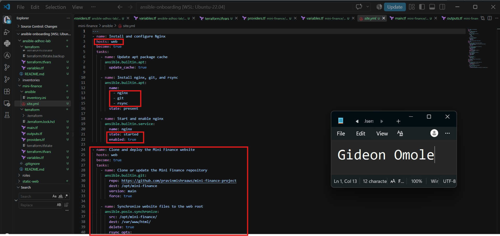

---

#### Screenshot 9 — `site.yml` showing the deployment destination, handler, and Play 3 verification

Screenshot must show:

- Website destination `/var/www/html/`
- Ownership set to `www-data:www-data`
- Nginx reload handler
- Play 3 targeting `localhost`
- The `uri` verification and `assert` condition

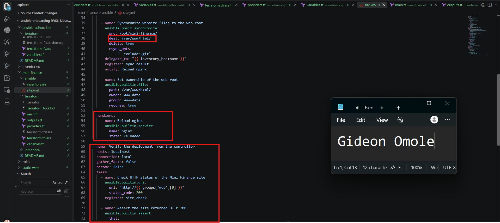

---

### Configuration File

Copy and paste the complete contents of your `ansible/site.yml` file below:

```yaml
---
- name: Install and configure Nginx
  hosts: web
  become: true
  tasks:
    - name: Update apt package cache
      ansible.builtin.apt:
        update_cache: true

    - name: Install nginx, git, and rsync
      ansible.builtin.apt:
        name:
          - nginx
          - git
          - rsync
        state: present

    - name: Start and enable nginx
      ansible.builtin.service:
        name: nginx
        state: started
        enabled: true

- name: Clone and deploy the Mini Finance website
  hosts: web
  become: true
  tasks:
    - name: Clone or update the Mini Finance repository
      ansible.builtin.git:
        repo: https://github.com/pravinmishraaws/mini-finance-project
        dest: /opt/mini-finance
        version: main
        force: true

    - name: Synchronize website files to the web root
      ansible.posix.synchronize:
        src: /opt/mini-finance/
        dest: /var/www/html/
        delete: true
        rsync_opts:
          - "--exclude=.git"
      delegate_to: "{{ inventory_hostname }}"
      register: sync_result
      notify: Reload nginx

    - name: Set ownership of the web root
      ansible.builtin.file:
        path: /var/www/html/
        owner: www-data
        group: www-data
        recurse: true

  handlers:
    - name: Reload nginx
      ansible.builtin.service:
        name: nginx
        state: reloaded

- name: Verify the deployment from the controller
  hosts: localhost
  connection: local
  gather_facts: false
  become: false
  tasks:
    - name: Check HTTP status of the Mini Finance site
      ansible.builtin.uri:
        url: "http://{{ groups['web'][0] }}"
        status_code: 200
      register: site_check

    - name: Assert the site returned HTTP 200
      ansible.builtin.assert:
        that:
          - site_check.status == 200
        success_msg: "Mini Finance site returned HTTP {{ site_check.status }}"
```

---

# Task 7 — Validate and Run the Ansible Playbook

## Goal

Validate the syntax of the multi-play Ansible playbook and run it to install Nginx, deploy the Mini Finance website, and verify the deployment.

### Evidence

#### Screenshot 10 — Successful playbook syntax check showing `playbook: site.yml`

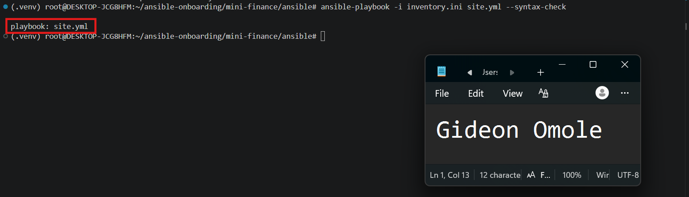

---

#### Screenshot 11 — Play 3 output showing the successful HTTP verification and assertion

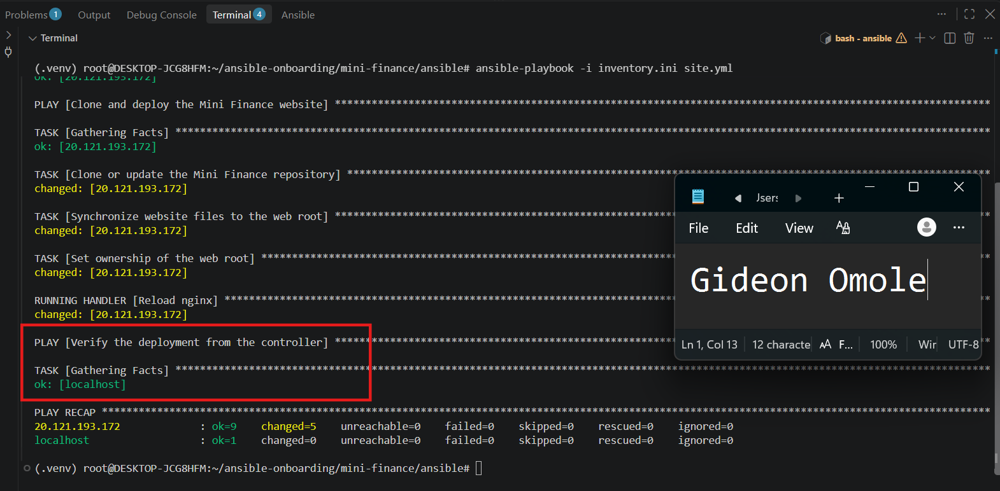

---

#### Screenshot 12 — Final `PLAY RECAP` showing `failed=0` and `unreachable=0`

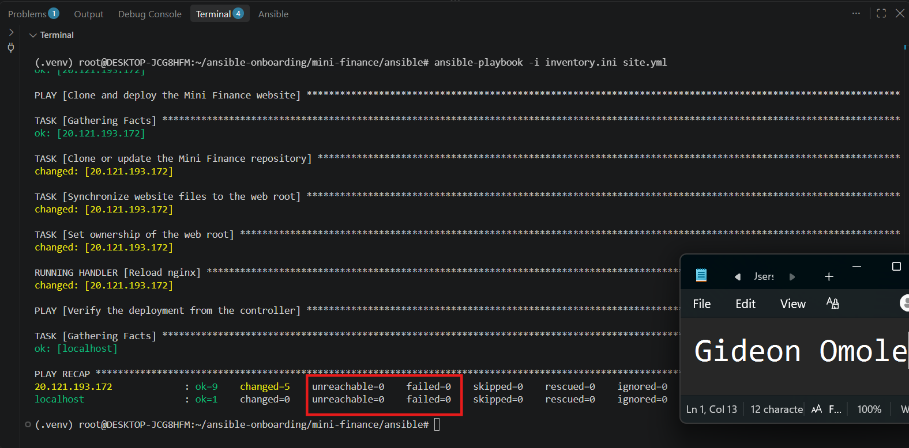

---

### Notes

Ran ansible-playbook -i inventory.ini site.yml --syntax-check first, which passed once the playbook's YAML indentation was corrected. Ran into an issue where the Git clone task had inconsistent indentation, causing a YAML parsing problem, fixed by rewriting the task block with the correct nesting so it aligned with the other tasks in the play.

Also had to correct the repository URL for the Mini Finance website, since the one provided in the assignment returned a 404. Once the correct URL was in place, ran the full playbook with ansible-playbook -i inventory.ini site.yml. Play 1 installed and started Nginx, Git, and rsync successfully. Play 2 cloned the repository, synchronized the files to /var/www/html/, set ownership to www-data:www-data, and triggered the Nginx reload handler since the files had changed. Play 3 confirmed the site returned HTTP 200 from the controller. The final play recap showed failed=0 and unreachable=0 for both the VM and localhost.

---

# Task 8 — Test the Mini Finance Website in a Browser

## Goal

Confirm that the Mini Finance website is publicly accessible through the Azure VM’s public IP address.

### Evidence

#### Screenshot 13 — Mini Finance website successfully loading in the browser, with the Azure VM’s public IP address visible in the address bar

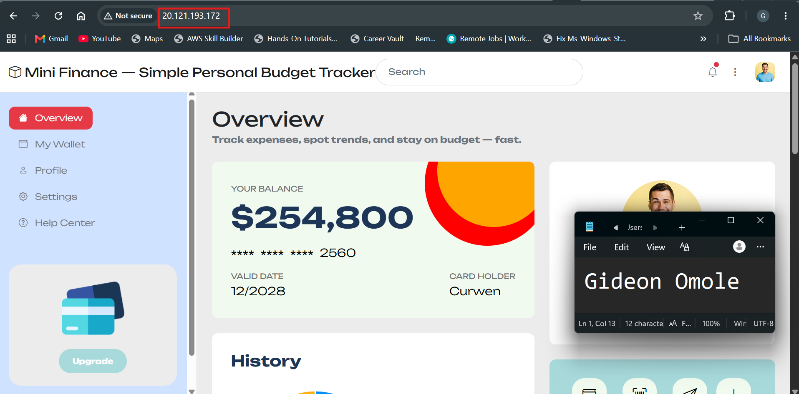

---

### Website URL

Add your deployed website URL below:

```text
http://20.121.193.172/
```

---

# Task 9 — Create the Project README

## Goal

Create a `README.md` file to document the Mini Finance infrastructure and deployment project.

### Evidence

#### Screenshot 14 — Completed `README.md` displayed in the VS Code Markdown preview or terminal

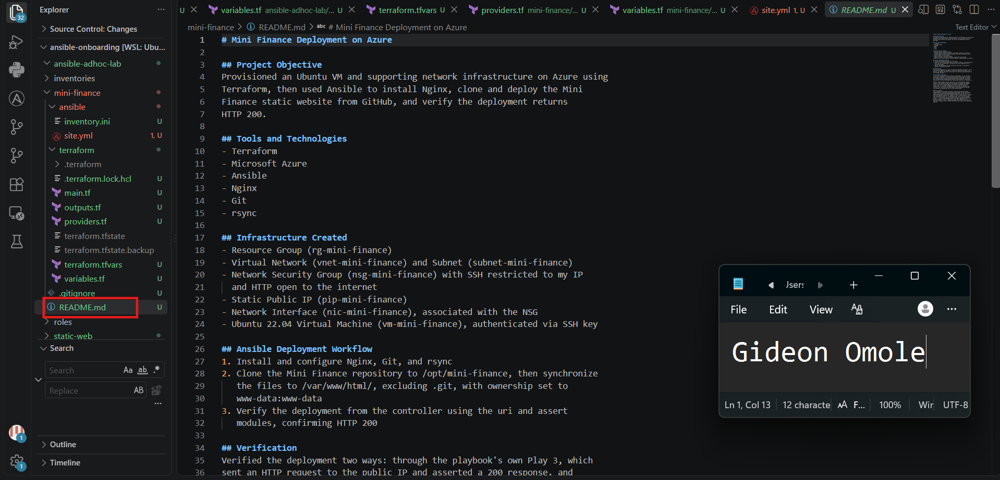

---

### README Content

Copy and paste the complete contents of your `README.md` file below:

```markdown
# Mini Finance Deployment on Azure

## Project Objective
Provisioned an Ubuntu VM and supporting network infrastructure on Azure using
Terraform, then used Ansible to install Nginx, clone and deploy the Mini
Finance static website from GitHub, and verify the deployment returns
HTTP 200.

## Tools and Technologies
- Terraform
- Microsoft Azure
- Ansible
- Nginx
- Git
- rsync

## Infrastructure Created
- Resource Group (rg-mini-finance)
- Virtual Network (vnet-mini-finance) and Subnet (subnet-mini-finance)
- Network Security Group (nsg-mini-finance) with SSH restricted to my IP
  and HTTP open to the internet
- Static Public IP (pip-mini-finance)
- Network Interface (nic-mini-finance), associated with the NSG
- Ubuntu 22.04 Virtual Machine (vm-mini-finance), authenticated via SSH key

## Ansible Deployment Workflow
1. Install and configure Nginx, Git, and rsync
2. Clone the Mini Finance repository to /opt/mini-finance, then synchronize
   the files to /var/www/html/, excluding .git, with ownership set to
   www-data:www-data
3. Verify the deployment from the controller using the uri and assert
   modules, confirming HTTP 200

## Verification
Verified the deployment two ways: through the playbook's own Play 3, which
sent an HTTP request to the public IP and asserted a 200 response, and
manually by opening the public IP directly in a browser and confirming the
site loaded correctly.

## Challenge and Solution
I ran into two separate issues during this assignment. First, Terraform
failed when creating the virtual machine because Azure's admin_ssh_key
only supports RSA keys, and my existing SSH key was ED25519. I resolved
this by generating a dedicated RSA key pair specifically for Azure and
updating the Terraform configuration and Ansible inventory to reference it.

Second, midway through testing, SSH access to the VM suddenly stopped
working. I discovered my home network's public IP address had changed
since I first ran terraform apply, which meant the Network Security
Group's SSH rule no longer matched my current IP and was silently
blocking me. I fixed this by updating the my_ip_cidr variable with my
current IP and re-running terraform apply, which updated just the NSG
rule without recreating the rest of the infrastructure.

## What I Learned
This assignment reinforced how cleanly Terraform and Ansible divide
responsibilities: Terraform handled everything about the infrastructure
itself, while Ansible handled everything about what runs on top of it.
When something went wrong, that separation made it much easier to isolate
where the problem actually was, whether it was a Terraform-level issue
like the SSH key format, or a networking-level issue like the changed
public IP, rather than digging through one large, undifferentiated setup
process. I also learned firsthand how strict YAML indentation is in
Ansible playbooks, since a single misaligned task caused a parsing error
that wasn't obvious until I rewrote the block from scratch with consistent
spacing.
```

---

# LinkedIn Post Required

## Evidence

#### Screenshot 15 — Published LinkedIn post showing the text and at least one deployment screenshot

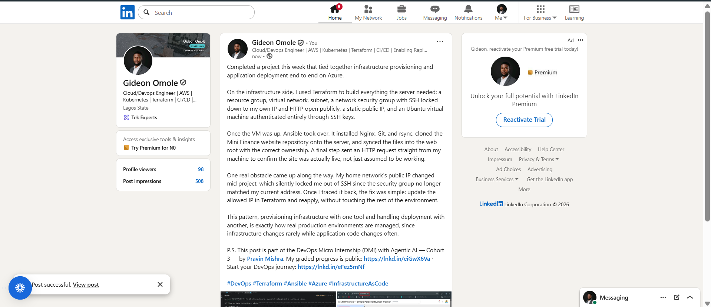

---

#### LinkedIn Post URL

Paste your LinkedIn post URL here:

`https://www.linkedin.com/posts/gideon-omole-5ba318180_devops-terraform-ansible-activity-7505972604298780672-v0RK/?utm_source=share&utm_medium=member_desktop&rcm=ACoAACrC7l4BK-z0pGwSRQMO8ZJ5pFZyqybbIk4`

---

### LinkedIn Submission Notes

**One challenge you faced and how you fixed it:**

One real obstacle came up along the way. My home network's public IP changed mid project, which silently locked me out of SSH since the security group no longer matched my current address. Once I traced it back, the fix was simple: update the allowed IP in Terraform and reapply, without touching the rest of the environment.

---

**One real-world example where you can use this learning:**

This pattern, provisioning infrastructure with one tool and handling deployment with another, is exactly how real production environments are managed, since infrastructure changes rarely while application code changes often.

---

# Assignment Questions

Answer the following in your own words:

**1. What did you provision using Terraform in this assignment?**

I provisioned a full set of Azure infrastructure: a resource group, a virtual network and subnet, a network security group with rules for SSH and HTTP, a static public IP address, a network interface associated with the security group, and an Ubuntu virtual machine configured with SSH key authentication and password authentication disabled.

---

**2. What did Ansible configure and deploy in this assignment?**

Ansible installed and started Nginx, Git, and rsync on the VM, cloned the Mini Finance website repository from GitHub directly onto the server, synchronized the website files into the Nginx web root with the correct ownership, and then verified from my own machine that the site was actually reachable and returning a successful HTTP response.

---

**3. Why is SSH access on port `22` restricted to your public IP address?**

Restricting SSH to a single known IP address significantly reduces the attack surface, since it means the only machine that can even attempt to authenticate is mine, rather than leaving port 22 exposed to anyone on the internet who could attempt brute-force login attempts or exploit vulnerabilities.

---

**4. Why is HTTP port `80` open to the internet?**

The whole purpose of the website is to be publicly accessible, so port 80 needs to accept traffic from any visitor. Unlike SSH, which is an administrative access point that only I should use, HTTP is the actual product being served and is meant to be reached by anyone.
---

**5. What is the purpose of the Ansible inventory file?**

The inventory file tells Ansible which servers exist and how to connect to them, including the IP address, SSH username, and private key path. It lets the rest of the playbook refer to servers by group name instead of hardcoding connection details into every task.

---

**6. Why does the playbook use separate plays for install, deploy, and verify?**

Splitting these into separate plays keeps each one focused on a single responsibility, which makes the playbook easier to read, debug, and maintain. Installing software rarely needs to change once it is done, while deploying website content happens more frequently, and verification is a completely different concern that runs locally rather than on the managed server, so keeping them apart avoids mixing unrelated logic together.

---

**7. Why is `rsync` useful when deploying website files?**

rsync only copies files that have actually changed instead of transferring everything every time, which makes deployments faster and avoids unnecessary disruption. It also supports options like excluding specific files or directories, such as excluding the .git folder when syncing a cloned repository into a web root.

---

**8. What does the Ansible `uri` module verify in this assignment?**

The uri module sends an actual HTTP request to the server's public IP address and checks the returned status code, confirming that Nginx is genuinely running and serving the website correctly, rather than just assuming the deployment succeeded because no errors were reported earlier in the playbook.

---

**9. What issue did you face during this assignment, and how did you fix it?**

Beyond the IP address issue mentioned above, I also hit a problem where Azure rejected my existing SSH key because it only accepts RSA keys, not the ED25519 key I normally use. I generated a separate RSA key pair specifically for this Azure VM and updated both my Terraform configuration and Ansible inventory to reference it.

---

**10. What did you learn from using Terraform and Ansible together?**

I learned how naturally the two tools complement each other when their responsibilities are kept separate. Terraform focused entirely on creating and describing the infrastructure, while Ansible focused entirely on configuring and deploying onto that infrastructure once it existed. This separation made troubleshooting far more straightforward, since I always knew whether a problem belonged to the infrastructure layer or the configuration layer, instead of untangling one large, mixed process.

---

# Required Files

Confirm that the following files are included in your assignment folder:

- [ ] `.gitignore`
- [ ] `README.md`
- [ ] `terraform/providers.tf`
- [ ] `terraform/main.tf`
- [ ] `terraform/variables.tf`
- [ ] `terraform/outputs.tf`
- [ ] `ansible/inventory.ini`
- [ ] `ansible/site.yml`

---

# Submission Instructions

- Add all required screenshots in the correct order.
- Full Name must be visible in required screenshots.
- Add the Azure VM public IP address.
- Add the final Mini Finance website URL.
- Paste `inventory.ini`, `site.yml`, and `README.md` as editable text.
- Answer all assignment questions clearly in your own words.
- Add your LinkedIn post URL.
- Do not expose SSH private keys, passwords, Azure credentials, subscription IDs, Terraform state contents, or other sensitive information.

---

# Completion Checklist

- [ ] Task 1: `mini-finance` project structure created
- [ ] Task 1: `.gitignore` created
- [ ] Task 2: Terraform Azure infrastructure code created
- [ ] Task 2: `Allow-SSH` rule configured for port `22`
- [ ] Task 2: `Allow-HTTP` rule configured for port `80`
- [ ] Task 2: NSG associated with the Network Interface
- [ ] Task 3: `terraform fmt` completed
- [ ] Task 3: `terraform init` completed
- [ ] Task 3: `terraform validate` completed successfully
- [ ] Task 3: `terraform apply` completed successfully
- [ ] Task 3: `terraform output public_ip` displayed the VM public IP
- [ ] Task 4: Passwordless SSH works from the Ansible controller
- [ ] Task 5: `inventory.ini` created
- [ ] Task 5: Ansible ping returns `SUCCESS` and `pong`
- [ ] Task 6: `site.yml` contains three separate plays
- [ ] Task 6: Play 1 installs Nginx, Git, and rsync
- [ ] Task 6: Play 2 clones and deploys the Mini Finance website
- [ ] Task 6: Play 3 verifies HTTP status code `200`
- [ ] Task 7: Playbook syntax check passes
- [ ] Task 7: Ansible playbook completes successfully
- [ ] Task 7: Final recap shows `failed=0` and `unreachable=0`
- [ ] Task 8: Mini Finance website loads in the browser
- [ ] Task 8: Azure VM public IP is visible in the browser screenshot
- [ ] Task 9: `README.md` completed
- [ ] Screenshots 1–15 are included
- [ ] `inventory.ini`, `site.yml`, and `README.md` are pasted as editable text
- [ ] Assignment questions are answered
- [ ] LinkedIn post published with Anyone visibility
- [ ] LinkedIn post URL added
- [ ] No sensitive information is exposed

---

## About DMI & CloudAdvisory

DevOps Micro Internship (DMI) is a project-based DevOps program run by Pravin Mishra and The CloudAdvisory, focused on real-world execution, systems thinking, and career readiness.

It helps learners build strong DevOps foundations with hands-on experience.

---

## Resources

- DMI Official Website: [https://dmi.pravinmishra.com?utm_source=github&utm_medium=readme](https://dmi.pravinmishra.com?utm_source=github&utm_medium=readme)
- University: [https://university.pravinmishra.com?utm_source=github&utm_medium=readme](https://university.pravinmishra.com?utm_source=github&utm_medium=readme)
- Discord Community: [https://discord.pravinmishra.com?utm_source=github&utm_medium=readme](https://discord.pravinmishra.com?utm_source=github&utm_medium=readme)
- Blog: [https://dmi.pravinmishra.com/blog?utm_source=github&utm_medium=readme](https://dmi.pravinmishra.com/blog?utm_source=github&utm_medium=readme)
- YouTube Playlist: [https://www.youtube.com/playlist?list=PLFeSNDtI4Cho](https://www.youtube.com/playlist?list=PLFeSNDtI4Cho)
- Pravin Mishra LinkedIn: [https://www.linkedin.com/in/pravin-mishra-aws-trainer/](https://www.linkedin.com/in/pravin-mishra-aws-trainer/)
- CloudAdvisory LinkedIn: [https://www.linkedin.com/company/thecloudadvisory/](https://www.linkedin.com/company/thecloudadvisory/)

---

*This submission is part of DevOps Micro Internship (DMI) — Agentic AI Track.*