# Assignment — Deploy EpicBook with Terraform and Ansible Roles

Part of the DevOps Micro Internship (DMI) with Agentic AI

---

## Purpose

In this assignment, you will deploy the EpicBook web application using Terraform and Ansible roles.

Terraform provisions the cloud infrastructure, including one Ubuntu VM and one managed MySQL database. Ansible roles configure the VM, install required software, deploy the EpicBook application, configure Nginx, connect the app to the managed MySQL database, and verify the deployment.

---

# Task 1 — Set Up the Project Folder Layout

## Goal

Create the project folder structure for Terraform and Ansible roles.

Terraform will be used to provision the cloud infrastructure. Ansible roles will be used to configure the VM and deploy the EpicBook application.

### Evidence

#### Screenshot 1 — Terminal showing the completed `epicbook-prod` project structure

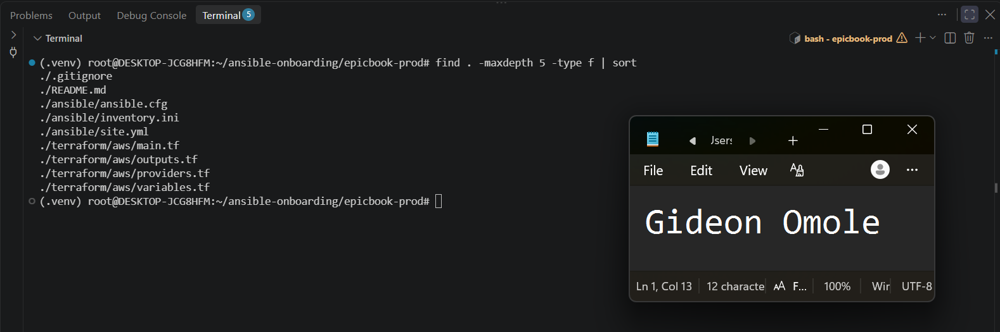.

---

### Notes

Answer the following in your own words:

**1. Which cloud provider did you choose for this assignment?**

I chose AWS, using EC2 for the application server and RDS for the managed MySQL database.

---

**2. Why is it useful to keep Terraform files and Ansible files in separate folders?**

Terraform and Ansible have completely different responsibilities, Terraform creates the infrastructure while Ansible configures what runs on top of it, so keeping their code physically separate reflects that division cleanly. It also means each tool's code can be read, tested, or reused independently without unrelated files getting in the way, and a single project-level .gitignore can protect both sides' secrets without needing to trace which folder a sensitive file belongs to

---

**3. What is the purpose of the `roles` directory in Ansible?**

The roles directory organizes automation into self-contained, reusable units, each with a single clear responsibility, such as preparing the server, configuring Nginx, or deploying the application. Instead of writing one long, tangled playbook, each role holds its own tasks, templates, and handlers, which makes the automation easier to read, test, and reuse in other projects without needing to untangle unrelated logic first.

---

# Task 2 — Provision the Infrastructure with Terraform

## Goal

Run Terraform to provision the cloud infrastructure for the EpicBook deployment.

Terraform will create the VM, managed MySQL database, networking, security rules, and required outputs.

### Evidence

#### Screenshot 2 — `terraform apply` completed successfully

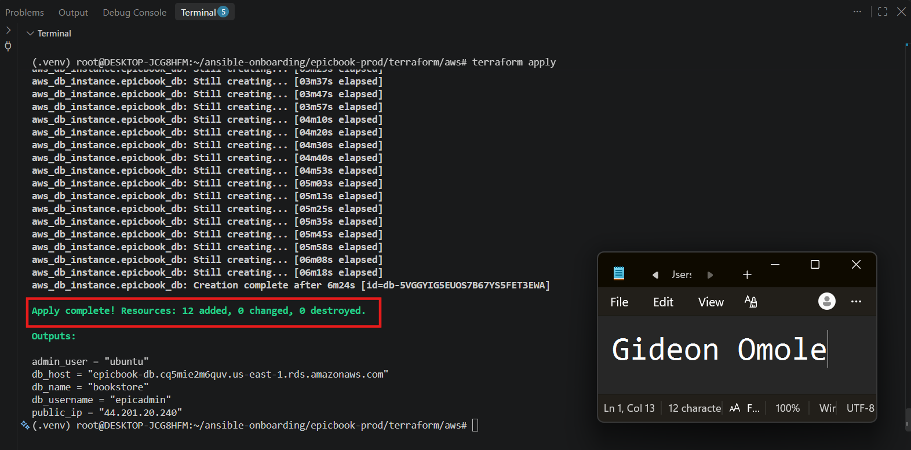

---

#### Screenshot 3 — Output of `terraform output`

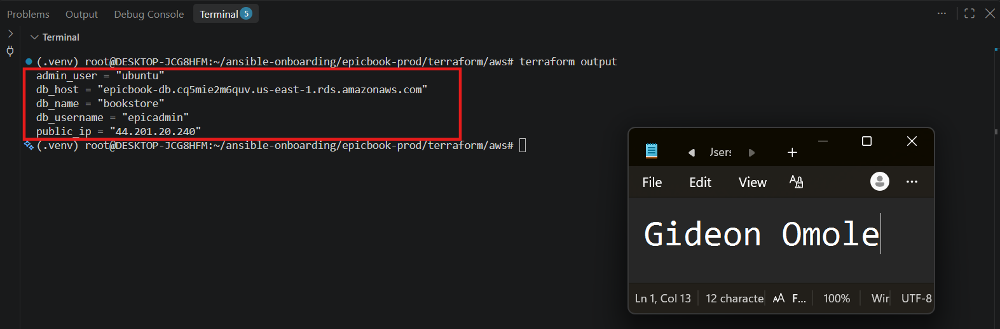

---

#### Screenshot 4 — Azure Portal or AWS Console showing the VM running

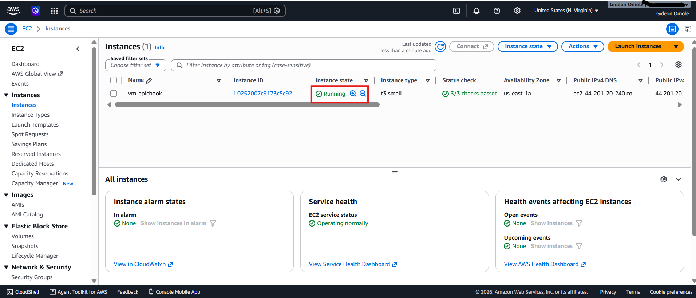

---

#### Screenshot 5 — Azure Portal or AWS Console showing the managed MySQL database created

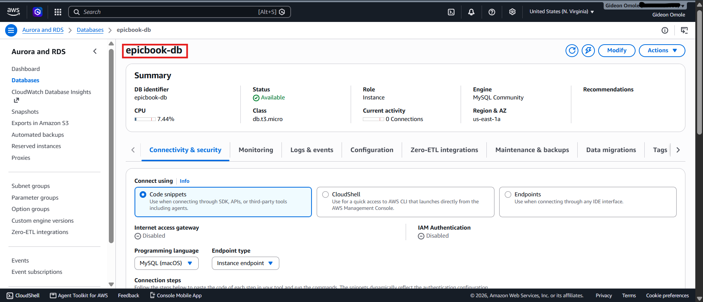

---

### Notes

Answer the following in your own words:

**1. What resources did Terraform create for this assignment?**

Terraform created a VPC with a public subnet and a second subnet in a different availability zone for the database, an internet gateway and route table for outbound access, two separate security groups (one for the app server allowing SSH from my IP and HTTP from anywhere, one for the database allowing MySQL only from the app server's security group), a key pair from my existing SSH public key, an EC2 instance running Ubuntu, an RDS MySQL database subnet group, and the RDS MySQL database instance itself.

---

**2. Why should you review `terraform plan` before running `terraform apply`?**

terraform plan shows exactly what Terraform intends to create, change, or destroy before anything actually happens, which is the last chance to catch a mistake, like an unexpected resource being destroyed, the wrong region, or an oversized and costly instance type, before it becomes a real, billable change. Since apply acts on real infrastructure rather than a simulation, skipping this review step means the first time you'd notice a problem is after it has already happened.

---

**3. Why should database passwords not be shown in Terraform output?**

Terraform output is often displayed directly in the terminal, saved in logs, or included in screenshots and documentation, so any sensitive value shown there can easily end up somewhere it shouldn't. Outputs are meant for values other tools or people need to reference, like the database hostname or the VM's IP address, not for exposing credentials, which should instead be marked sensitive in Terraform or handled through a separate secrets mechanism entirely.

---

# Task 3 — Verify SSH Key-Based Access

## Goal

Verify that the cloud VM can be accessed from the Ansible controller using SSH key-based authentication.

### Evidence

#### Screenshot 6 — Successful SSH hostname check from the Ansible controller

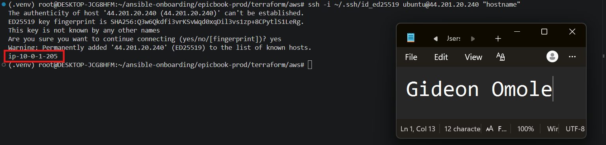

---

### Notes

Answer the following in your own words:

**1. What command did you use to verify SSH access?**

I ran ssh -i ~/.ssh/id_ed25519 ubuntu@<PUBLIC_IP> "hostname" from the Ansible controller, using the public IP address returned by terraform output public_ip

---

**2. What proves that SSH key-based access worked successfully?**

The command returned the VM's hostname immediately without ever prompting for a password, only asking me to confirm the host's fingerprint on the very first connection. That confirmed the public key Terraform registered on the VM through the key pair resource correctly matched my private key on the controller, and that the security group was actually allowing my IP address through on port 22.

---

**3. What would you check if SSH returned `Permission denied (publickey)`?**

I would first confirm I'm using the correct private key with the -i flag, since it needs to exactly match the public key Terraform registered on the VM through the aws_key_pair resource. I would also check that the username is correct for the AMI being used (ubuntu for official Ubuntu images, not something like ec2-user, which is specific to Amazon Linux), and confirm the security group actually allows inbound SSH from my current public IP, since an outdated or mismatched /32 rule would cause the connection to be silently blocked rather than explicitly reveal itself as the cause.

---

# Task 4 — Create the Ansible Inventory and Configuration

## Goal

Create the Ansible inventory file and local Ansible configuration for the EpicBook VM.

The inventory tells Ansible which VM to manage and which SSH user to use.

### Evidence

#### Screenshot 7 — `inventory.ini` showing the VM under the `web` group

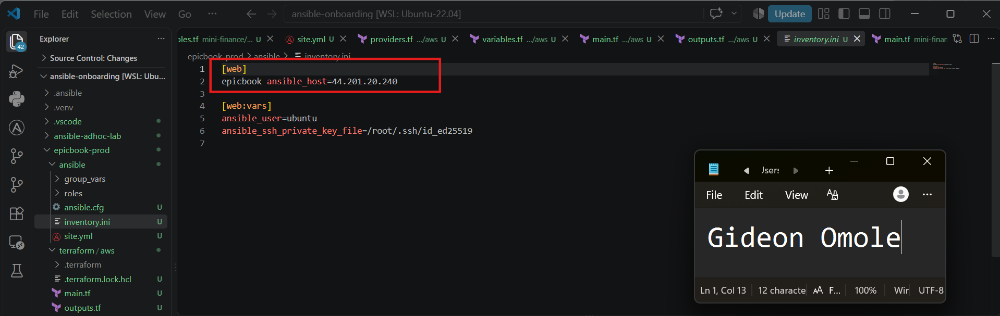

---

#### Screenshot 8 — Output of `ansible-inventory -i inventory.ini --graph`

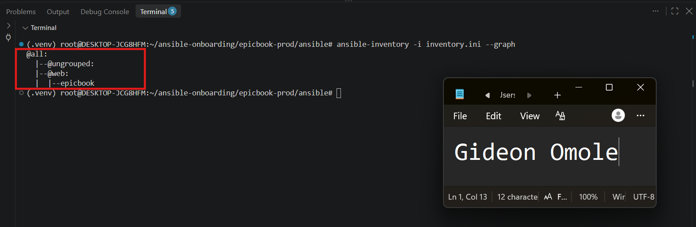

---

#### Screenshot 9 — Output of `ansible web -i inventory.ini -m ping`

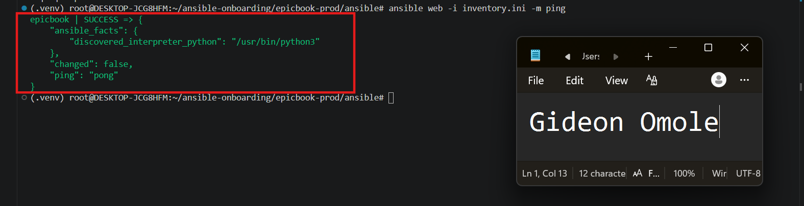

---

### Notes

Answer the following in your own words:

**1. What is the purpose of `inventory.ini`?**

inventory.ini tells Ansible which servers exist and how to reach them, grouping hosts under labels like web so the rest of the playbook can target them by group name instead of hardcoding IP addresses and connection details into every task.

---

**2. What does `ansible_host` store?**

ansible_host stores the actual IP address (or hostname) Ansible should connect to for a given inventory entry, keeping the real address separate from the friendly name (like epicbook) used to refer to that server elsewhere in the project.

---

**3. What does `ansible_ssh_private_key_file` tell Ansible?**

It tells Ansible exactly which private key file to use when authenticating over SSH to the managed host, rather than relying on SSH's default key discovery, which matters whenever the key isn't the system's default (like id_rsa) or lives at a non-standard path.

---

**4. Why is `host_key_checking = False` used only for this temporary lab?**

Host key checking normally protects against connecting to a server whose SSH fingerprint has unexpectedly changed, which can be a sign of a spoofed or compromised host, so disabling it removes a real security safeguard. It's acceptable here only because this is a short-lived, disposable lab environment where I control both ends of the connection and the servers are torn down afterward, but in a production setting fingerprints should be properly verified and stored in known_hosts ahead of time instead of skipping the check entirely, since disabling it there would leave real infrastructure open to a genuine risk it's meant to catch.

---

# Task 5 — Create the Main Ansible Playbook

## Goal

Create the main Ansible playbook that runs the required roles in the correct order.

The `site.yml` file will call the `common`, `nginx`, and `epicbook` roles.

### Evidence

#### Screenshot 10 — `site.yml` showing the roles in the correct order

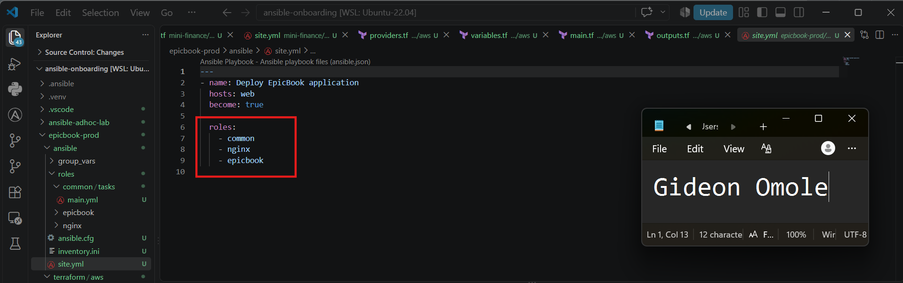

---

#### Screenshot 11 — Output of `ansible-playbook -i inventory.ini site.yml --syntax-check`

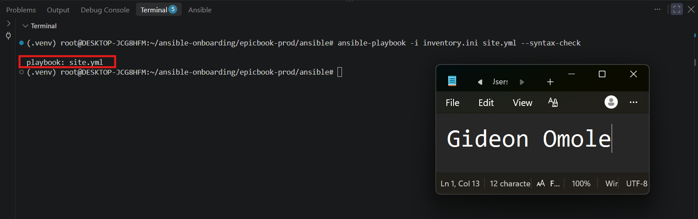

---

### Notes

Answer the following in your own words:

**1. What is the purpose of `site.yml`?**

site.yml is the main playbook that ties everything together. It defines which hosts to target, that tasks need elevated privileges, and which roles to run and in what order, but it deliberately contains no actual configuration logic itself, keeping that separated inside each role.

---

**2. Why should the roles run in the order `common`, `nginx`, and `epicbook`?**

Each role depends on the one before it being finished. common has to run first because it installs baseline tools like Git and curl that later roles rely on, nginx runs second so the reverse proxy exists before there's anything meaningful to route traffic to, and epicbook runs last since deploying and starting the actual application only makes sense once the server is prepared and Nginx is ready to receive requests for it. Ansible runs roles strictly in the order they're listed, so this sequence directly determines the order things happen on the server.

---

**3. What does `become: true` allow Ansible to do?**

become: true tells Ansible to run tasks with elevated, root-level privileges on the managed server, similar to prefixing a command with sudo. This is necessary because actions like installing packages, editing system configuration files, or managing services require administrative access that the regular SSH user doesn't have by default.

---

# Task 6 — Create the `common` Role

## Goal

Create the `common` role to prepare the Ubuntu VM with the basic packages required for the EpicBook deployment.

This role handles the common server setup before Nginx and the application are configured.

### Evidence

#### Screenshot 12 — `roles/common/tasks/main.yml` showing the common setup tasks

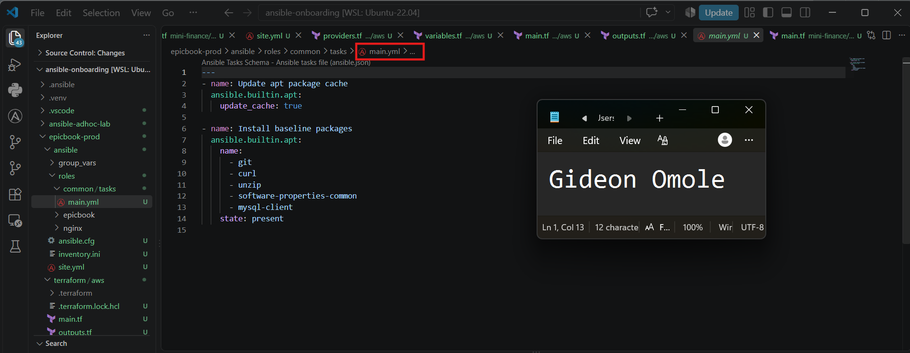

---

### Notes

Answer the following in your own words:

**1. What is the responsibility of the `common` role?**

The common role prepares the server with baseline tools every later role depends on, updating the package cache and installing things like Git, curl, unzip, and mysql-client, without touching anything specific to Nginx or the application itself.

---

**2. Why should Nginx installation not be placed inside the `common` role?**

Keeping Nginx installation in its own role keeps each role focused on a single, clear responsibility, which makes the automation easier to read, test, and reuse. If Nginx setup were mixed into common, that role would no longer be truly generic server preparation, and reusing common in a different project that doesn't need Nginx would require pulling that logic back out again.

---

**3. Why is `mysql-client` useful in this deployment?**

mysql-client gives the server command-line tools to connect to and query the managed MySQL database directly, which is useful for verifying connectivity, checking whether the schema already exists, or manually inspecting the database during troubleshooting, separate from whatever database library the Node.js application itself uses internally.

---

# Task 7 — Create the `nginx` Role

## Goal

Create the `nginx` role to install Nginx and configure it as a reverse proxy for the EpicBook application.

Nginx will receive browser traffic on port `80` and forward it to the EpicBook Node.js application running on the VM.

### Evidence

#### Screenshot 13 — `roles/nginx/tasks/main.yml` showing Nginx installation and site configuration tasks

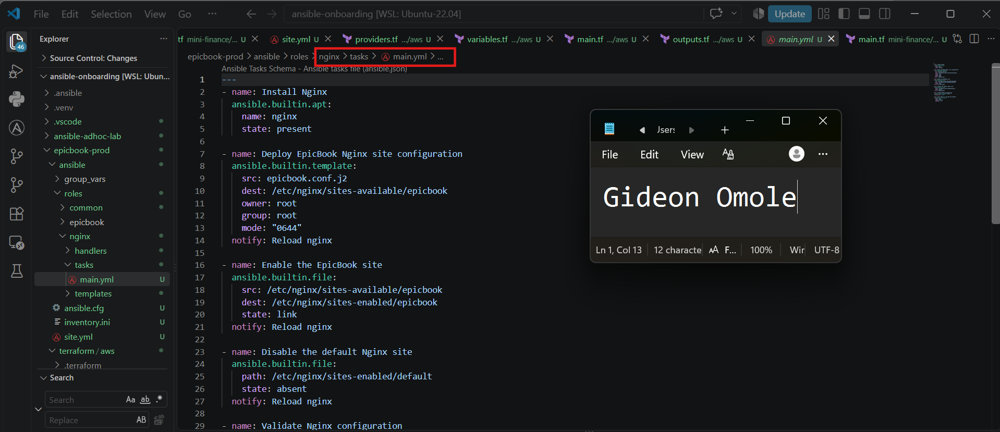

---

#### Screenshot 14 — `roles/nginx/templates/epicbook.conf.j2` showing the reverse proxy configuration

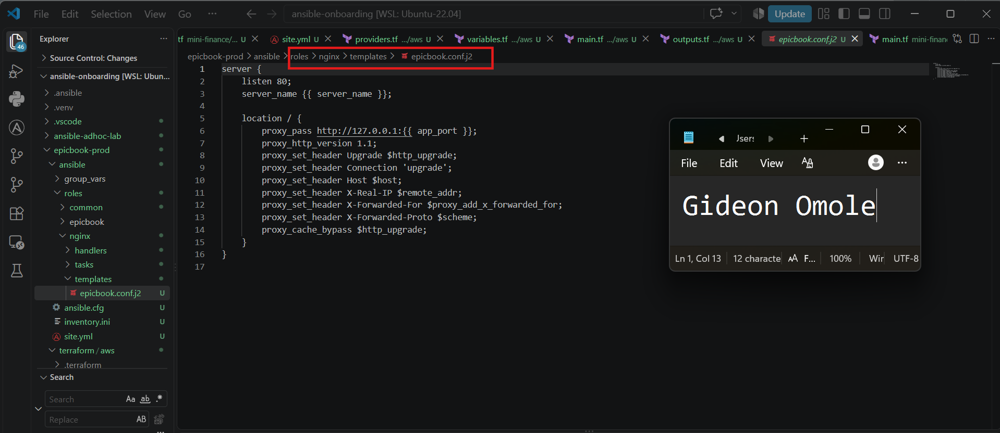

---

### Notes

Answer the following in your own words:

**1. What is the responsibility of the `nginx` role?**

The nginx role installs Nginx and configures it as a reverse proxy for the EpicBook application, deploying the site configuration from a template, enabling it, disabling the default site, validating the configuration, and making sure the service is running and enabled. It has no responsibility for the application itself, that belongs entirely to the epicbook role.

---

**2. Why is Nginx configured as a reverse proxy in this deployment?**

Nginx sits in front of the Node.js application, accepting public traffic on port 80 and forwarding it internally to the app running on its own port. This means the Node.js process never needs to be exposed directly to the internet, and Nginx can also handle things like preserving the original client IP and protocol in the forwarded request headers, which the application relies on to behave correctly behind a proxy.

---

**3. Why should the application port come from `group_vars/web.yml` instead of being hard-coded?**

Using a variable instead of hardcoding the port keeps the Nginx template reusable and consistent across the project. If the application's port ever needed to change, it would only need to be updated in one place, group_vars/web.yml, rather than tracking down and editing the value everywhere it happens to appear across different role files.

---

# Task 8 — Create the `epicbook` Role

## Goal

Create the `epicbook` role to deploy the EpicBook application, connect it to the managed MySQL database, and run the application on port `8080` using PM2.

### Evidence

#### Screenshot 15 — `roles/epicbook/tasks/main.yml` showing application deployment tasks

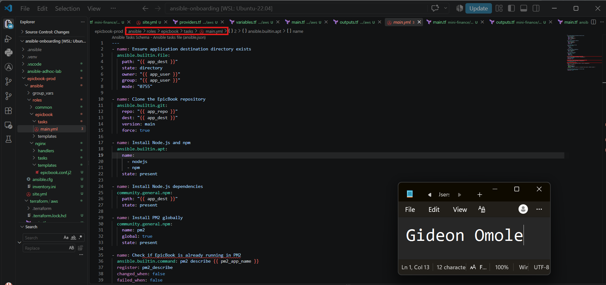

---

#### Screenshot 16 — Task or file showing how the database connection is configured, with secrets hidden

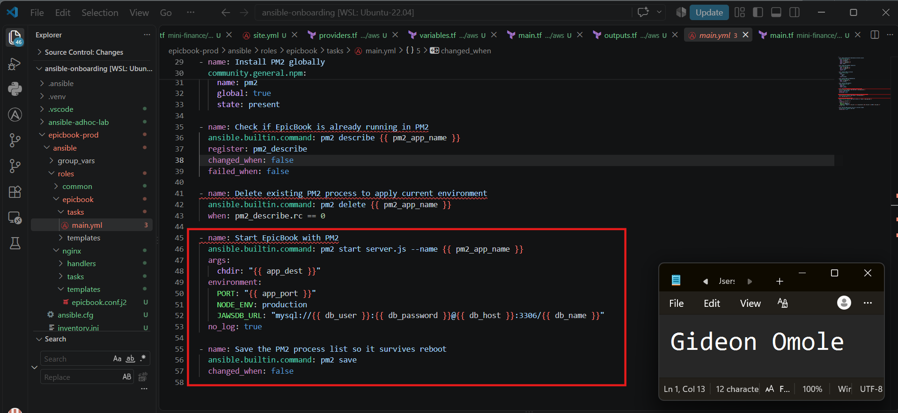

---

#### Screenshot 17 — Task or output showing the EpicBook application managed by PM2

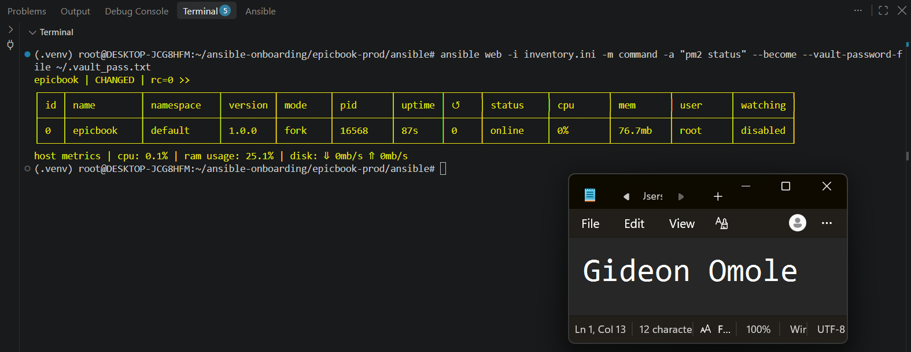

---

### Notes

Answer the following in your own words:

**1. What is the responsibility of the `epicbook` role?**

The epicbook role gets the actual application running on the server. It creates the application directory, clones the repository from GitHub, installs Node.js and its dependencies, configures the database connection, and starts and manages the application process using PM2. It doesn't touch anything related to the reverse proxy or general server setup, those belong to the nginx and common roles.

---

**2. Why is PM2 used for the EpicBook Node.js application?**

Node.js applications don't keep running on their own the way a proper background service does, if you just run node server.js directly, the process dies the moment the terminal session ends or the app crashes. PM2 manages the application as a persistent background process, automatically restarting it if it crashes, and keeping it running independently of any SSH session, which is essential for a server that needs to stay available.

---

**3. Why should database passwords not be hard-coded in public files?**

A hard-coded password in a file that ends up in version control becomes permanently exposed the moment it's pushed, anyone with access to the repository, including its history even after the line is later removed, could read it and gain direct access to the database. Using a variable reference backed by an encrypted vault file keeps the real value out of any file that could realistically be shared, committed, or viewed by someone who shouldn't have it.

---

**4. What does it mean for the application to run on port `8080` while Nginx listens on port `80`?**

It means the Node.js application itself is never directly exposed to the internet, it only listens locally on the server at port 8080. Nginx is the only thing actually facing outside traffic on port 80, and it forwards, or proxies, incoming requests internally to the application's port. This adds a layer of separation and control, allowing Nginx to handle things like the public-facing entry point, while the application itself stays reachable only from within the server.

---

# Task 9 — Create Group Variables

## Goal

Create reusable variables for the EpicBook deployment.

The `group_vars/web.yml` file stores values that can be reused across the Ansible roles.

### Evidence

#### Screenshot 18 — `group_vars/web.yml` showing the application, PM2, and database variables, with passwords hidden or masked

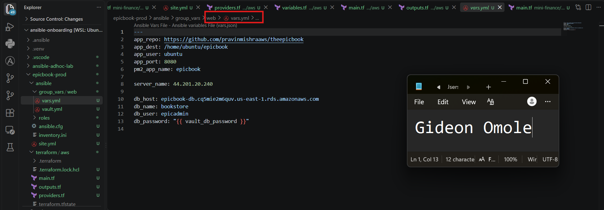

---

### Notes

Answer the following in your own words:

**1. What is the purpose of `group_vars/web.yml`?**

It's a single file where all the shared settings live, things like the app's repository link, its port, and the database details, so the roles don't need those values typed directly into them. If something changes, I only need to update it in one place.
---

**2. Which values did you store in `group_vars/web.yml`?**

The app's GitHub repo URL, where it should live on the server, which user runs it, its port, the PM2 process name, the Nginx server name, and the database connection info, host, name, and username. The password isn't stored directly, it points to a separate vault variable instead.

---

**3. How did you handle the database password securely?**

Instead of writing the real password anywhere in plain text, I used Ansible Vault to encrypt it in its own file. The regular settings file just references it by name, and Ansible automatically pulls the real, decrypted value in at runtime using a separate vault password, so the actual database password never sits in a readable file..

---

# Task 10 — Run the Ansible Playbook

## Goal

Run the Ansible playbook to configure the VM and deploy the EpicBook application.

The playbook should run the roles in this order:

1. `common`
2. `nginx`
3. `epicbook`

### Evidence

#### Screenshot 19 — Ansible playbook output showing the roles running

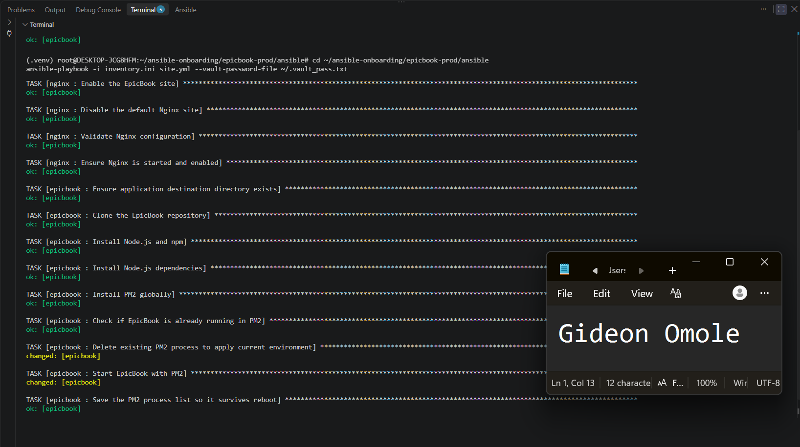

---

#### Screenshot 20 — Final Ansible recap showing `failed=0`

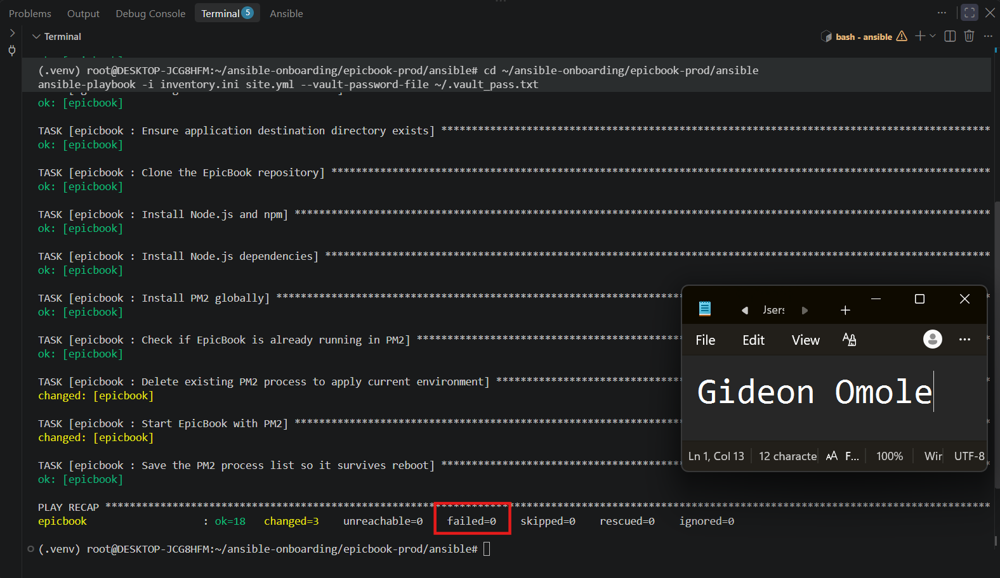

---

#### Screenshot 21 — Output of `ansible web -i inventory.ini -m command -a "systemctl is-active nginx" --become`

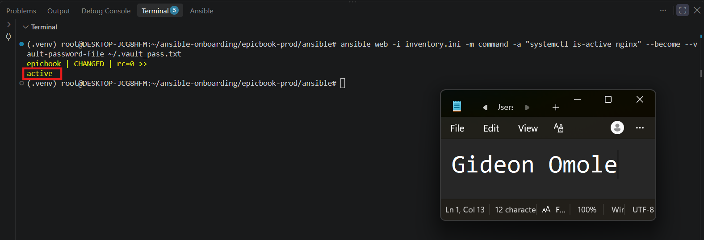

---

#### Screenshot 22 — Output of `ansible web -i inventory.ini -m command -a "pm2 status"`

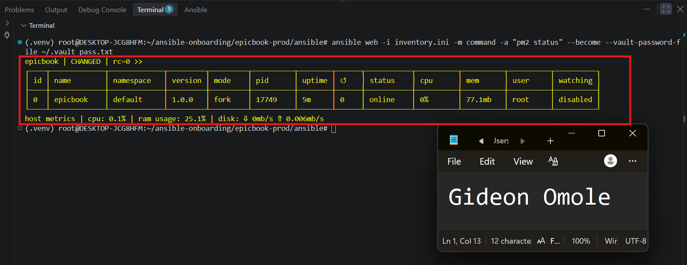

---

#### Screenshot 23 — Output of `ansible web -i inventory.ini -m command -a "curl -I http://localhost:8080"`

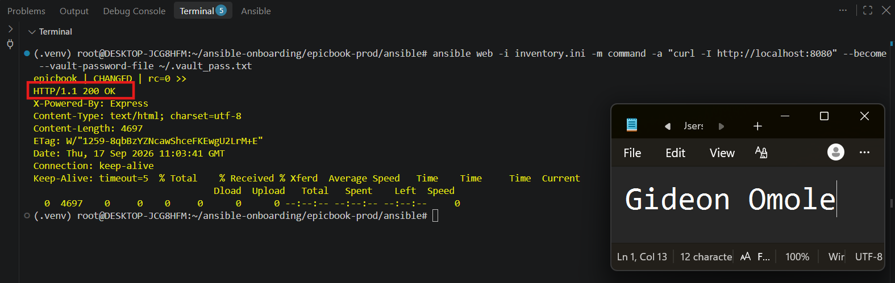

---

### Notes

Answer the following in your own words:

**1. What command did you run to execute the Ansible playbook?**

I ran ansible-playbook -i inventory.ini site.yml --vault-password-file ~/.vault_pass.txt, which supplies the vault password from a local file so Ansible can decrypt the database password stored in the encrypted vault file.

---

**2. How do you know all roles completed successfully?**

The final play recap at the end of the run showed failed=0, meaning every task in the common, nginx, and epicbook roles completed without error. I also watched each task individually during the run and confirmed there were no red FAILED lines anywhere in the output.

---

**3. What proves that Nginx is active?**

Running systemctl is-active nginx through Ansible returned active, confirming the Nginx service is genuinely running on the server, not just that the install task reported success earlier in the playbook.

---

**4. What proves that PM2 is managing the EpicBook application?**

Running pm2 status showed a process named epicbook with a status of online, confirming PM2 is actively tracking and keeping the application running rather than it having started once and then silently stopped.

---

**5. What proves that the EpicBook application responds on port `8080`?**

Running curl -I http://localhost:8080 directly on the server returned a real HTTP response instead of a connection error, confirming the Node.js application itself is actually listening and responding on that port, independent of whether Nginx is correctly proxying to it.
---

# Task 11 — Verify the EpicBook Deployment

## Goal

Verify that the EpicBook application is running, accessible in the browser, and connected to the managed MySQL database.

### Evidence

#### Screenshot 24 — Output of `curl -I http://<public_ip>`

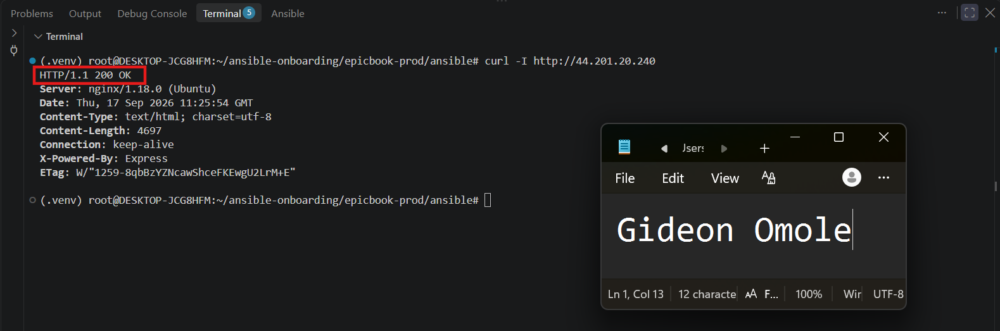
---

#### Screenshot 25 — Output of the cart API test command

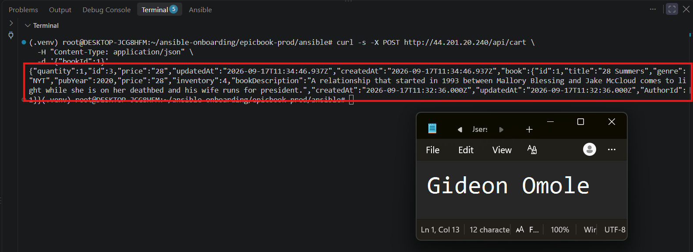

---

#### Screenshot 26 — Output of the `/cart` HTTP status check

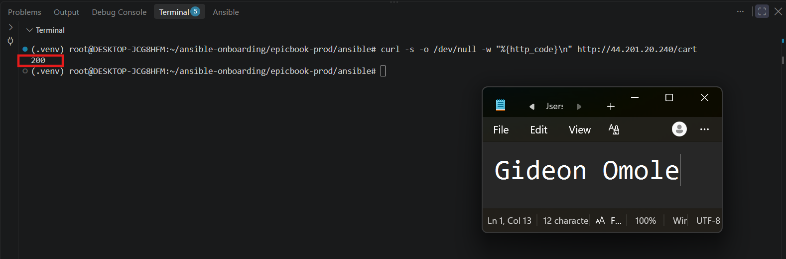

---

#### Screenshot 27 — Browser showing the EpicBook application loaded from `http://<public_ip>`

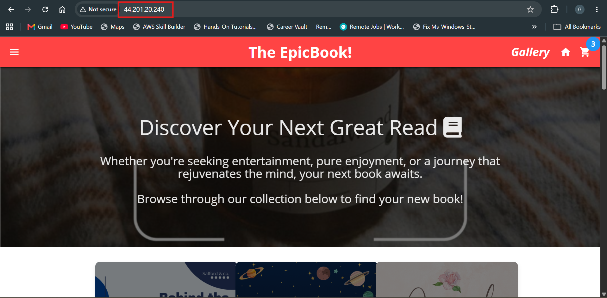

---

### Notes

Answer the following in your own words:

**1. What HTTP response did you receive from the public application URL?**

Running curl -I http://44.201.20.240 returned a 200 OK response, confirming the application was reachable from the public internet, not just locally on the server.

---

**2. What did the cart API test prove?**

Sending a POST request to /api/cart with a real book ID returned a full JSON response containing the book's actual details, title, price, and description, pulled directly from the database. This proved the entire request path was working end to end, from the public internet, through the security group, through Nginx's reverse proxy, into the Node.js application, and all the way to a real query against the managed MySQL database.

---

**3. What did the `/cart` status check return?**

The status check returned 200, confirming the cart page itself loads successfully rather than returning an error like a 502 or 504.

---

**4. What issue did you face during verification, and how did you fix it?**

The cart API initially returned a 504 Gateway Timeout. Checking the application's logs showed it was trying to look up a book with ID 1, but the book table existed with no data in it, since Sequelize had automatically created the database schema on first connection but never inserted any actual book records. I found the seed SQL files already included in the application's own db/ folder and imported them directly into the database, first the author data and then the book data, since the book table has a foreign key dependency on authors. After that, the same cart API request returned a complete, correct JSON response with real book details.
---

# LinkedIn Post Required

## Evidence

#### LinkedIn Post URL

Paste your LinkedIn post URL here:

`https://www.linkedin.com/posts/gideon-omole-5ba318180_devops-terraform-ansible-ugcPost-7506318740800602112-9JzC/?utm_source=share&utm_medium=member_desktop&rcm=ACoAACrC7l4BK-z0pGwSRQMO8ZJ5pFZyqybbIk4`

---

#### Screenshot — Published LinkedIn post

---

# Assignment Questions

Answer the following in your own words:

**1. Why is Terraform used for infrastructure provisioning?**

Terraform lets infrastructure be defined as code, meaning the entire environment, the VM, the database, the networking, can be created, reviewed, and recreated consistently through version-controlled files rather than manually clicking through a cloud console. This makes the setup reproducible, auditable, and easy to tear down and rebuild identically whenever needed.
---

**2. Why are Ansible roles useful for production-style deployments?**

Roles break automation into focused, reusable pieces, each responsible for one part of the system, preparing the server, configuring Nginx, deploying the application, rather than one long, tangled playbook. This makes the automation easier to read, test, and reuse in other projects, and makes it much faster to isolate a problem to a specific area when something goes wrong.

---

**3. What is the purpose of `group_vars/web.yml`?**

It centralizes the reusable configuration values that all the roles depend on, things like the application's repository URL, ports, and database connection details, in one place rather than hardcoding them inside individual role tasks. This keeps the roles themselves generic and makes updating a value a one-line change instead of a search across multiple files.

---

**4. Why should database passwords not be committed to GitHub?**

A password committed to GitHub becomes part of that repository's history, readable by anyone with access, even if the line is later deleted, since Git retains old commits by default. Anyone who found that password could gain direct access to the real database, which is why it needs to be encrypted separately, like through Ansible Vault, rather than ever appearing as plain text in a tracked file.

---

**5. What is the purpose of Nginx in this deployment?**

Nginx acts as a reverse proxy, accepting public traffic on port 80 and forwarding it internally to the Node.js application running on its own separate port. This means the application itself is never directly exposed to the internet, and Nginx can also handle details like preserving the original client's IP address and protocol when passing requests through.

---

**6. Why should the managed MySQL database not be publicly accessible?**

A publicly accessible database would be reachable by anyone on the internet, not just the application server that actually needs it, dramatically increasing the risk of unauthorized access or brute-force attempts against it. Restricting it so only the application server's security group can connect means the database is only reachable from exactly where it needs to be, nowhere else.

---

**7. Why is PM2 used for the EpicBook Node.js application?**

Node.js applications do not stay running on their own, if the process crashes or the terminal session ends, it simply stops. PM2 manages the application as a persistent background process, automatically restarting it if it crashes and keeping it running independently of any SSH session, which is essential for something meant to stay available continuously.

---

**8. What does idempotency mean in Ansible?**

Idempotency means running the same automation multiple times produces the same end result without making unnecessary or repeated changes each time. If a package is already installed or a file already matches what is expected, Ansible recognizes that and skips redoing the work, rather than blindly reapplying every step regardless of the current state.

---

**9. What issue did you face during the deployment, and how did you fix it?**

The most significant issue was a database password containing a # character, which has special meaning inside a URL and silently truncated the connection string the application used to reach MySQL, causing it to misread the username as the database hostname. I fixed it by changing the password to avoid URL-reserved characters and updating it in both Terraform and the Ansible Vault file. Separately, the application's book table existed but had no data in it, which I resolved by importing the seed SQL files already included in the application's own repository.

---

**10. What security improvement would you make before using this setup in production?**

I would re-enable SSH host key checking instead of disabling it, since it protects against connecting to a server whose fingerprint has unexpectedly changed. I would also avoid typing the vault and database passwords directly into ad hoc terminal commands, since they can end up in shell history, and instead rely entirely on Ansible Vault and properly scoped IAM credentials, along with rotating the database password used during this project since it was exposed in terminal output while debugging.

---

# Required Files

Confirm that the following files are included in your GitHub repository or assignment folder:

- [ ] `README.md`
- [ ] Terraform files under either `terraform/azure/` or `terraform/aws/`
- [ ] `ansible/ansible.cfg`
- [ ] `ansible/inventory.ini`
- [ ] `ansible/site.yml`
- [ ] `ansible/group_vars/web.yml`
- [ ] `ansible/roles/common/tasks/main.yml`
- [ ] `ansible/roles/nginx/tasks/main.yml`
- [ ] `ansible/roles/nginx/templates/epicbook.conf.j2`
- [ ] `ansible/roles/epicbook/tasks/main.yml`

---

# Submission Instructions

- Add all required screenshots in your submission.
- Full Name must be visible in required screenshots.
- Mention the cloud provider used: Azure or AWS.
- Add the VM public IP address.
- Add the final application URL.
- Add Terraform output proof.
- Add Ansible role tree proof.
- Add all required notes and assignment question answers.
- Add your LinkedIn post URL.
- Do not expose SSH private keys, passwords, cloud credentials, database credentials, Terraform state files, subscription IDs, or account IDs.

---

# Completion Checklist

- [ ] Task 1: Project folder layout created
- [ ] Task 2: Terraform infrastructure provisioned
- [ ] Task 3: SSH key-based access verified
- [ ] Task 4: Ansible inventory and configuration created
- [ ] Task 5: Main Ansible playbook created
- [ ] Task 6: `common` role created
- [ ] Task 7: `nginx` role created
- [ ] Task 8: `epicbook` role created
- [ ] Task 9: Group variables created
- [ ] Task 10: Ansible playbook run completed
- [ ] Task 11: EpicBook deployment verified
- [ ] Terraform files created under only one cloud provider folder
- [ ] One Ubuntu VM was created
- [ ] One managed MySQL database was created
- [ ] SSH port `22` is restricted to the controller public IP
- [ ] HTTP port `80` is accessible
- [ ] MySQL port `3306` is not publicly open
- [ ] `ansible web -i inventory.ini -m ping` returns `SUCCESS`
- [ ] `site.yml` calls the roles in the correct order
- [ ] Database secrets are hidden or handled securely
- [ ] Nginx is active
- [ ] PM2 shows the EpicBook application running
- [ ] EpicBook responds on port `8080`
- [ ] Public URL loads in the browser
- [ ] Cart API verification works
- [ ] Playbook completes with `failed=0`
- [ ] Screenshots 1–27 are included
- [ ] Assignment questions are answered
- [ ] LinkedIn post published
- [ ] LinkedIn post URL added
- [ ] No sensitive information is exposed

---

## About DMI & CloudAdvisory

DevOps Micro Internship (DMI) is a project-based DevOps program run by Pravin Mishra and The CloudAdvisory, focused on real-world execution, systems thinking, and career readiness.

It helps learners build strong DevOps foundations with hands-on experience.

---

## Resources

- DMI Official Website: [https://dmi.pravinmishra.com?utm_source=github&utm_medium=readme](https://dmi.pravinmishra.com?utm_source=github&utm_medium=readme)
- University: [https://university.pravinmishra.com?utm_source=github&utm_medium=readme](https://university.pravinmishra.com?utm_source=github&utm_medium=readme)
- Discord Community: [https://discord.pravinmishra.com?utm_source=github&utm_medium=readme](https://discord.pravinmishra.com?utm_source=github&utm_medium=readme)
- Blog: [https://dmi.pravinmishra.com/blog?utm_source=github&utm_medium=readme](https://dmi.pravinmishra.com/blog?utm_source=github&utm_medium=readme)
- YouTube Playlist: [https://www.youtube.com/playlist?list=PLFeSNDtI4Cho](https://www.youtube.com/playlist?list=PLFeSNDtI4Cho)
- Pravin Mishra LinkedIn: [https://www.linkedin.com/in/pravin-mishra-aws-trainer/](https://www.linkedin.com/in/pravin-mishra-aws-trainer/)
- CloudAdvisory LinkedIn: [https://www.linkedin.com/company/thecloudadvisory/](https://www.linkedin.com/company/thecloudadvisory/)

---

*This submission is part of DevOps Micro Internship (DMI) — Agentic AI Track.*