# Assignment 6 — AI-Assisted Ansible Change Risk Review

Part of the DevOps Micro Internship (DMI) with Agentic AI

---

## Purpose

In this assignment, you will build an AI-assisted Ansible risk-review workflow using `ansible-playbook --check --diff`, Bash scripting, and Claude Code.

You will review possible server changes before applying them, classify risky tasks, and keep the final apply decision under human control.

---

# Task 1 — Confirm EpicBook Connectivity and Create the Workspace

## Goal

Confirm that your previous EpicBook Ansible project is working before creating the risk-review automation.

### Evidence

#### Screenshot 1 — Output of `ansible web -i inventory.ini -m ping`

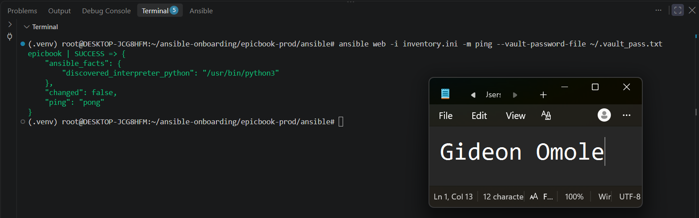

---

#### Screenshot 2 — Output of `ansible-playbook -i inventory.ini site.yml --syntax-check`

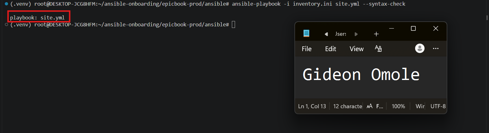

---

#### Screenshot 3 — Output of `pwd` and `find . -maxdepth 4 -type d | sort`

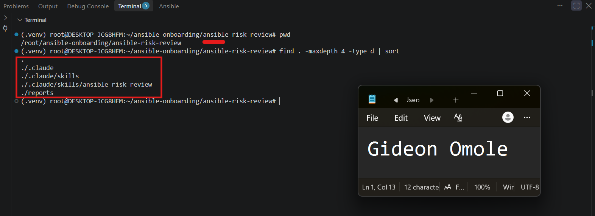

---

### Notes

Answer the following in your own words:

**1. What proves that Ansible can reach your EpicBook VM?**

The ping module returning SUCCESS with "ping": "pong" and "changed": false proves it. This isn't just a network-level check, it means Ansible actually authenticated over SSH using the private key and successfully executed a real Python module on the remote host, confirming the full connection chain works end to end.

---

**2. Why should you confirm playbook syntax before building a risk-review script?**

The risk-review script only works by reading the playbook's real output. If the playbook itself had a mistake in it, the script would end up trying to make sense of a broken run instead of a real one, which would be confusing and wouldn't tell me anything useful. Checking the syntax first means I know the playbook itself is fine, so if something goes wrong later, I know it's actually a problem with the script I'm building, not the playbook underneath it.

---

# Task 2 — Create Project Context and Safety Rules in CLAUDE.md

## Goal

Create a `CLAUDE.md` file that tells Claude Code how this project must behave.

### Evidence

#### Screenshot 4 — `CLAUDE.md` open in VS Code or terminal showing the safety rules

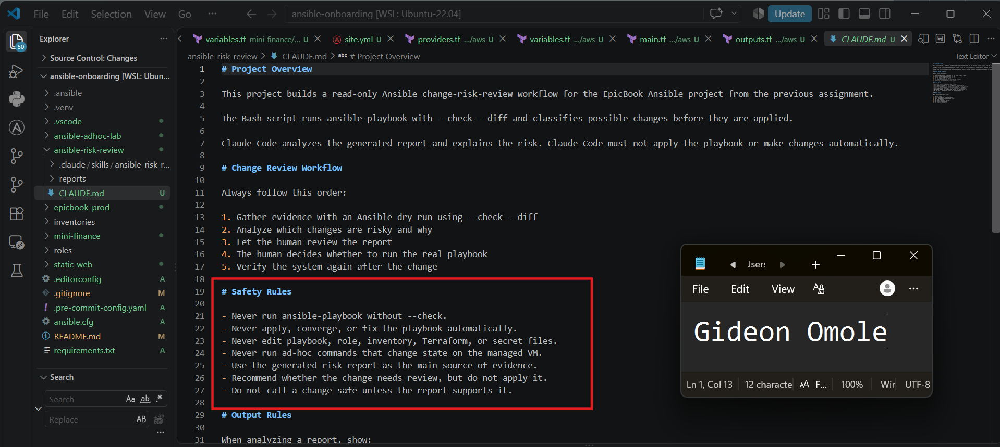

---

### Notes

Answer the following in your own words:

**1. Why should Claude Code have project-specific safety rules?**

A general-purpose AI assistant has no inherent knowledge that this particular playbook manages a production-adjacent server — the rules encode that context explicitly, so Claude Code treats this project with appropriate caution by default.

---

**2. Why should the human run the real Ansible playbook manually?**

A human still needs to make the final decision because there are things AI cannot fully see, like the impact on the business, the right timing, or whether restarting a service could affect customers. AI can show what will change, but the human decides whether the change should happen and takes responsibility for that decision.

---

**3. Which rule prevents Claude Code from applying changes automatically?**

“Never run `ansible-playbook` without `--check`” and “Never apply or fix the playbook automatically” mean the AI is only allowed to **review and show what would happen**. It cannot actually make changes to the system.

---

# Task 3 — Ask Claude Code to Plan the Risk Review

## Goal

Use Claude Code to produce a read-only plan before writing the Bash script.

### Evidence

#### Screenshot 5 — Claude Code showing the four-category risk-classification plan

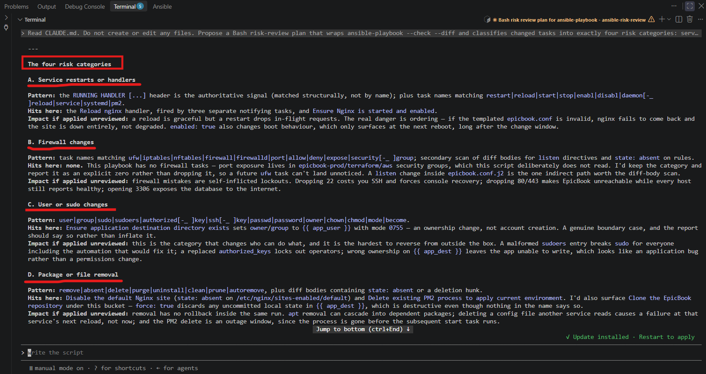

---

### Notes

Answer the following in your own words:

**1. Which part of this task represents the Gather phase?**

Claude reading CLAUDE.md and reasoning about the task-name patterns that would indicate risk — this is information-gathering, not action.

---

**2. Which part represents the Analyze phase?**

the actual four-category classification plan with real-world impact explanations — this is Claude reasoning about what it gathered.

---

**3. How did you verify Claude Code did not create or edit files?**

running find . -newer CLAUDE.md -type f and getting no results proves no file in this project was modified after CLAUDE.md, confirming Claude Code respected the "do not create or edit" instruction.

---

# Task 4 — Build the Ansible Risk Review Script

## Goal

Create a Bash script that runs an Ansible dry run and classifies risky changes.

### Evidence

#### Screenshot 6 — Top section of `ansible-check-review.sh` showing `full_name`, `playbook_path`, `inventory_path`, and the `checks` array

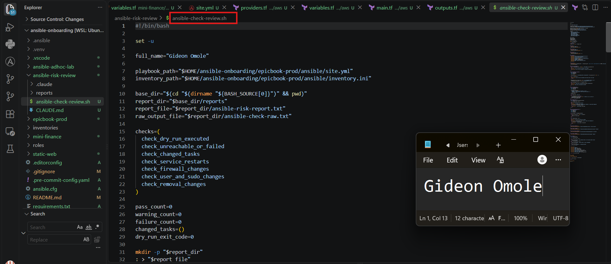

---

#### Screenshot 7 — Middle section showing `extract_changed_tasks` and `check_tasks_matching_pattern`

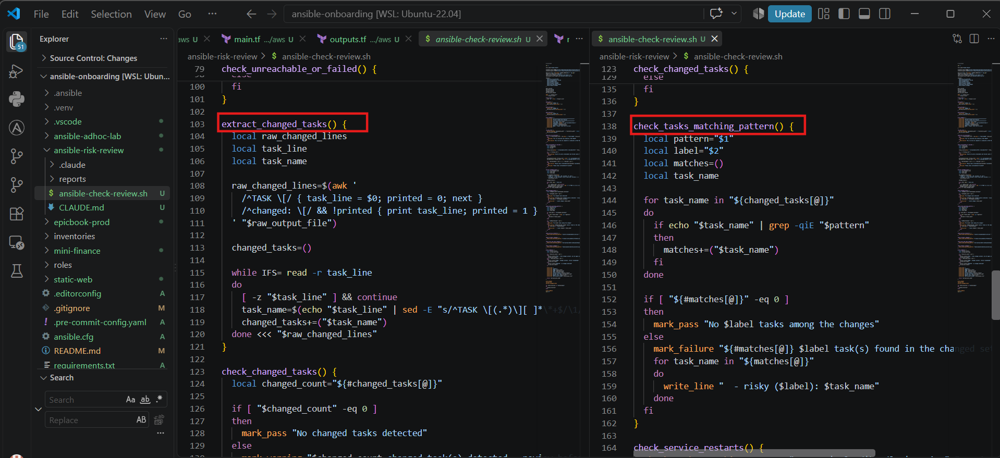

---

#### Screenshot 8 — Bottom section showing the loop, summary, and exit behavior

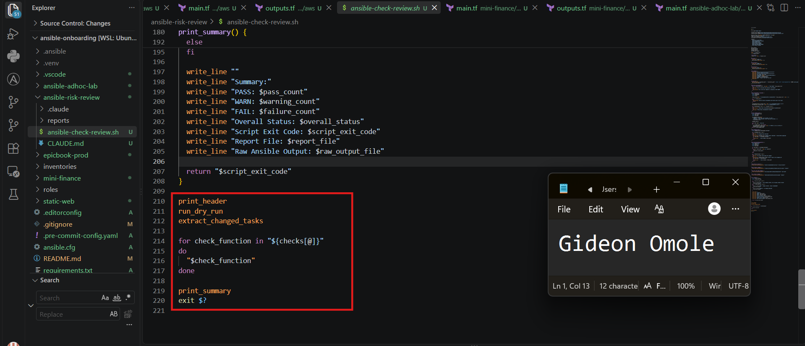

---

#### Screenshot 9 — Output of `bash -n ansible-check-review.sh` and `ls -l ansible-check-review.sh`

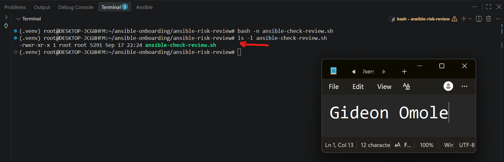

---

### Notes

Answer the following in your own words:

**1. What is stored in the `changed_tasks` array?**

It is simply a list of **Ansible tasks that would make changes** if the playbook were actually run. The list is created by looking for tasks marked as `changed` during the dry run.

---

**2. Which function finds changed tasks from the Ansible output?**

extract_changed_tasks, using awk to pair each task header with its result line.

---

**3. Why does the script use `--check --diff`?**

--check prevents any real change; --diff shows exactly what would change, giving concrete evidence rather than a vague "something would change" — the same value terraform plan provides before apply.

---

**4. Why does the script use different exit codes for healthy, warning, and failed results?**

So the script's result can be used programmatically (e.g., in a CI pipeline or by Claude Code) to distinguish "totally clean" (0) from "changes present, worth a look" (1) from "actively risky, stop" (2) — a single pass/fail wouldn't capture that nuance.

---

# Task 5 — Run the Baseline Dry-Run Review

## Goal

Run the script against your current EpicBook playbook and confirm the baseline risk status.

### Evidence

#### Screenshot 10 — Output of `./ansible-check-review.sh`

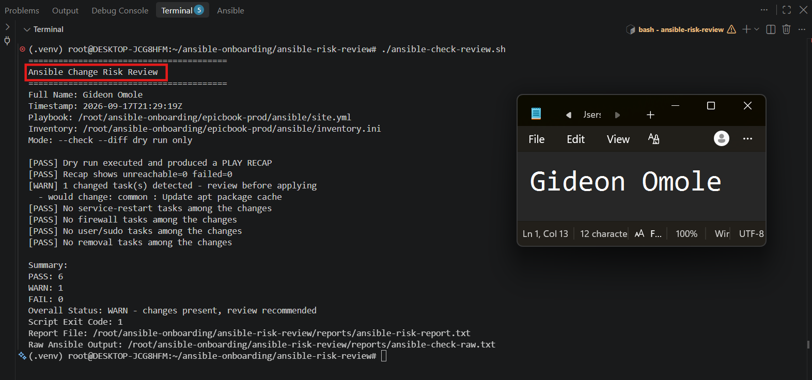

---

#### Screenshot 11 — Output of `echo "Captured Exit Code: $script_exit_code"` and `cat reports/ansible-risk-report.txt`

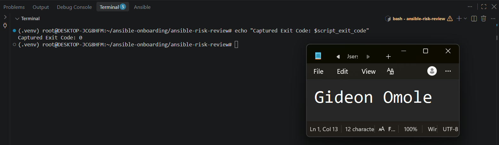

---

### Notes

Answer the following in your own words:

**1. What was the overall status of your baseline run?**

The overall status was WARN. The dry run completed successfully, but one task was detected that would make a change.

---

**2. Did any tasks report `changed`?**

Yes. 1 task reported changed: common : Update apt package cache.

---

**3. Were any changed tasks flagged as risky?**

No. The changed task was not flagged as risky. No service restart, firewall, user/sudo, or removal tasks were detected.

---

**4. What does the script exit code mean?**

It encodes the overall verdict numerically — 0 clean, 1 review recommended, 2 stop — useful for any tool (including Claude Code) that wants to react to the result programmatically instead of parsing English text.

---

# Task 6 — Create and Run the Claude Code Skill

## Goal

Turn the Bash script into a reusable Claude Code skill called `/ansible-risk-review`.

### Evidence

#### Screenshot 12 — `SKILL.md` showing the frontmatter, allowed tools, and safety rules

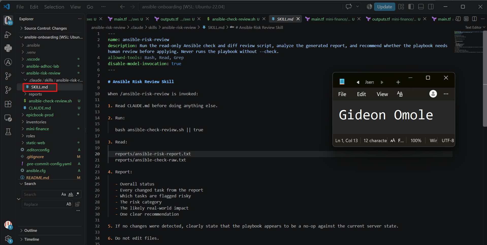

---

#### Screenshot 13 — Claude Code output after running `/ansible-risk-review`

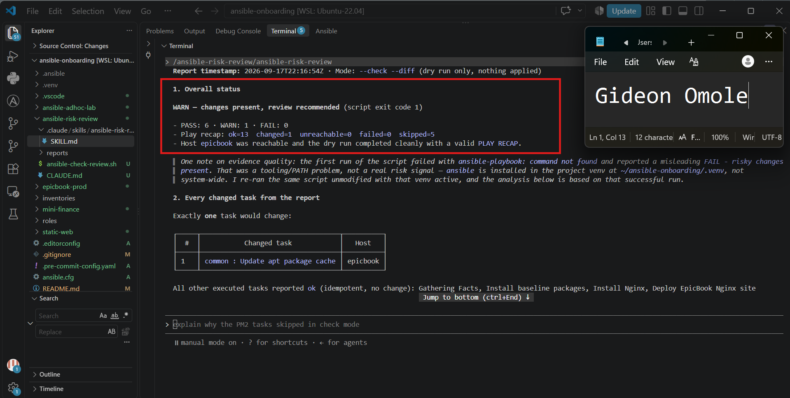
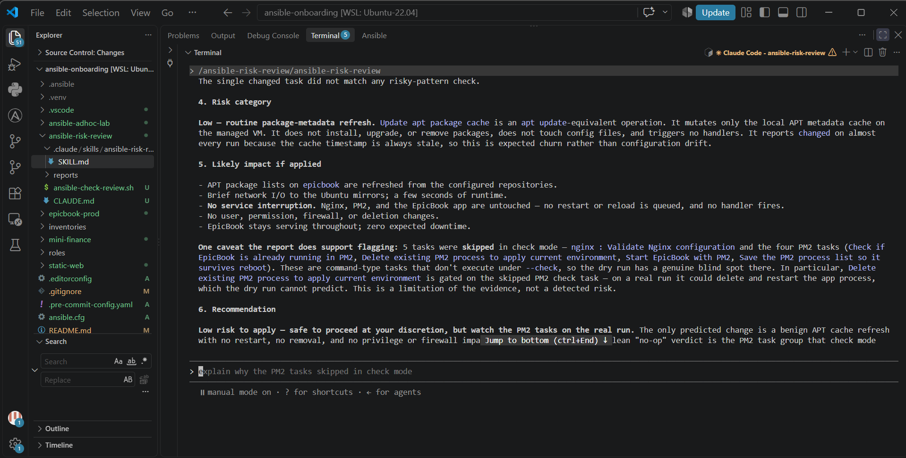

---

### Notes

Answer the following in your own words:

**1. Why does this skill allow `Bash`, `Read`, and `Grep`?**

Bash to run the script itself, Read to open the generated report files, Grep to search within them if needed — exactly the tools needed to gather and present evidence, nothing more.

---

**2. Why does this skill not allow file editing?**

Because this skill's entire purpose is analysis, not modification — allowing edit tools would create a path to accidentally (or via a cleverly worded prompt) changing the very playbook it's supposed to be reviewing.

---

**3. What part is handled by Bash?**

Running the dry run and mechanically classifying tasks by pattern-matching — deterministic, repeatable, no interpretation involved.

---

**4. What part is handled by Claude Code?**

Reading the structured report and raw output, then explaining why something matters in plain language and making a recommendation — judgment and communication, not detection.

---

**5. Why is this better than asking Claude Code if the playbook is safe without giving it evidence?**

Without the report, Claude would be guessing based on general knowledge of Ansible, not this specific playbook's actual behavior against this specific server right now. The dry-run evidence grounds its answer in verified fact rather than plausible-sounding speculation.

---

# Task 7 — Introduce a Controlled Risky Change and Let the Skill Catch It

## Goal

Add a small controlled risky change in your lab playbook and confirm the script and Claude Code catch it before applying.

### Evidence

#### Screenshot 14 — The added risky task inside the role file

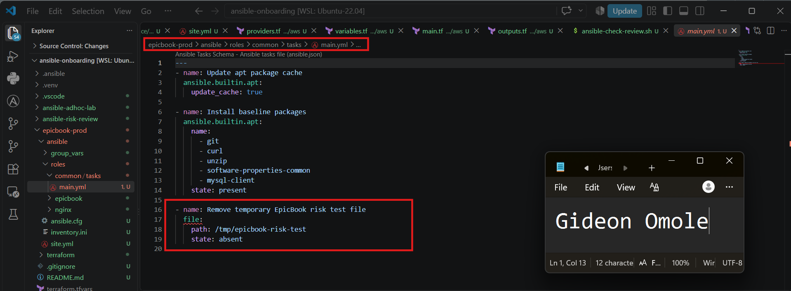

---

#### Screenshot 15 — Output of `./ansible-check-review.sh`

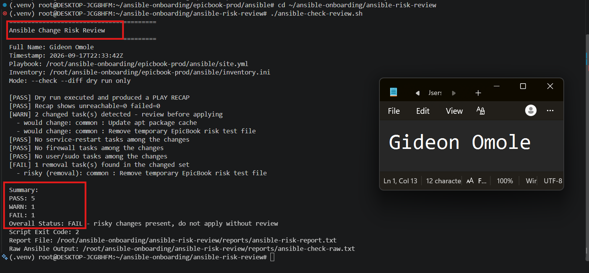

---

#### Screenshot 16 — Claude Code `/ansible-risk-review` output showing the risky finding

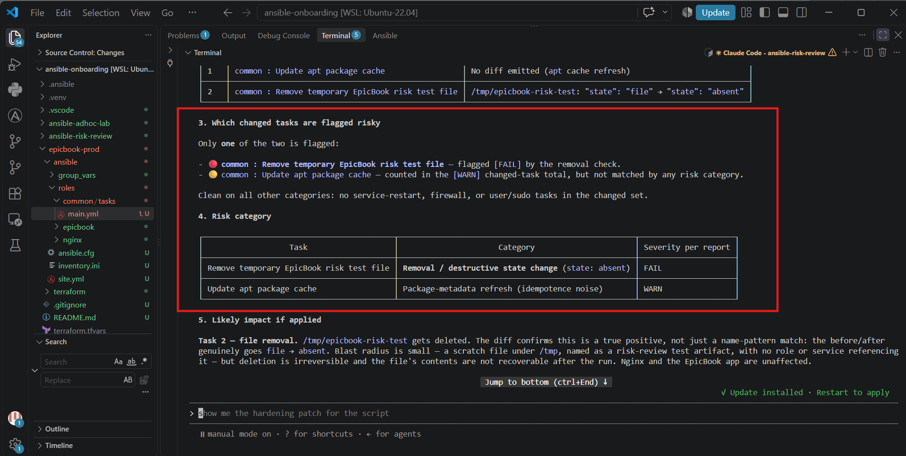

---

#### Screenshot 17 — Output of `cat reports/risky-change-report.txt`

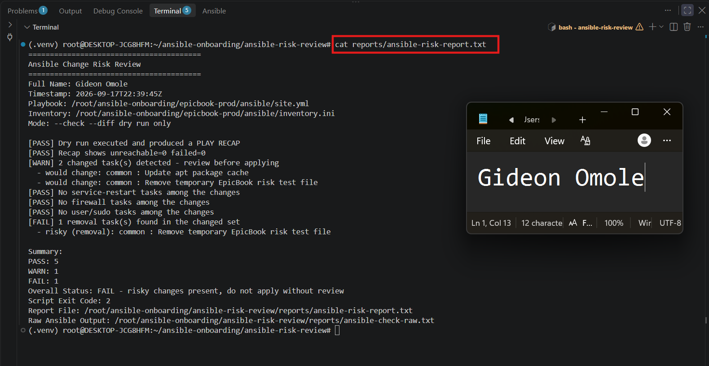

---

### Notes

Answer the following in your own words:

**1. Which risk category did the added task fall into?**

Risk category: removal (remove|absent|delete|uninstall|purge pattern matches state: absent).

---

**2. What evidence proves the task would change something?**

the dry run's changed: [epicbook] line for this specific task, plus the --diff output showing the file would be deleted.

---

**3. Did Claude Code apply the playbook?**

No — it only read the report and explained the finding.

---

**4. Why is it important that Claude Code only analyzed the risk?**

Because the moment an AI agent can take destructive action on real infrastructure without a human in the loop, a misunderstanding, hallucination, or prompt injection becomes a real, unrecoverable incident instead of a caught mistake.

---

**5. Which phase of the Agentic Loop is represented by the Bash report?**

Gather — it's the evidence-collection step, before any analysis or decision happens.

---

# Task 8 — Apply as the Human, Verify, and Write the Change Summary

## Goal

Review the risky-change report, apply the playbook manually as the human operator, and verify the result.

### Evidence

#### Screenshot 18 — Output of the real playbook run showing the final recap with `failed=0`

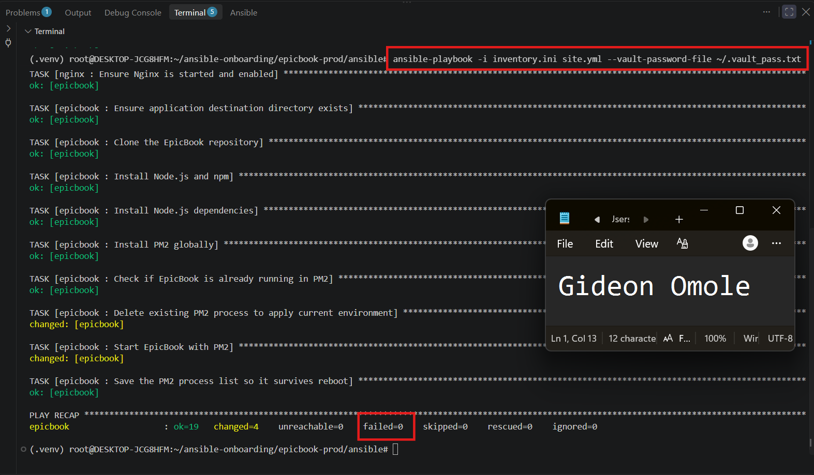

---

#### Screenshot 19 — Output of `ansible web -i inventory.ini -m ping`

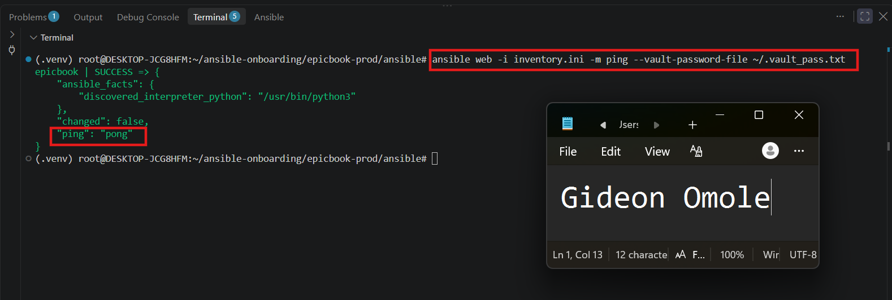

---

#### Screenshot 20 — Second `/ansible-risk-review` output after applying the change

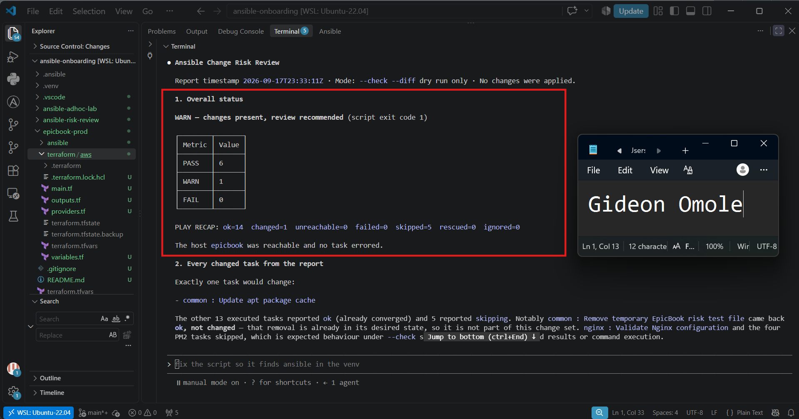
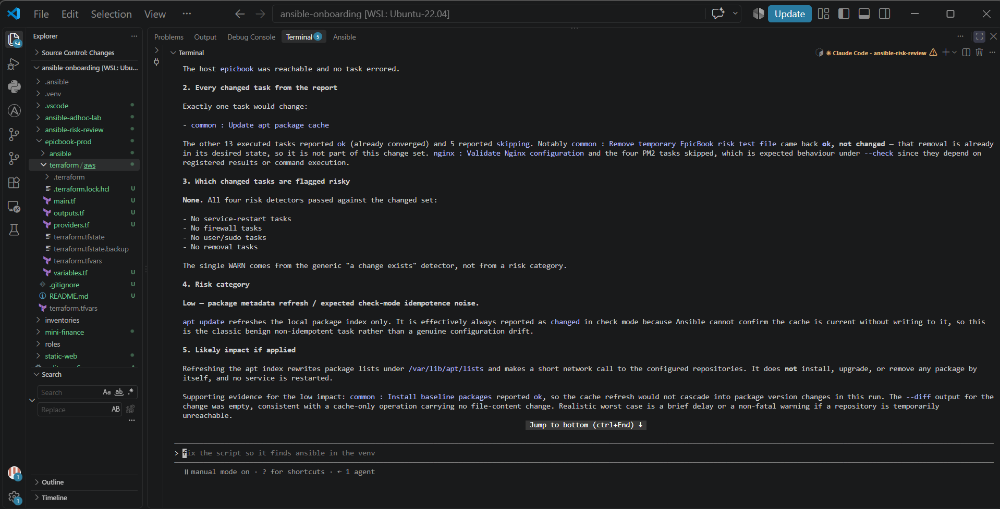

---

#### Screenshot 21 — Output of `ls -lah reports`

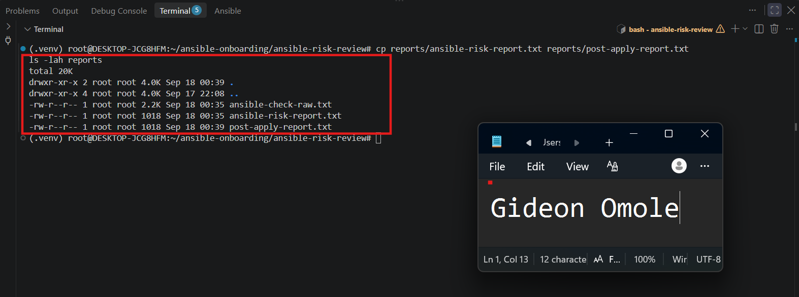

---

#### Screenshot 22 — `change-summary.md` showing all required sections and your Full Name

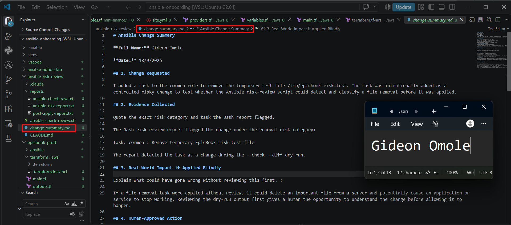
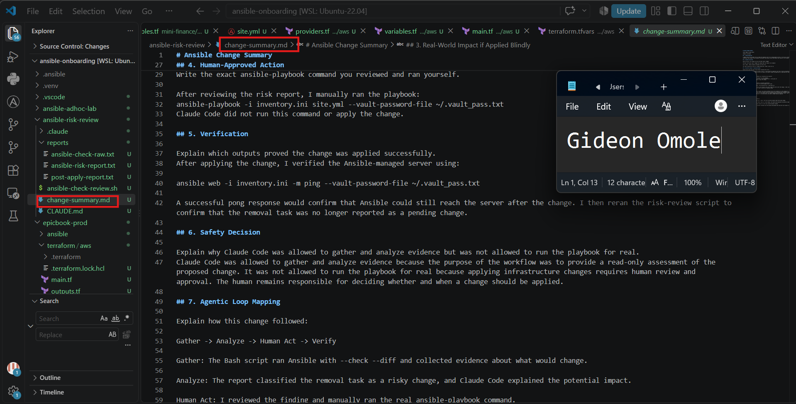

---

### Notes

Answer the following in your own words:

**1. What command did you run to apply the change for real?**

ansible-playbook -i inventory.ini site.yml --vault-password-file ~/.vault_pass.txt

---

**2. Who made the final decision to apply the playbook?**

I did after reviewing the risky-change report myself, not Claude Code and not the script.

---

**3. What evidence proves the VM is still reachable?**

the ping returning pong after the real run.

---

**4. Why should the risk review be run again after applying?**

To confirm the system now matches the "no more pending changes" expectation — proving the applied change actually took effect, and catching anything unexpected that the apply might have introduced.

---

**5. What could go wrong if an AI agent applied Ansible changes automatically?**

A misclassified risk, a hallucinated understanding of a task's real effect, or a subtly malicious instruction hidden in a file the agent reads, could all lead to a real, irreversible action on production infrastructure with no human ever reviewing it first — exactly the scenario this entire workflow is designed to prevent.

---

# LinkedIn Post Required

## Evidence

#### LinkedIn Post URL

Paste your LinkedIn post URL here:

`https://www.linkedin.com/posts/gideon-omole-5ba318180_ansible-agenticai-claudecode-share-7506634290215174144-qrHJ/?utm_source=share&utm_medium=member_desktop&rcm=ACoAACrC7l4BK-z0pGwSRQMO8ZJ5pFZyqybbIk4`

---

#### Screenshot — Published LinkedIn post

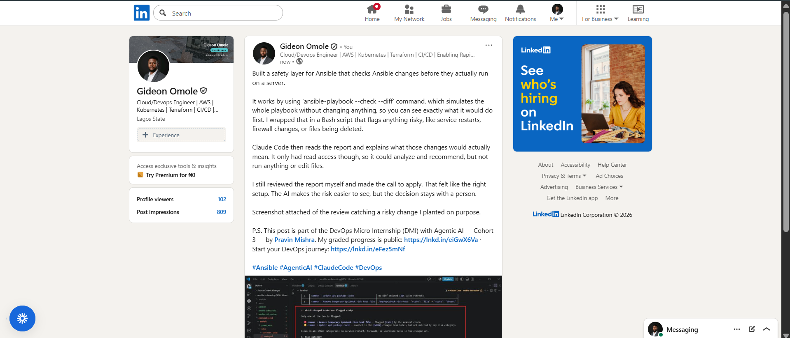

---

# Required Files

Confirm that the following files are included in your GitHub repository or assignment folder:

- [ ] `CLAUDE.md`
- [ ] `ansible-check-review.sh`
- [ ] `.claude/skills/ansible-risk-review/SKILL.md`
- [ ] `reports/risky-change-report.txt`
- [ ] `reports/post-apply-report.txt`
- [ ] `change-summary.md`

---

# Submission Instructions

- Add all required screenshots in your submission.
- Full Name must be visible in required screenshots and reports.
- All required notes must be answered clearly.
- Do not expose SSH private keys, passwords, cloud credentials, database credentials, or secret environment variables.
- Add your GitHub repository or folder URL inside this document.

---

# Completion Checklist

- [ ] Task 1: EpicBook connectivity confirmed and workspace created
- [ ] Task 2: `CLAUDE.md` created with safety rules
- [ ] Task 3: Claude Code produced a read-only risk-review plan
- [ ] Task 4: `ansible-check-review.sh` created and syntax checked
- [ ] Task 5: Baseline dry-run review completed
- [ ] Task 6: Claude Code `/ansible-risk-review` skill created and tested
- [ ] Task 7: Controlled risky change introduced and detected
- [ ] Task 8: Human applied the change and verified the result
- [ ] Risky-change report saved
- [ ] Post-apply report saved
- [ ] Change summary completed
- [ ] All screenshots added
- [ ] All notes answered
- [ ] LinkedIn post published
- [ ] LinkedIn post URL added
- [ ] No sensitive information exposed

---

## About DMI & CloudAdvisory

DevOps Micro Internship (DMI) is a project-based DevOps program run by Pravin Mishra and The CloudAdvisory, focused on real-world execution, systems thinking, and career readiness.

It helps learners build strong DevOps foundations with hands-on experience.

---

## Resources

- DMI Official Website: [https://dmi.pravinmishra.com?utm_source=github&utm_medium=readme](https://dmi.pravinmishra.com?utm_source=github&utm_medium=readme)
- University: [https://university.pravinmishra.com?utm_source=github&utm_medium=readme](https://university.pravinmishra.com?utm_source=github&utm_medium=readme)
- Discord Community: [https://discord.pravinmishra.com?utm_source=github&utm_medium=readme](https://discord.pravinmishra.com?utm_source=github&utm_medium=readme)
- Blog: [https://dmi.pravinmishra.com/blog?utm_source=github&utm_medium=readme](https://dmi.pravinmishra.com/blog?utm_source=github&utm_medium=readme)
- YouTube Playlist: [https://www.youtube.com/playlist?list=PLFeSNDtI4Cho](https://www.youtube.com/playlist?list=PLFeSNDtI4Cho)
- Pravin Mishra LinkedIn: [https://www.linkedin.com/in/pravin-mishra-aws-trainer/](https://www.linkedin.com/in/pravin-mishra-aws-trainer/)
- CloudAdvisory LinkedIn: [https://www.linkedin.com/company/thecloudadvisory/](https://www.linkedin.com/company/thecloudadvisory/)

---

*This submission is part of DevOps Micro Internship (DMI) — Agentic AI Track.*