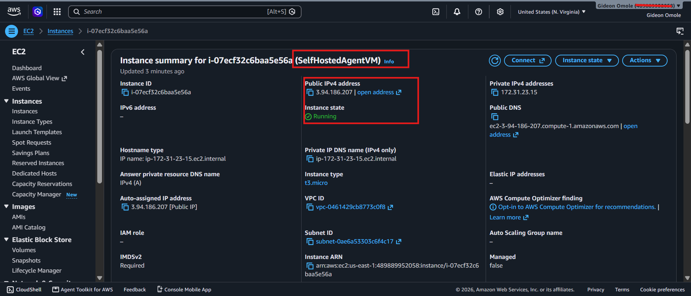
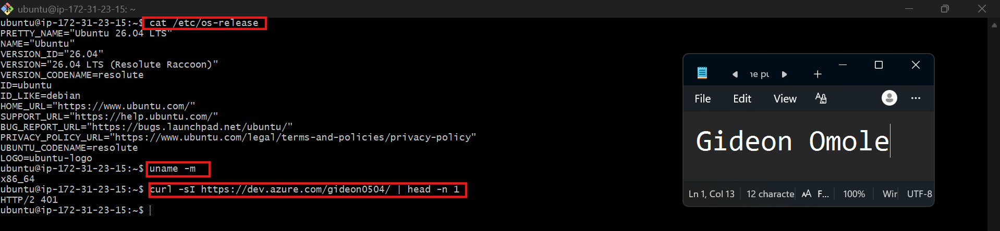
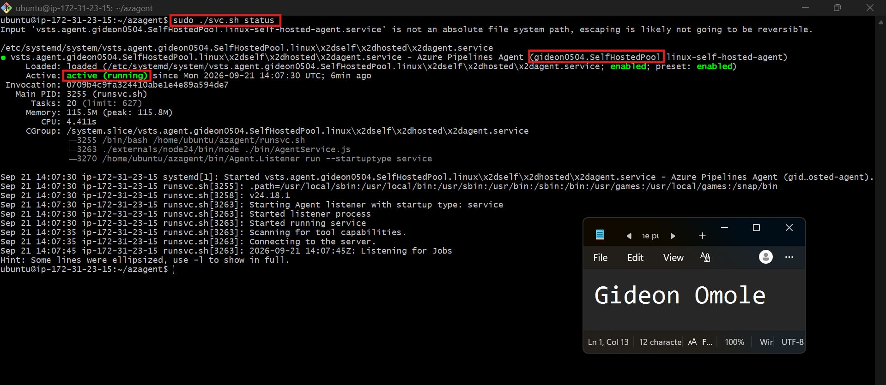
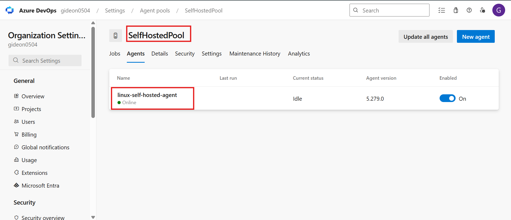
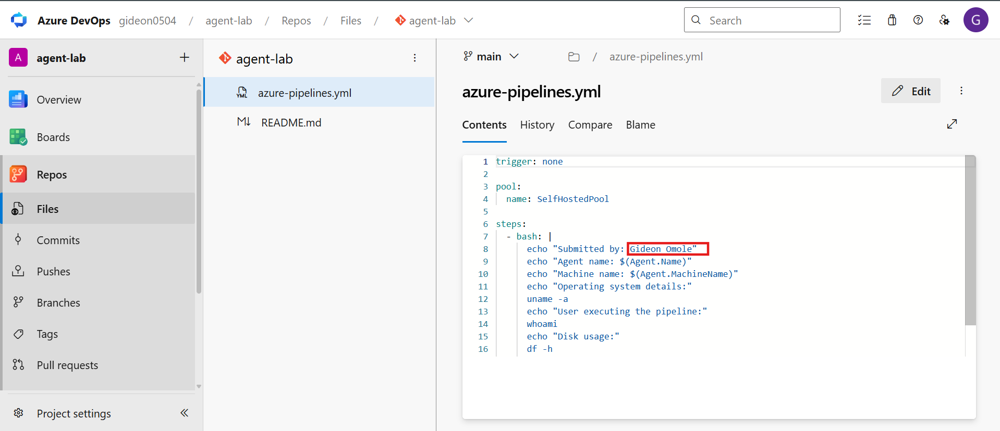
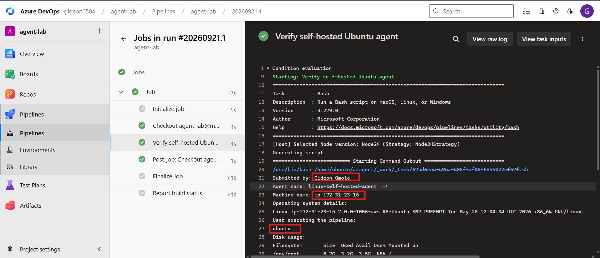
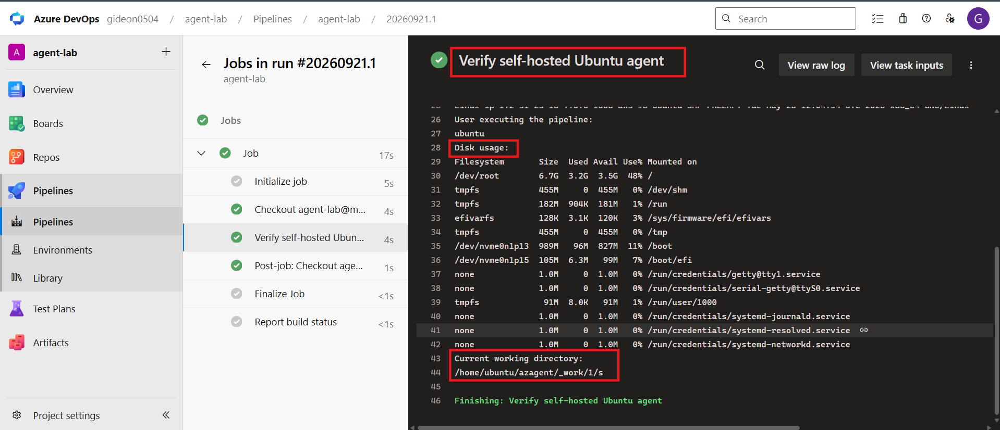
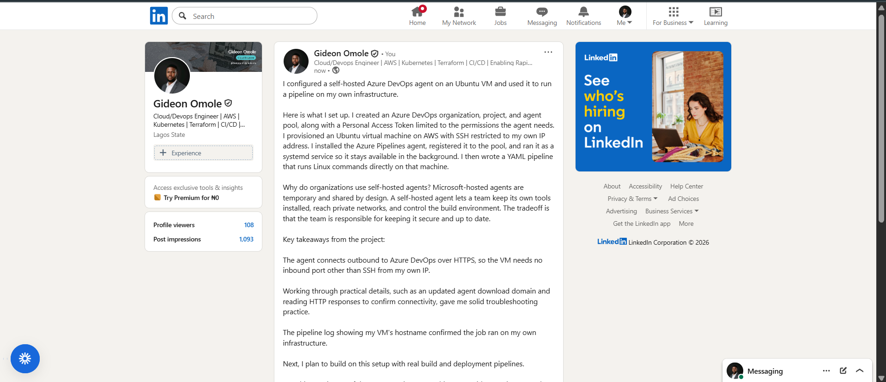

# Assignment 1 — Configure a Self-Hosted Azure DevOps Agent on Ubuntu

Part of the DevOps Micro Internship (DMI) with Agentic AI

---

## Purpose

In this assignment, you will provision an Ubuntu VM in AWS or Azure and configure it as a self-hosted Azure Pipelines agent. You will create an agent pool, register the agent using a Personal Access Token (PAT), run it as a Linux system service, and verify it by executing a test pipeline on the VM.

---

# Task 0 — Create or Access Azure DevOps

## Goal

Sign in to Azure DevOps and create or access an organization and project for the assignment.

No submission screenshot is required for this task.

---

# Task 1 — Create a Personal Access Token (PAT)

## Goal

Create and securely store the PAT required to register the self-hosted agent.

No submission screenshot is required for this task.

> Do not include the PAT in this document or in any screenshot.

---

# Task 2 — Create a Self-Hosted Agent Pool

## Goal

Create the Azure DevOps agent pool that will contain the Linux agent.

No submission screenshot is required for this task.

---

# Task 3 — Provision and Connect to the Ubuntu VM

## Goal

Provision an Ubuntu VM in AWS or Azure and verify its operating system, architecture, and outbound connection to Azure DevOps.

## Evidence

### Screenshot 1 — Ubuntu VM Running

Add a screenshot from AWS or Azure showing:

* Ubuntu VM name
* VM status as **Running**
* Public IP address



---

### Screenshot 2 — Ubuntu, Architecture, and HTTPS Verification

Add an SSH terminal screenshot showing the output of:

* `cat /etc/os-release`
* `uname -m`
* `curl -I https://dev.azure.com`

The screenshot must confirm a supported Ubuntu version, `x86_64` architecture, and a successful HTTP response from Azure DevOps.



---

# Task 4 — Install and Configure the Azure Pipelines Agent

## Goal

Download, configure, and register the Linux Azure Pipelines agent, and run it as a system service.

## Evidence

### Screenshot 3 — Agent Configuration and Service Status

Add a terminal screenshot showing:

* Successful agent configuration
* Agent service installation
* Agent service start
* `sudo ./svc.sh status` reporting that the service is running



> Ensure that the PAT is not visible.

---

# Task 5 — Verify That the Agent Is Online

## Goal

Confirm that the agent service is running and the agent appears online in Azure DevOps.

## Evidence

### Screenshot 4 — Agent Online in Azure DevOps

Add a screenshot of the Azure DevOps Agent Pool **Agents** page showing:

* Selected agent pool
* Selected agent name
* Agent status as **Online**
* Agent enabled and available



---

# Task 6 — Create and Run a Test Pipeline

## Goal

Create an Azure DevOps YAML pipeline and verify that its commands execute on the self-hosted Ubuntu VM.

## Evidence

### Screenshot 5 — Azure Pipelines YAML

Add a screenshot of `azure-pipelines.yml` open in the Azure Repos editor showing:

* `trigger: none`
* Selected self-hosted agent pool
* Bash verification step
* Your Full Name
* Linux verification commands



---

### Screenshot 6 — Successful Test Pipeline

Add a screenshot of the successful Azure DevOps pipeline run showing:

* Overall status as **Succeeded**
* Expanded **Verify self-hosted Ubuntu agent** step
* `Submitted by: <your-full-name>`
* Agent name
* Machine name
* Output from `uname -a`
* Output from `whoami`
* Output from `df -h`
* Output from `pwd`




---

## Completed azure-pipelines.yml

Paste the contents of your completed `azure-pipelines.yml` file below.

```yaml
trigger: none

pool:
  name: SelfHostedPool

steps:
  - bash: |
      echo "Submitted by: Gideon Omole"
      echo "Agent name: $(Agent.Name)"
      echo "Machine name: $(Agent.MachineName)"
      echo "Operating system details:"
      uname -a
      echo "User executing the pipeline:"
      whoami
      echo "Disk usage:"
      df -h
      echo "Current working directory:"
      pwd
    displayName: Verify self-hosted Ubuntu agent
```

> Do not include your PAT, SSH private key, password, or cloud credentials in the YAML file.

---

# Assignment Summary

Write a short summary of what you configured.

In this assignment, I configured a self-hosted Azure DevOps agent on an Ubuntu virtual machine and used it to run a test pipeline.

I created an Azure DevOps organization (gideon0504) and a project, then generated a Personal Access Token with only the Agent Pools (Read & manage) and Build (Read & execute) scopes. I created a self-hosted agent pool named SelfHostedPool.

I launched an Ubuntu 22.04 LTS x64 EC2 instance on AWS, named [your VM name]. Its security group allows inbound SSH (port 22) only from my own IP address, and outbound HTTPS (port 443) is allowed so the VM can reach Azure DevOps. I connected over SSH and verified the Ubuntu version, the x86_64 architecture, and connectivity to Azure DevOps.

On the VM, I downloaded and extracted the Azure Pipelines agent (version 5.279.0), registered it in SelfHostedPool with `./config.sh` using the PAT, and installed it as a systemd service with `svc.sh` so it keeps running in the background. The agent, named [your agent name], shows as Online in the pool.

Finally, I created an azure-pipelines.yml file that targets SelfHostedPool and runs a Bash step printing my full name, the agent name, the machine name, and the output of uname -a, whoami, df -h, and pwd. The pipeline run succeeded, and the log shows the commands executed on my self-hosted VM.

---

# LinkedIn Requirement (If Applicable)

## Screenshot 7 — LinkedInisor填Token Belle

Add a screenshot of your LinkedIn post showing:

* What you configured
* Why organizations use self-hosted agents
* Three to five lines explaining your experience
* A screenshot of the successful pipeline run with no secrets visible



**LinkedIn Post URL:** https://www.linkedin.com/posts/gideon-omole-5ba318180_azuredevops-devops-cicd-activity-7507821112341200896-kevH/?utm_source=share&utm_medium=member_desktop&rcm=ACoAACrC7l4BK-z0pGwSRQMO8ZJ5pFZyqybbIk4

---

# Submission Instructions

* Include the short assignment summary.
* Include Screenshots 1–6.
* Include the contents of your completed `azure-pipelines.yml` file.
* Include Screenshot 7 and the LinkedIn post URL if the LinkedIn requirement applies.
* Do not expose a PAT, SSH private key, password, account details, or another secret.

---

# Completion Checklist

* Azure DevOps organization and project are ready
* A supported Ubuntu LTS VM is running and accessible through SSH
* SSH access is restricted to your public IP address
* Outbound HTTPS connectivity is working
* PAT was created with the required scopes and stored securely
* A self-hosted agent pool was created
* The same pool name was used during registration and in the pipeline YAML
* The agent service is running
* The agent appears **Online** in Azure DevOps
* The pipeline targets the selected agent pool
* The pipeline run completed with **Succeeded** status
* The pipeline output displays your Full Name
* Screenshots 1–6 are included and readable
* Screenshot 7 and the LinkedIn post URL are included if applicable
* The completed `azure-pipelines.yml` content is included
* No PAT, SSH private key, password, or other secret is visible

---

*This submission is part of the DevOps Micro Internship (DMI) — Agentic AI Track.*
