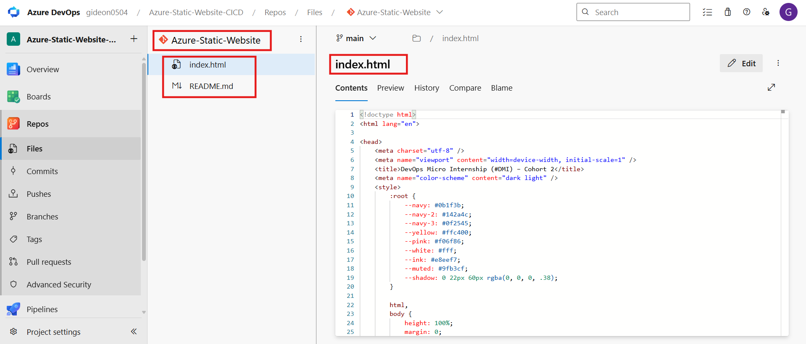
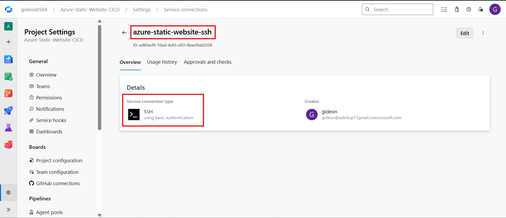
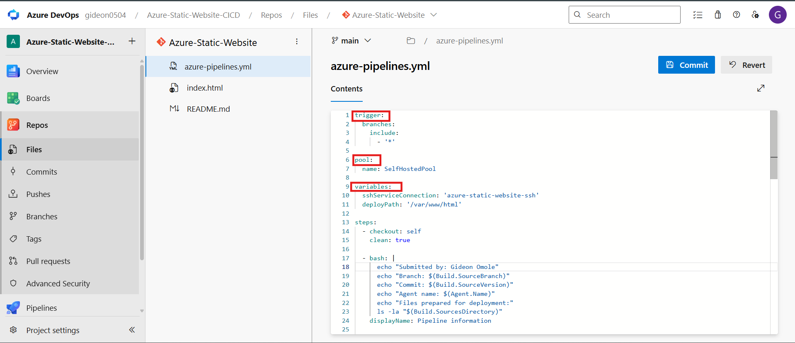
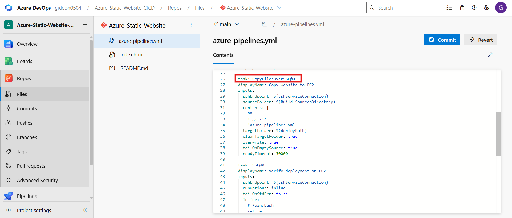
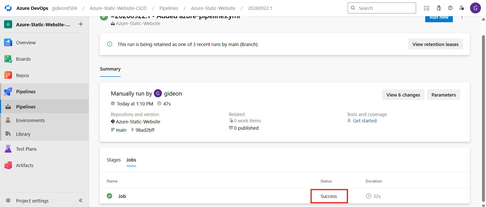
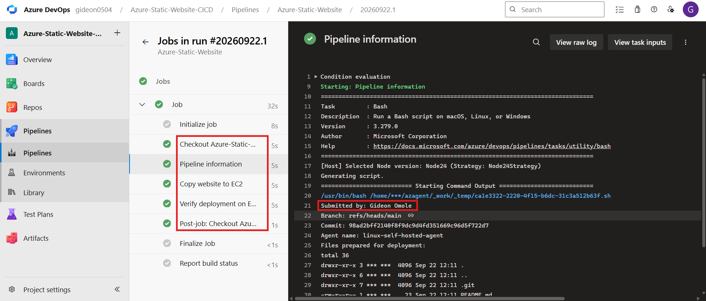
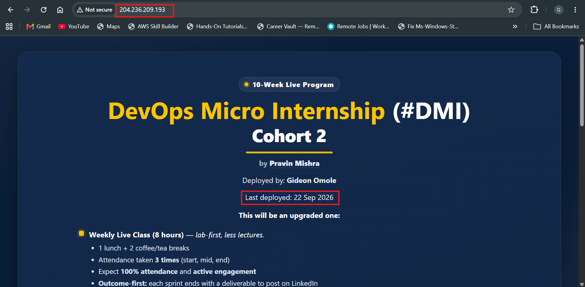
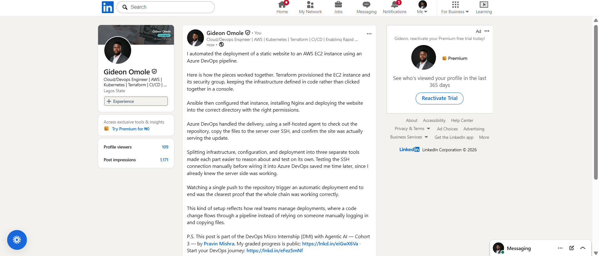

# Assignment 2 — Deploy A Static Website to AWS EC2 Using an Azure DevOps CI/CD Pipeline

Part of the DevOps Micro Internship (DMI) with Agentic AI

---

## Purpose

In this assignment, you will import and personalize the Static Website, provision and configure an AWS EC2 instance using Terraform and Ansible, and create an Azure DevOps CI/CD pipeline that automatically deploys the website to Nginx through an SSH Service Connection.

---

# Task 0 — Verify the Existing Tooling and Self-Hosted Agent

## Goal

Confirm that Terraform, Ansible, AWS CLI, SSH, and the self-hosted Azure Pipelines agent are ready.

No submission screenshot is required for this task.

---

# Task 1 — Import and Personalize the Azure Static Website Repository

## Goal

Import the Azure Static Website into Azure Repos and add your Full Name to the website.

## Evidence

### Screenshot 1 — Azure Static Website in Azure Repos

Add a screenshot of Azure Repos showing:

* Imported Azure Static Website repository
* Project files
* `index.html`

---

# Task 2 — Provision and Configure the Target EC2 Instance

## Goal

Provision the AWS EC2 instance using Terraform and configure Nginx, SSH access, and deployment permissions using Ansible.

No additional submission screenshot is required for this task.

---

# Task 3 — Create the SSH Service Connection

## Goal

Create an Azure DevOps SSH Service Connection that can connect to the target EC2 instance using your selected SSH authentication method.

## Evidence

### Screenshot 2 — SSH Service Connection

Add a screenshot of the saved SSH Service Connection **Overview** page showing:

* Service Connection name
* SSH connection type

> Do not expose a password, SSH private key, passphrase, or another credential.

---

# Task 4 — Create the Azure DevOps YAML Pipeline

## Goal

Create an Azure DevOps YAML pipeline that deploys the Azure Static Website to the target EC2 instance after a commit is pushed.

## Evidence

### Screenshot 3 — Azure Pipelines YAML

Add a screenshot of `azure-pipelines.yml` open in the Azure Repos editor showing:

* Push trigger
* Selected self-hosted agent pool
* Pipeline variables
* Repository checkout step
* Pipeline information step
* `CopyFilesOverSSH@0` task
* `SSH@0` verification task

> Ensure that no password, SSH private key, PAT, or AWS credential is visible.

---

# Task 5 — Create, Authorize, and Run the Pipeline

## Goal

Run the Azure DevOps pipeline and confirm that the website files are transferred and verified successfully.

## Evidence

### Screenshot 4 — Successful Pipeline Run

Add a screenshot of the successful pipeline run and log summary showing:

* Overall pipeline status as **Succeeded**
* Pipeline information step completed
* File-copy step completed
* Remote-verification step completed
* Your Full Name visible in the pipeline output

---

# Task 6 — Verify the Website and Automatic Trigger

## Goal

Confirm that the website is accessible through the EC2 public IP address and that a new pushed commit automatically triggers another deployment.

## Evidence

### Screenshot 5 — Deployed Azure Static Website

Add a browser screenshot showing:

* Deployed Azure Static Website
* EC2 public IP address in the browser address bar
* Your Full Name
* Updated website content after the automatic deployment

## Final Website URL

`http://<target-vm-public-ip>`

Replace the placeholder with your actual website URL:

[http://204.236.209.193/]

---

# Assignment Summary

Write a short summary of the completed CI/CD workflow.

[# Assignment Summary

I automated the deployment of a static website to an AWS EC2 instance using an Azure DevOps CI/CD pipeline.

I imported the Azure Static Website repository into Azure Repos and added my full name to index.html. I used Terraform to provision an Ubuntu EC2 instance on AWS, with a security group that allows SSH only from my own IP and the self-hosted agent's IP, and allows HTTP from anywhere. I then used Ansible to install and configure Nginx on that instance, deploy the website into /var/www/html, and set the correct ownership so the deployment user can write to it.

I created an SSH service connection in Azure DevOps using private key authentication, then wrote an azure-pipelines.yml file that triggers on a push to any branch, runs on my existing self-hosted agent from Assignment 38, checks out the repository, copies the website files to the EC2 instance over SSH, and verifies the deployment by confirming index.html exists and the site responds with an HTTP 200 status.

The pipeline runs successfully, and pushing a new commit automatically triggers a fresh deployment without any manual steps.]

---

# LinkedIn Requirement

## LinkedIn Post Screenshot

Add a screenshot of your LinkedIn post containing:

* What you automated
* How Terraform, Ansible, and Azure DevOps worked together
* Three to five lines describing the CI/CD workflow
* A screenshot of the successful pipeline or deployed website

## LinkedIn Post URL

[https://www.linkedin.com/posts/gideon-omole-5ba318180_azuredevops-terraform-ansible-ugcPost-7508142264787931136-LoGX/?utm_source=share&utm_medium=member_desktop&rcm=ACoAACrC7l4BK-z0pGwSRQMO8ZJ5pFZyqybbIk4]

> Do not expose AWS credentials, SSH private keys, passwords, PATs, or other sensitive information.

---

# Submission Instructions

* Include the short assignment summary.
* Include Screenshots 1–5.
* Include the final website URL.
* Include the LinkedIn post screenshot and URL.
* Confirm that the EC2 instance is running during grading.
* Do not expose a password, SSH private key, passphrase, PAT, AWS credential, account ID, or another secret.

---

# Completion Checklist

* The correct Azure Static Website repository was imported into Azure Repos
* `index.html` is visible in Azure Repos
* Your Full Name was added to the website
* The target EC2 instance was provisioned using Terraform
* A suitable Ubuntu image and EC2 size were selected
* Nginx was configured using Ansible
* SSH login works using the selected authentication method
* The SSH user can write to `/var/www/html`
* TCP ports 22 and 80 are configured correctly
* The self-hosted Azure Pipelines agent is online
* The SSH Service Connection was created successfully
* The YAML trigger includes all branches
* The YAML uses the correct self-hosted agent pool
* The copy and remote-verification tasks completed successfully
* The pipeline status is **Succeeded**
* A new pushed commit triggered the pipeline automatically
* The Azure Static Website loads through the EC2 public IP address
* Your Full Name is visible on the deployed website
* Screenshots 1–5 are included and readable
* The final website URL is included
* The LinkedIn post screenshot and URL are included
* No sensitive information is exposed

---

*This submission is part of the DevOps Micro Internship (DMI) — Agentic AI Track.*
