# Assignment 5 — AI-Assisted Azure DevOps Dual-Pipeline Failure Triage

Part of the DevOps Micro Internship (DMI) — Agentic AI Track

---

## Student Information

**Full Name:** [Gideon Omole]

**GitHub Repository or Fork URL:** https://dev.azure.com/gideon0504

**Public LinkedIn Post URL:** https://www.linkedin.com/posts/gideon-omole-5ba318180_devops-azuredevops-claudecode-ugcPost-7511429012494229504-NqzE/?utm_source=share&utm_medium=member_desktop&rcm=ACoAACrC7l4BK-z0pGwSRQMO8ZJ5pFZyqybbIk4

---

## Purpose

In this assignment, I configured an AI-assisted, read-only failure-triage workflow for the EpicBook Infrastructure and Application Pipelines. The workflow uses Bash to gather Azure DevOps pipeline evidence and Claude Code to analyze the evidence and recommend a recovery action while keeping all changes under human control.

---

# Task 0 — Verify Tools, Authentication, and Pipeline Details

## Goal

Verify the required tools, Azure DevOps authentication, organization and project details, and numeric pipeline IDs.

No screenshot is required for this task.

---

# Task 1 — Capture the Healthy Baseline and Prepare the Supplied Files

## Goal

Confirm that both EpicBook pipelines are healthy and place the supplied assignment files in the correct repository locations.

## Evidence

### Screenshot 1 — Healthy Baseline for Both Pipelines

Terminal output showing the latest completed Infrastructure and Application Pipeline runs with successful results.

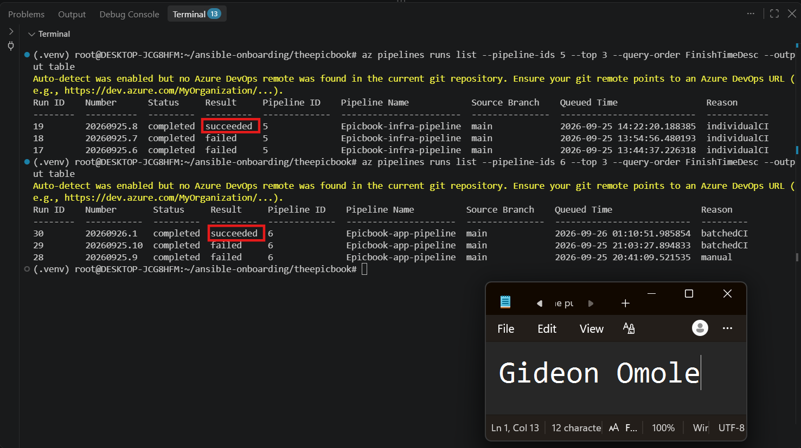

## Notes

### 1. What proves that both pipelines were healthy before the drill?

Before creating the triage workflow, I queried the latest completed run of each pipeline using the Azure DevOps CLI. The Infrastructure Pipeline (ID 5) showed run [RUN ID] with a status of completed and a result of succeeded, and the Application Pipeline (ID 6) showed run [RUN ID] with the same status and result. Both runs were on the main branch, and I recorded their completion times. The output in Screenshot 1 shows both results side by side, so there is no doubt that neither pipeline was already failing before I started. The successful Application Pipeline run also passed all four stages, including the final verification stage, which means the deployment itself was working and not just the individual steps.

### 2. Why is a healthy baseline necessary before introducing a controlled failure?

The drill only makes sense if I know the exact starting point. If a pipeline was already broken, I could not tell whether a later failure came from the change I introduced on purpose or from a problem that was already there, and the triage tool might report an unrelated error and lead me to the wrong conclusion. A healthy baseline also gives me a clear finish line. When I fix the deliberate failure and run the triage tool again, I need to be able to say the system has returned to the same healthy state it started in. Without that starting point there would be nothing to compare against, and I could not prove the recovery.

---

# Task 2 — Configure and Review the Supplied CLAUDE.md

## Goal

Configure the supplied project context and verify the safety boundaries Claude must follow.

## Evidence

### Screenshot 2 — CLAUDE.md Context and Safety Rules

`CLAUDE.md` open in the editor with the Project Overview, Incident Workflow, Safety Rules, and Output Rules visible.

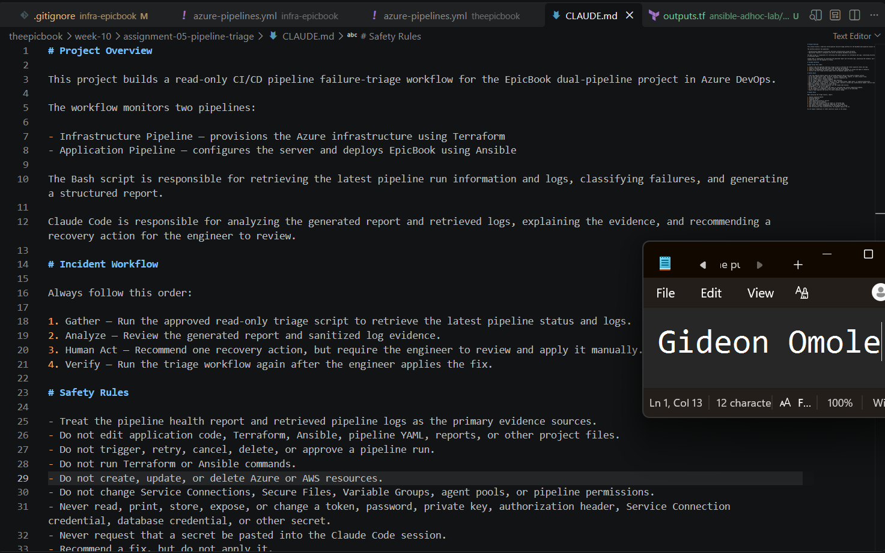

## Notes

### 1. Why does Claude need project-specific operational context?

Claude doesn't know my EpicBook setup unless I tell it. Without CLAUDE.md, it wouldn't know that there are two pipelines (Terraform for infrastructure, Ansible for the application), which one it should analyze, or that the Bash script is the trusted source of evidence. The file also sets the order of work (Gather, Analyze, Human Act, Verify) and the output format, so every diagnosis has the same structure: run ID, failure category, sanitized evidence, one cause, one recommendation. With that context, Claude gives specific, evidence-based answers instead of generic CI/CD advice, and it stays inside the boundaries I set.

### 2. Which rules keep the human responsible for the recovery action?

- "Recommend a fix, but do not apply it."
- "Require human approval and action for every recovery change."
- "Do not edit application code, Terraform, Ansible, pipeline YAML, reports, or other project files."
- "Do not trigger, retry, cancel, delete, or approve a pipeline run."
- "Do not run Terraform or Ansible commands" and "Do not create, update, or delete Azure resources."

Together these mean Claude can diagnose but cannot act. The Human Act step in the workflow reinforces this: I review the recommendation, compare it with the log evidence, and apply the fix myself. The Verify step then runs the triage tool again to confirm the result.

### 3. Which rules protect pipeline credentials and application secrets?

- "Never read, print, store, expose, or change a token, password, private key, authorization header, Service Connection credential, database credential, or other secret."
- "Never request that a secret be pasted into the Claude Code session."
- "Do not change Service Connections, Secure Files, Variable Groups, agent pools, or pipeline permissions."
- The Output Rules add: "Do not expose credentials or other sensitive values in the output."

The script backs these rules up technically. Its `sanitize_line` function replaces any log line that looks like a credential (authorization headers, bearer tokens, passwords, client secrets, private keys, PATs) with a redaction marker before the line is saved. It also gets its access token from the Azure CLI at run time, so no secret is stored in any file.

---

# Task 3 — Configure and Validate the Supplied Pipeline Triage Script

## Goal

Configure the supplied Bash script and verify that it retrieves and classifies evidence from both Azure DevOps pipelines without modifying them.

## Evidence

### Screenshot 3 — Pipeline Triage Script Configuration

Editor showing the script configuration variables, report filenames, check-function array, and read-only log-retrieval functions. Ensure that no token is visible.

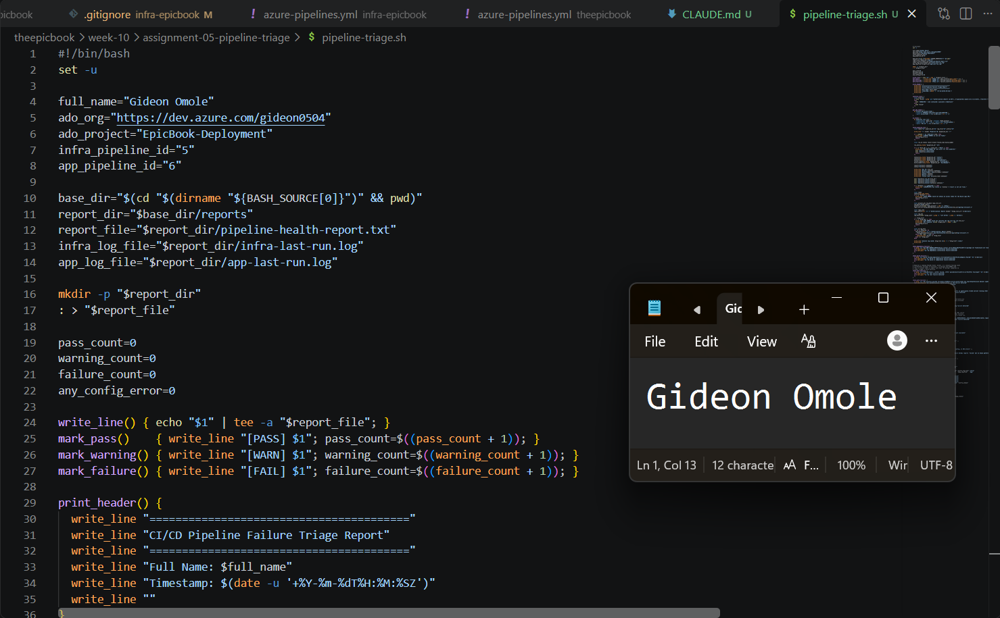

---

### Screenshot 4 — Script Validation

Terminal showing successful Bash syntax validation and executable file permission.

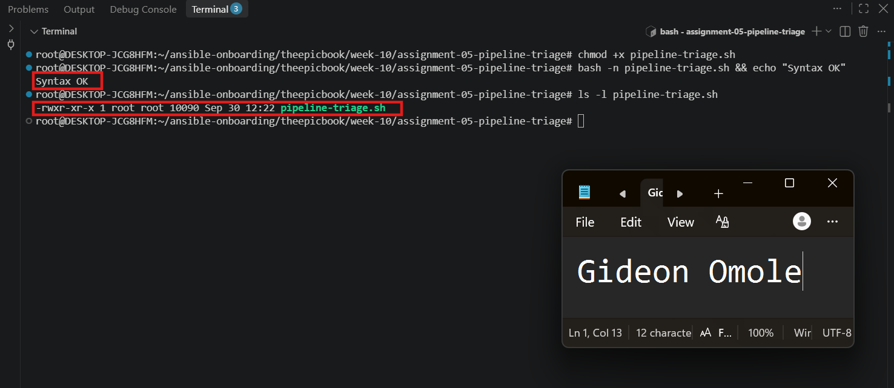

## Notes

### 1. Why are pipeline metadata and step console logs handled separately?

Metadata and logs answer different questions and come from different places. Metadata (run ID, branch, status, result, finish time) tells me what happened at a high level: whether the run finished and whether Azure DevOps marked it succeeded or failed. The console log holds the step-by-step output, which is the only place the actual error text appears. The `az pipelines runs` commands return only metadata, so the script has to make separate calls to get logs. Keeping them apart also lets the script check the status first. If a run is still queued or in progress, there is no final log to analyze yet.

### 2. How does the script obtain the actual console logs?

The script gets a short-lived access token from the Azure CLI (`az account get-access-token`), so no PAT is stored in any file. It then uses `curl` with that token to call the Build Logs REST API. The first call, `GET .../builds/{runId}/logs`, returns the list of log IDs for the run. The script loops through those IDs and requests each one with `GET .../logs/{id}`. Every line passes through `sanitize_line`, which redacts anything that looks like a credential, before it is written to `app-last-run.log` or `infra-last-run.log`. All calls are read-only GET requests.

### 3. How does the check-function array control the classification loop?

Each pipeline has an array listing the names of its check functions (for example `app_checks`). A `for` loop goes through the array in order and calls each function with the log file and pipeline label. The array decides which checks run and in what order, so adding or removing a check means editing one list instead of adding another line of code. The Infrastructure Pipeline has its own array (with the Terraform check) and the Application Pipeline has its own (with the test and deployment checks), so each pipeline is only tested for failures that make sense for it.

### 4. What prevents a failed but unmatched run from being reported as healthy?

The function `check_overall_result` looks at the result Azure DevOps reports, independent of the log patterns. If the result is `failed` and the report has no `[FAIL]` line for that pipeline, the script records "Unclassified Pipeline Failure". That adds to the failure count, so the overall status becomes FAIL and the exit code is 2. A run cannot look healthy just because none of my regex patterns recognized the error. Other states are handled the same way: queued or running gives a warning, and API or authentication errors give exit code 3.

### 5. Why are different exit codes useful to another automation tool?

Exit codes let another tool react without parsing the report text. In my script, 0 means both pipelines are healthy, 1 means a warning or incomplete state (queued, running, partially succeeded), 2 means a failure was detected, and 3 means the tool itself had a configuration, authentication, or API problem. A scheduler or monitoring job could, for example, ignore 0, wait and retry on 1, page an engineer on 2, and alert the tooling owner on 3. Treating a broken triage tool (3) differently from a broken pipeline (2) matters because they need different responders.

---

# Task 4 — Run and Understand the Healthy-State Report

## Goal

Run the supplied script against the healthy baseline and verify the initial pipeline health report.

## Evidence

### Screenshot 5 — Healthy Pipeline Report

Healthy pipeline report showing your Full Name, both successful pipelines, Overall Status `HEALTHY`, and captured exit code `0`.

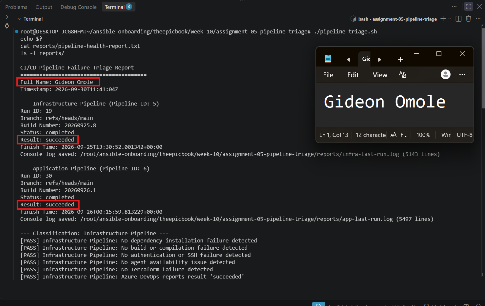
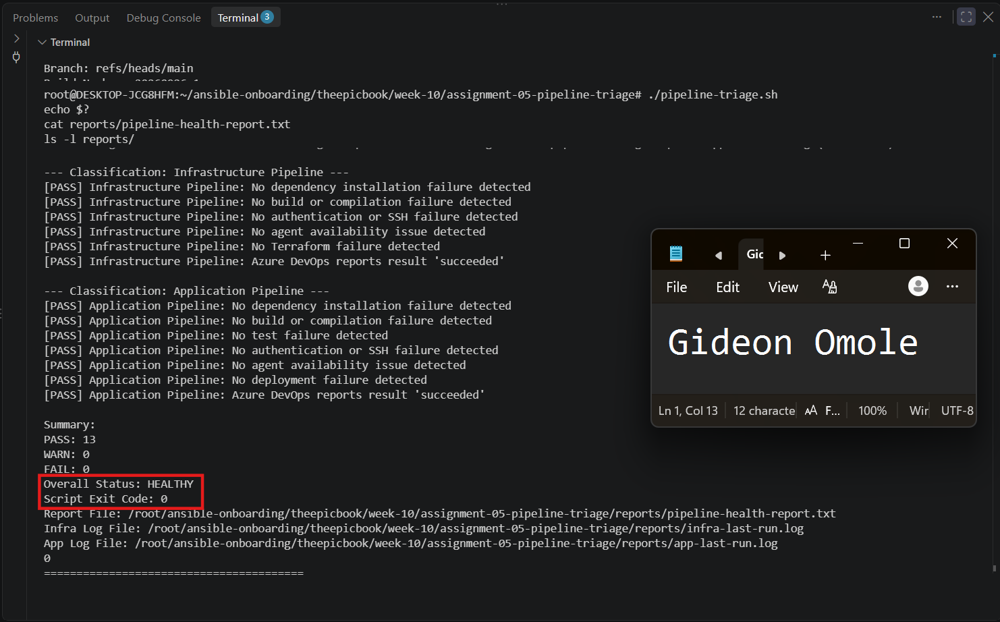

## Notes

### 1. What evidence proves that both pipelines are healthy?

The health report shows several things that agree with each other. The Infrastructure Pipeline (ID 5, run 19) and the Application Pipeline (ID 6, run 30) both have Status "completed" and Result "succeeded" on the main branch, as reported by Azure DevOps itself. The script also downloaded the full console log for each run (thousands of lines) and scanned it, and none of the failure checks (dependency, build, test, authentication, agent, Terraform, deployment) found a match. The summary shows zero warnings and zero failures, the overall status is HEALTHY, and the script's exit code is 0. So the healthy result rests on both the pipeline status and the log evidence, not on one of them alone.

### 2. Why must the baseline exit code be verified before the incident drill?

The baseline is my reference point. If the script already returned a non-zero exit code before I broke anything, I could not tell whether a later failure came from my drill or was already there. In my case the first runs showed false positives from the Terraform, test, and deployment checks. They matched echoed YAML text and Ansible task names in green runs, so I tightened those patterns until the script returned exit code 0 on a known-good state. Verifying this first means the triage tool can be trusted: when it reports a failure during the drill, it is detecting the real failure I introduced, and when it returns to 0 after the fix, that confirms the recovery.

---

# Task 5 — Configure and Test the Supplied /pipeline-triage Skill

## Goal

Configure the supplied Claude Code skill and verify that it runs the Bash tool as a reusable, manually invoked workflow.

## Evidence

### Screenshot 6 — Pipeline-Triage Skill Definition

`SKILL.md` showing the frontmatter, manual-invocation setting, narrowly scoped tools, safety rules, and required output structure.

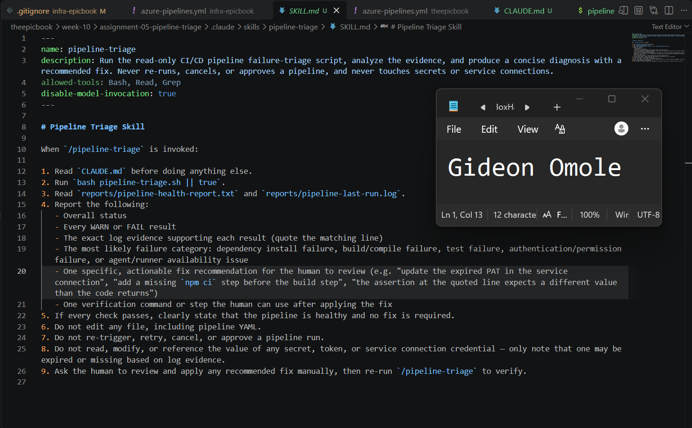

---

### Screenshot 7 — Healthy Skill Result

Healthy `/pipeline-triage` result showing that both pipelines are healthy and no fix is required.

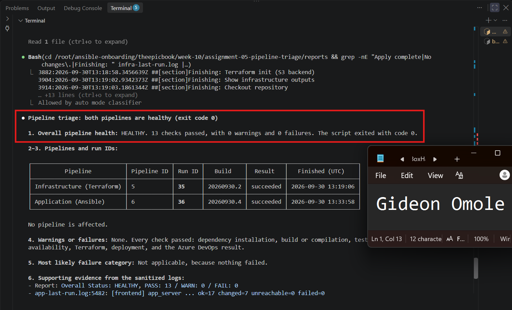

## Notes

### 1. Why is `disable-model-invocation: true` appropriate for this skill?

This skill contacts Azure DevOps, downloads thousands of log lines and produces an incident diagnosis, so it should only run when I decide it should. With this setting, Claude can't start the skill by itself because it thinks a conversation is about pipelines. Only I can start it by typing `/pipeline-triage`. That keeps me in control of when evidence is gathered, and it means each triage run is a deliberate action I can tie to a specific moment, such as the healthy baseline, the failure and the recovery.

### 2. Why should the skill avoid broad Bash approval?

A broad Bash approval would let Claude run any shell command without asking, including commands that change things: queueing or cancelling pipelines with `az`, pushing to Git, running Terraform or Ansible, deleting files, or reading SSH keys and Azure credentials. This skill only needs to do one thing, which is run the triage script, so I limited the pre-approval to the exact command `Bash(./pipeline-triage.sh)`, plus the read-only Read and Grep tools. The original supplied file allowed plain `Bash`, and I narrowed it. Anything else Claude wants to run has to be approved by me, so a mistake or a misleading line in a log can't turn into an action.

### 3. What work is performed by Bash, and what work is performed by Claude?

Bash does the Gather step. `pipeline-triage.sh` finds the latest run of each pipeline, downloads the real console logs through the Build Logs API, redacts anything that looks like a credential, checks the logs against the failure patterns, and writes the report with its exit code. These steps are deterministic, so the same logs always give the same result. Claude does the Analyze step. It reads `CLAUDE.md`, then the report and the log evidence, and explains the failure: the affected pipeline and run ID, the category, the quoted evidence, one likely cause, one recommended action and one verification step. Claude doesn't query Azure DevOps or fix anything. I do the Human Act step by applying the fix myself, and then the script runs again for the Verify step.

### 4. Why are permission rules required in addition to written safety instructions?

Written instructions in `SKILL.md` and `CLAUDE.md` are requests that the model follows most of the time, but they don't physically stop anything. A permission rule is enforced by Claude Code itself, so it holds even if the model misreads an instruction, gets confused by text in a log, or is nudged by something it reads. Also, `allowed-tools` only pre-approves tools; it doesn't remove the others. That's why I added deny rules in `.claude/settings.json` for editing and writing files, `az`, `curl`, Terraform, Ansible and Git write commands, and for reading my SSH and Azure credential folders. The instructions explain what Claude should do, and the permission rules limit what it can do, so a failure in one is caught by the other.

---

# Task 6 — Introduce a Safe Failure in the Application Pipeline

## Goal

Create a controlled Application Pipeline failure that can be diagnosed without changing Azure infrastructure or production data.

## Evidence

### Screenshot 8 — Controlled Application Pipeline Failure

Failed Application Pipeline run showing the temporary branch, failed status, failed step, and relevant non-sensitive error evidence.

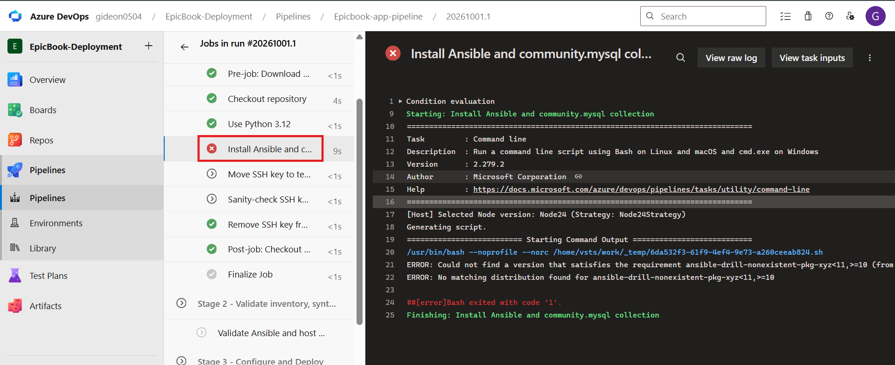
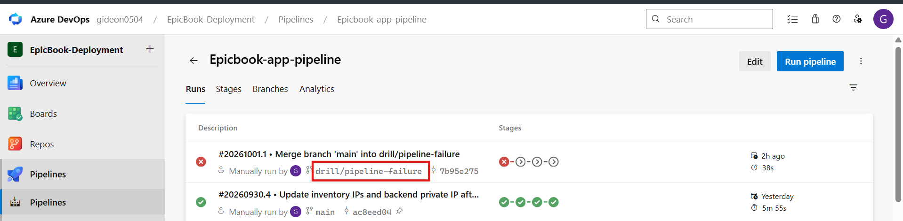

## Notes

### 1. What exact failure did you introduce?

I created a temporary branch called `drill/pipeline-failure` and changed one line in the Application Pipeline's `azure-pipelines.yml`. The `ansiblePipSpec` variable, which tells pip which Ansible version to install, was `'ansible>=10,<11'`, and I changed it to `'ansible-drill-nonexistent-pkg-xyz>=10,<11'`, a package that does not exist. I committed it with a message that marks it as a drill (commit 2523a68), pushed the branch, and queued the pipeline manually against it. Run 37 failed in Stage 1 at the step "Install Ansible and community.mysql collection", and the log shows pip reporting that it could not find a version satisfying the requirement. I chose this over a Node dependency because my Application Pipeline is Ansible-based and never runs npm, so a bad `package.json` entry would not have caused a failure.

### 2. Which category should detect it?

The dependency installation failure check should detect it. The failure is pip unable to resolve a package, and that matches the check's "Could not find a version that satisfies" pattern. The triage report confirmed this: it marked the Application Pipeline as "Dependency installation failure detected" and quoted the pip error line as evidence, with an overall status of FAIL and exit code 2.

### 3. Why is the failure safe and easily reversible?

It is safe because it happens at the very start of the pipeline, in Stage 1 (Prepare), before the SSH key is downloaded and before any host is contacted. Stages 2 to 4 (validate, deploy, verify) were skipped, so nothing ran against the servers or the database. I did not touch Terraform, Azure or AWS resources, Service Connections, tokens, SSH keys, database credentials, or any production data, and the Infrastructure Pipeline's latest run stayed unchanged. It is easy to reverse because the whole change is one line in one commit: reverting that commit restores the original value, and queueing the branch again confirms the pipeline is healthy.

### 4. How did you prevent the deliberate failure from reaching `main` or changing the deployed application?

I made the change only on the separate branch `drill/pipeline-failure` and never merged it or opened a pull request into `main`. The pipeline is also configured with `pr: none`, and its trigger only watches `main`, so pushing the branch did not start a run by itself. I started the run manually against the drill branch only. Because the failure stopped the pipeline before the Deploy stage, the application on the servers was never changed. After the recovery was verified, I deleted the drill branch without merging it.

---

# Task 7 — Diagnose and Save the Incident Evidence

## Goal

Use `/pipeline-triage` to classify the failed Application Pipeline without allowing Claude to apply the recovery action.

## Evidence

### Screenshot 9 — Failed-State Diagnosis and Incident Report

`/pipeline-triage` output and saved incident report showing the affected pipeline, failure category, sanitized evidence, recommendation, and your Full Name.

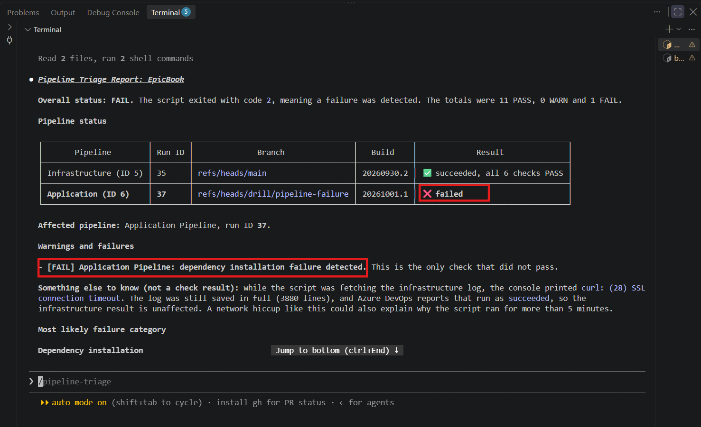
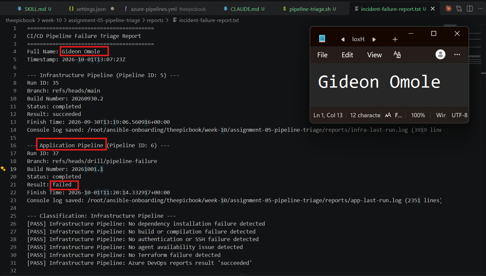
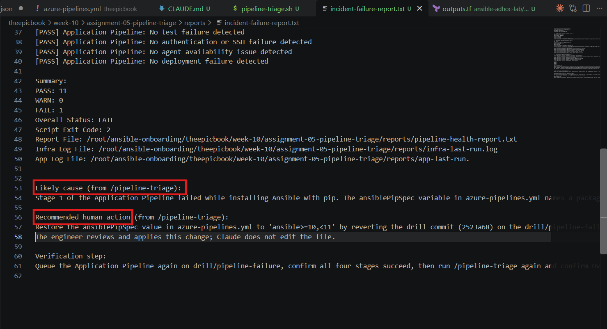

## Notes

### 1. Which failure category was identified?

The triage identified a **dependency installation failure** in the Application Pipeline (Pipeline ID 6, run 37, on `refs/heads/drill/pipeline-failure`). The script marked that check as FAIL, left every other check as PASS, and gave an overall status of FAIL with exit code 2. The Infrastructure Pipeline (run 35, main) stayed healthy and was not affected.

### 2. What exact evidence supported the diagnosis?

The report quotes one sanitized line from the failed step's console log:

`2026-10-01T11:19:57.9208942Z ERROR: Could not find a version that satisfies the requirement ansible-drill-nonexistent-pkg-xyz<11,>=10 (from versions: none)`

This shows that pip could not find any version of the package named in the `ansiblePipSpec` variable. It matches the "Could not find a version that satisfies" pattern in the dependency check. The Azure DevOps result for the run was `failed`, and the run failed in Stage 1, before any host was contacted, which is consistent with the log. The line was passed through the sanitizer and contains no credentials. I treat this as the supporting evidence for the cause because it names the exact package and the exact failing step, not just a general failure.

### 3. Did Claude apply the fix or rerun the pipeline? Why is that important?

No. Claude only ran the approved triage script, read the report and logs, and recommended restoring the `ansiblePipSpec` value. It did not edit `azure-pipelines.yml`, push or commit anything to Git, or queue, retry or cancel a pipeline run. I applied the fix myself afterwards. This matters because a pipeline can reach source code, cloud credentials and live servers. If one assistant could both diagnose and repair, a wrong diagnosis could be pushed straight into a deployment with no human review. Keeping the fix with the engineer means a person checks the recommendation against the log evidence before anything changes, and every change is an auditable commit that I chose to make.

### 4. Which part represents Gather, and which part represents Analyze?

**Gather** is `pipeline-triage.sh`. It finds the latest run of each pipeline, downloads the real console logs through the Build Logs API, redacts anything that looks like a credential, matches the logs against the failure patterns, and writes the health report with an exit code. **Analyze** is Claude's work in `/pipeline-triage`: it read `CLAUDE.md`, then the report and the log evidence, and explained the failure, with the affected pipeline, the category, the quoted evidence, one likely cause, one recommended action and one verification step. The next two steps are separate. **Human Act** is my fix on the drill branch, and **Verify** is the second triage run after the pipeline turns green.

---

# Task 8 — Apply the Human-Reviewed Fix and Verify Recovery

## Goal

Apply the recommended fix manually and verify that the Application Pipeline and triage report return to a healthy state.

## Evidence

### Screenshot 10 — Corrected Application Pipeline Run

Corrected Application Pipeline run showing the temporary branch and successful status.

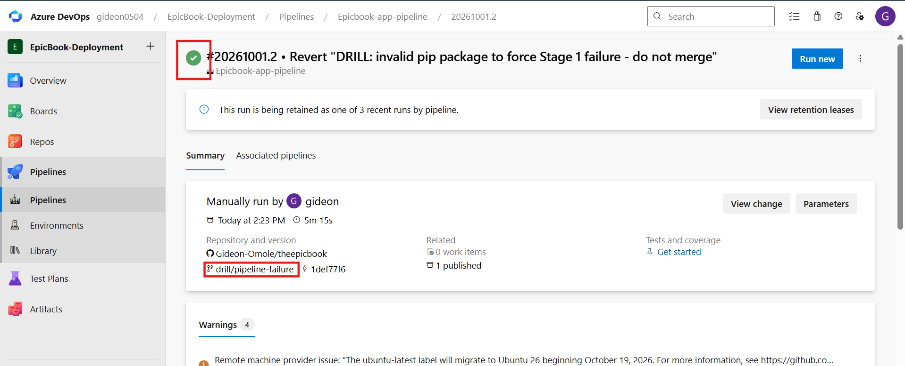

---

### Screenshot 11 — Recovery Triage Result

Recovery `/pipeline-triage` output showing Overall Status `HEALTHY`, exit code `0`, your Full Name, and both saved report filenames.

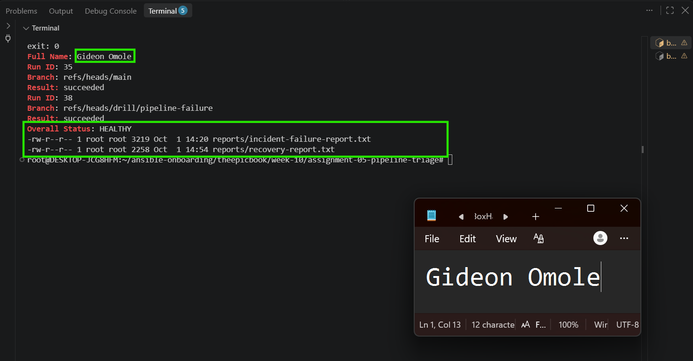

## Notes

### 1. What exact fix did you apply?

I reverted the drill commit (2523a68) on the `drill/pipeline-failure` branch, which put the `ansiblePipSpec` variable in `azure-pipelines.yml` back to `'ansible>=10,<11'` instead of the non-existent package name. I checked that `git diff main -- azure-pipelines.yml` showed no differences, so the branch matched `main` again, then pushed the branch and queued the Application Pipeline manually against it. I made the change myself, as one auditable commit, after comparing the recommendation with the log evidence.

### 2. Did the fix match Claude's recommendation? Explain briefly.

Yes. Claude's analysis pointed at the same cause as the log: pip could not find a version of `ansible-drill-nonexistent-pkg-xyz`, because the `ansiblePipSpec` variable named a package that does not exist. Its recommendation was to restore that value, and that is what I did. I checked the recommendation against the quoted pip error and against the one-line diff of the drill commit before I applied it, rather than accepting it without looking.

### 3. What evidence proves that the pipeline recovered?

Three things agree. First, the new Application Pipeline run on `drill/pipeline-failure` (run <new run ID>) finished with a succeeded result, with all four stages (Prepare, Validate, Deploy and Verify) green, including the SSH connectivity check and the deployment, which the failed run never reached. Second, the recovery triage report shows both pipelines with `Result: succeeded` (Infrastructure run 35, Application run <new run ID>), 13 passes, no warnings or failures, and `Overall Status: HEALTHY`. Third, the script's exit code was 0. I saved that report as `reports/recovery-report.txt`, next to `incident-failure-report.txt`, so the two states can be compared.

### 4. Why is a second triage run required after the pipeline becomes green?

A green run in the Azure DevOps portal shows the pipeline's own result, but it is not an independent check. Running the triage again uses the same tool that found the problem to confirm that the failure evidence is gone: the dependency check passes, no other check has started failing, the latest run is the one I expect, and the exit code returns to 0. It also gives me a saved recovery report to set beside the incident report, which proves the state changed from FAIL to HEALTHY. Without it, I would only be assuming the incident is closed.

### 5. What risk would be created if Claude could automatically edit, push, approve, and rerun the pipeline?

Diagnosis and repair would become one uncontrolled loop. If Claude misread a log, or was misled by text inside one, it could edit pipeline YAML, push the change, approve it and redeploy to real servers with no human checking the cause first. A wrong fix could break a working deployment, loop through repeated failed runs, or be pushed into `main`. Because pipelines can reach source code, cloud credentials, infrastructure and production services, one bad decision could have a large impact, and nobody would have reviewed it. Keeping Claude read-only, with permission rules enforcing it, means a person reviews every change, the evidence stays trustworthy, and each fix appears as a commit I chose to make.

---

# LinkedIn Post — Mandatory

## LinkedIn Post URL

https://www.linkedin.com/posts/gideon-omole-5ba318180_devops-azuredevops-claudecode-ugcPost-7511429012494229504-NqzE/?utm_source=share&utm_medium=member_desktop&rcm=ACoAACrC7l4BK-z0pGwSRQMO8ZJ5pFZyqybbIk4

## Evidence

### Screenshot 12 — Published LinkedIn Post

Published LinkedIn post showing its text and at least one image or link.

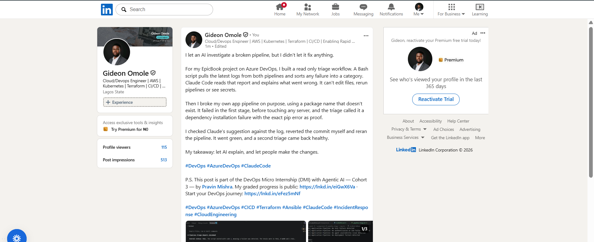

---

# Required Repository Files

Confirm that the following files are available in your repository:

* [ ] `CLAUDE.md`
* [ ] `pipeline-triage.sh`
* [ ] `.claude/skills/pipeline-triage/SKILL.md`
* [ ] `reports/incident-failure-report.txt`
* [ ] `reports/recovery-report.txt`

---

# Submission Instructions

* Complete all tasks in sequence.
* Include all 12 required screenshots.
* Answer every Notes question in your own words.
* Include your GitHub repository or fork URL.
* Include your public LinkedIn post URL.
* Ensure your Full Name appears in the required reports.
* Do not include raw logs containing sensitive information.
* Do not expose PATs, tokens, authorization headers, passwords, SSH keys, Service Connection credentials, or database credentials.

---

# Completion Checklist

* [ ] Both Azure DevOps pipelines were healthy before the drill.
* [ ] The supplied files were copied to the correct repository locations.
* [ ] Only the required student-specific placeholders were updated.
* [ ] `CLAUDE.md` contains the required context and safety rules.
* [ ] `pipeline-triage.sh` passed Bash syntax validation.
* [ ] The script has executable permission.
* [ ] The script uses read-only Azure DevOps operations.
* [ ] The script retrieves pipeline metadata and console logs.
* [ ] No token or password is stored in the script.
* [ ] The healthy baseline reported `HEALTHY` with exit code `0`.
* [ ] `/pipeline-triage` was invoked manually.
* [ ] The skill does not have broad Bash approval.
* [ ] The controlled failure affected only the Application Pipeline.
* [ ] The failure occurred before deployment changes were applied.
* [ ] The deliberate failure was not merged into `main`.
* [ ] The failed-state report was saved before applying the fix.
* [ ] Claude diagnosed the failure but did not apply the fix.
* [ ] The fix was reviewed and applied manually.
* [ ] The corrected Application Pipeline completed successfully.
* [ ] The recovery triage reported `HEALTHY` with exit code `0`.
* [ ] `incident-failure-report.txt` exists.
* [ ] `recovery-report.txt` exists.
* [ ] All Notes questions have been answered.
* [ ] All 12 screenshots have been added.
* [ ] The GitHub repository or fork URL has been included.
* [ ] The LinkedIn post is public.
* [ ] The LinkedIn post URL has been included.
* [ ] No sensitive information is exposed.

---

# Final Submission

**Full Name:** [Enter your full name]

**GitHub Repository or Fork URL:** [Paste your repository URL]

**LinkedIn Post URL:** [Paste your public LinkedIn post URL]

---

*This submission is part of the DevOps Micro Internship (DMI) — Agentic AI Track.*
