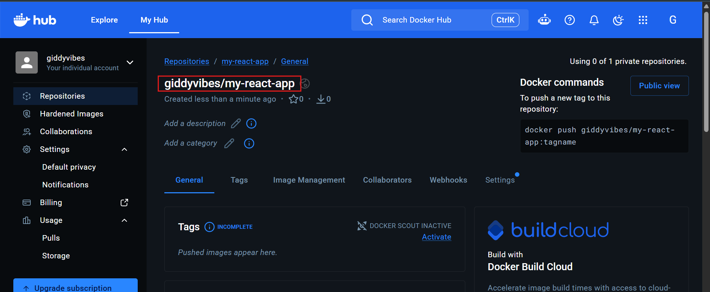
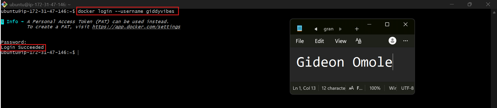
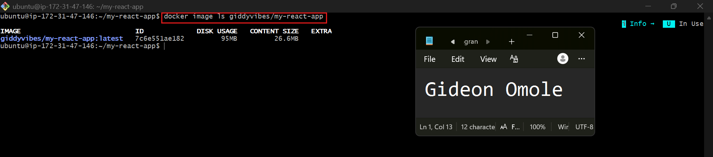
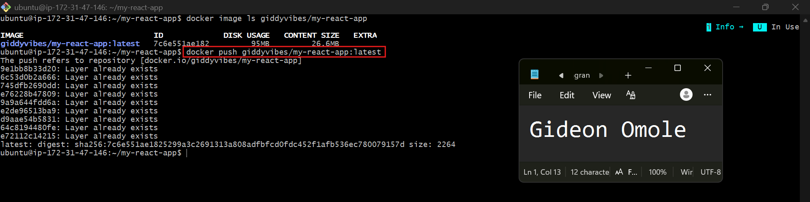
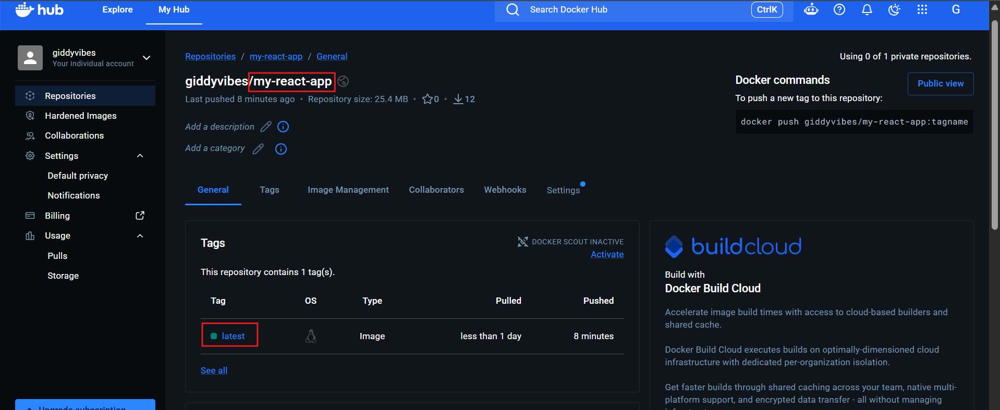
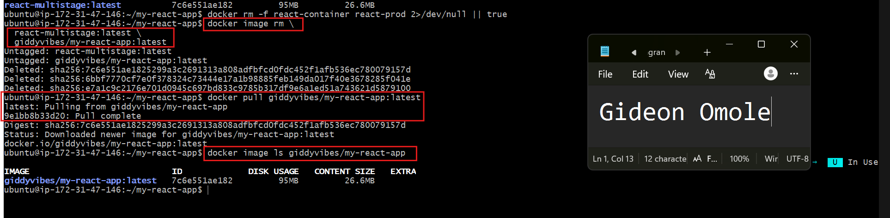
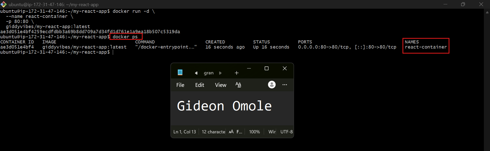
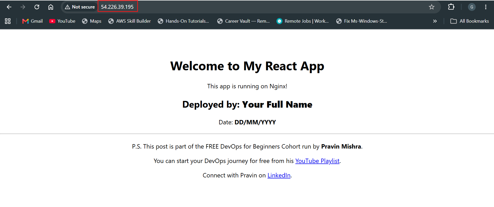
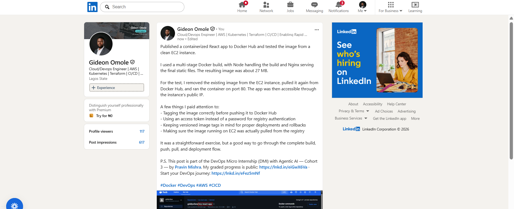

# Assignment 5 — Publish a Docker Container on Docker Hub

Part of the DevOps Micro Internship (DMI) with Agentic AI

---

## Purpose

In this assignment, you will publish a Dockerized React application to Docker Hub, remove the local image tags, pull the image again from Docker Hub, and run it to verify that it can be downloaded and deployed from a container registry.

---

# Task 1 — Publish a Docker Image to Docker Hub

## Goal

Tag a locally built React image, publish it to Docker Hub, remove the local copy, pull it again from Docker Hub, and run it successfully.

### Evidence

#### Screenshot 1 — Public Docker Hub Repository

Add a screenshot of Docker Hub showing your newly created public repository:

```text
my-react-app
```



---

#### Screenshot 2 — Successful Docker Login

Add a screenshot of the terminal showing:

```text
Login Succeeded
```

Ensure that your full name is visible and that no password, Personal Access Token, or device code is exposed.



---

#### Screenshot 3 — Correctly Tagged Image

Add a screenshot of the terminal showing:

```bash
docker image ls <YOUR_DOCKERHUB_USERNAME>/my-react-app
```

The output must show the `latest` tag.



---

#### Screenshot 4 — Successful Docker Push

Add a screenshot of the terminal showing successful completion of:

```bash
docker push <YOUR_DOCKERHUB_USERNAME>/my-react-app:latest
```

The output must include a pushed status or image digest.



---

#### Screenshot 5 — Published `latest` Tag in Docker Hub

Add a screenshot of your Docker Hub repository showing the uploaded `latest` image tag.



---

#### Screenshot 6 — Local Image Removed and Pulled Again

Add a screenshot of the terminal showing:

- The targeted local image tags removed
- Successful `docker pull` output
- `docker image ls` showing the pulled image



---

#### Screenshot 7 — Running Pulled Image

Add a screenshot of the terminal showing:

```bash
docker ps
```

The output must show the running `react-container` with:

```text
0.0.0.0:80->80/tcp
```



---

#### Screenshot 8 — React Application in Browser

Add a browser screenshot showing the React application at:

```text
http://54.226.39.195/
```

Ensure that the VM public IP is visible in the address bar. Add your full name as a clear caption directly below the screenshot.



---

# Docker Hub Repository URL

**Repository URL:** `https://hub.docker.com/repository/docker/giddyvibes/my-react-app/general`

---

# Registry and Image Tagging Notes

## Why image tagging is required before pushing to Docker Hub

Docker Hub needs to know which account and repository an image belongs to. A local name like `react-multistage:latest` carries no owner information, so Docker has no idea where to send it. Tagging the image as `<username>/my-react-app:latest` gives it a name in the `username/repository:tag` format, which tells Docker Hub exactly where to store it. Tagging doesn't copy the image. It just adds a second name to the same image, which is why both names show the same image ID in `docker image ls`.

## Why a container registry is useful in DevOps workflows

A registry is a central place to store and share images. Once an image is pushed, any machine with access can pull and run it without rebuilding from source. This means the same tested image can move through development, testing, and production unchanged, which keeps environments consistent and avoids "it works on my machine" problems. It also fits naturally into CI/CD pipelines, where one stage builds and pushes the image and later stages pull and deploy it. In this assignment, removing the local images and pulling the image back from Docker Hub showed that the registry copy is complete and runs on its own.

## Why production deployments should use versioned image tags instead of relying only on `latest`

`latest` is just a label that can be moved to a different image at any time, so it doesn't tell you what is actually running. Two servers pulling `latest` on different days could end up with different code. Versioned tags like `v1.0.1`, `build-125`, or `commit-a1b2c3d` point to one specific build, so every deployment is traceable. If a release causes problems, you can roll back by redeploying the previous tag. Versioned tags also make debugging, auditing, and team communication clearer, because everyone knows exactly which version is live.

---

# LinkedIn Requirement

## Goal

Create a LinkedIn post about publishing a Docker container image to Docker Hub.

Include:

- Assignment title: **Publish a Docker Container Image to Docker Hub**
- Your Docker Hub repository URL
- What you published
- How you verified the remote image by pulling and running it
- Key learning outcomes

### Evidence

#### LinkedIn Post URL

Paste your LinkedIn post URL here:

`https://www.linkedin.com/posts/gideon-omole-5ba318180_docker-devops-aws-share-7513574114071207937-FN5a/?utm_source=share&utm_medium=member_desktop&rcm=ACoAACrC7l4BK-z0pGwSRQMO8ZJ5pFZyqybbIk4`

---

#### LinkedIn Post Screenshot



---

# Submission Instructions

- Complete all steps in sequence.
- Include Screenshots 1–8 exactly as specified.
- Include your Docker Hub repository URL.
- Include the Registry and Image Tagging Notes.
- Include the LinkedIn post URL and screenshot.
- Ensure that your full name is visible in all terminal screenshots.
- Add your full name as a clear caption below the browser screenshot.
- Do not expose passwords, Personal Access Tokens, device codes, credentials, or other sensitive information.

---

# Completion Checklist

- [ ] Public `my-react-app` repository created
- [ ] Docker login completed successfully
- [ ] `react-multistage:latest` tagged correctly
- [ ] Image pushed to Docker Hub
- [ ] `latest` tag verified in Docker Hub
- [ ] Targeted local image tags removed
- [ ] Image pulled again from Docker Hub
- [ ] Pulled image runs successfully
- [ ] React application is accessible through the VM public IP
- [ ] Docker Hub repository URL included
- [ ] Registry and image-tagging notes completed
- [ ] LinkedIn post URL and screenshot included
- [ ] All required screenshots included
- [ ] Full name visible in terminal screenshots
- [ ] Browser screenshot has a full-name caption
- [ ] No passwords, tokens, or credentials exposed
---

## 📌 About DMI & CloudAdvisory

DevOps Micro Internship (DMI) is a project-based DevOps program run by Pravin Mishra (The CloudAdvisory) focused on real-world execution, systems thinking, and career readiness.

It helps learners build strong DevOps foundations with hands-on experience.

---

## 📌 Resources

- 🌐 DMI Official Website: https://dmi.pravinmishra.com?utm_source=github&utm_medium=readme  
- 🎓 University: https://university.pravinmishra.com?utm_source=github&utm_medium=readme  
- 💬 Discord Community: https://discord.pravinmishra.com?utm_source=github&utm_medium=readme  
- 📝 Blog: https://dmi.pravinmishra.com/blog?utm_source=github&utm_medium=readme  
- ▶️ YouTube Playlist: https://www.youtube.com/playlist?list=PLFeSNDtI4Cho  
- 🔗 Pravin Mishra (LinkedIn): https://www.linkedin.com/in/pravin-mishra-aws-trainer/  
- 🏢 CloudAdvisory (LinkedIn): https://www.linkedin.com/company/thecloudadvisory/

---

*This submission is part of DevOps Micro Internship (DMI) — Agentic AI Track.*
